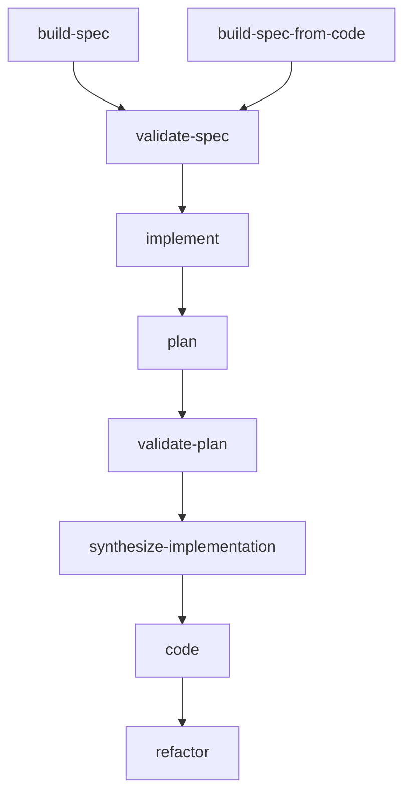

# Architecture Overview

`solid-coder` is a staged workflow system for spec-driven coding.

The main execution model is:

1. build or refine a spec
2. validate the spec for buildability
3. derive the ideal architecture
4. validate that architecture against the existing codebase
5. decide what should be reused, modified, or created
6. write code with active rules already loaded
7. review and refactor through reusable principles

## Main workflow map

## Why the workflow is split

The stages are intentionally separate so the system does not collapse into a single vague “write code” prompt.

This gives the plugin explicit places to:
- reason about architecture separately from coding
- search for reuse before creating new code
- apply rules before and after code is written
- preserve artifacts that can be inspected and debugged

## Core design ideas

- **Specs are the source of intent**
- **Plans are codebase-blind first**
- **Validation searches for existing ownership in the codebase**
- **Synthesis decides reuse / modify / create**
- **Code writes under active rule constraints**
- **Refactor is a structured safety net**

## Fresh-session philosophy

A strong operating model for `solid-coder` is:
- one spec or subspec
- one fresh Claude Code session
- one bounded implementation run
- one verification pass
- optional bounded self-correction

If a spec cannot fit inside one bounded session, it is usually a sign that the spec should be split.
