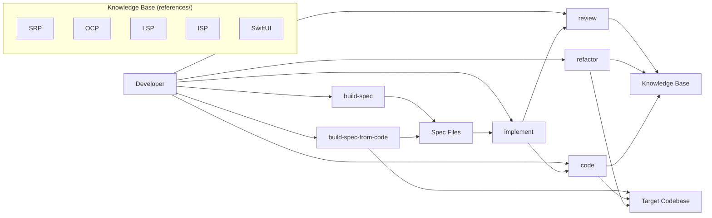
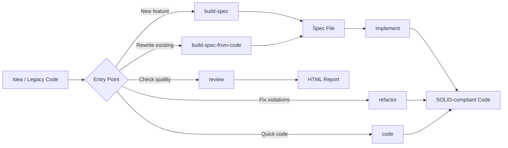

# solid-coder

## Description

A Claude Code plugin that provides a full coding pipeline from spec to SOLID-compliant code. The system reviews, refactors, and writes code using SOLID principles (SRP, OCP, LSP, ISP) and SwiftUI best practices as enforceable, metric-driven rules. Includes spec authoring tools, an implementation orchestrator, and iterative review/refactor loops. Principles are data — each lives in `references/` with its own rules, metrics, fix patterns, and examples.

## Input / Output

| | Detail |
|---|---|
| **In** | Prompts, spec files, existing code (files or directories) |
| **Out** | SOLID-compliant source code, spec files, review reports (HTML), refactor logs |
| **Consumer** | Developers using Claude Code on Swift (and future Kotlin/Java) projects |
| **Lifetime** | Permanent plugin — installed per-project via `.claude-plugin/` |

## User Stories

**As a developer, I want to build structured specs from prompts through an interview flow**
so that feature requirements are concrete and buildable before implementation begins.
- `/build-spec` runs an interview: type, title, description, connections, I/O, edge cases, user stories, diagrams
- Specs are written to `.claude/specs/` with YAML frontmatter (number, type, status, parent, blocked-by, blocking)
- Supports create, resume, edit, and breakdown flows
- Buildability gate (`validate-spec`) flags vague terms, undefined types, implicit contracts

**As a developer, I want to analyze existing code and produce a rewrite spec**
so that I can plan a clean rewrite of legacy components through the same pipeline.
- `/build-spec-from-code <target>` reads existing files, extracts types/patterns/dependencies
- Interviews the user about target state and pain points
- Produces a spec with `mode: rewrite` and `## Current State` section
- Generates subtasks: rebuild (mode: rewrite), bridge old→new, migrate consumers

**As a developer, I want to implement a spec into SOLID-compliant code in one command**
so that I get architecture decomposition, codebase validation, and principle-aware code generation end-to-end.
- `/implement <spec-file>` orchestrates: plan → validate-plan → synthesize-implementation → code → review
- Planner reads spec + ancestors, carries forward acceptance criteria, design references, design decisions, technical requirements
- Validator checks architecture against existing codebase (reuse/adjust/create/conflict)
- Synthesizer produces enriched directives with criteria, designs, and technical specs per plan item
- Code agent executes directives with principle rules loaded as constraints

**As a developer, I want to review code for SOLID violations without modifying it**
so that I can understand the quality of existing code before deciding what to fix.
- `/review <target>` produces an HTML report with per-file, per-principle findings
- Supports branch diff, staged changes, folder, file, or inline buffer as input
- Parallel principle reviews (SRP, OCP, LSP, ISP, SwiftUI) with findings filtered to changed ranges
- Each finding has severity (COMPLIANT/MINOR/SEVERE), metrics, and fix suggestions

**As a developer, I want to refactor code to fix SOLID violations automatically**
so that principle violations are resolved with cross-checked, conflict-free fixes.
- `/refactor <target>` runs full pipeline: review → synthesize fixes → implement → iterate
- Synthesizer cross-checks every fix against all other active principles before applying
- Iteration loop re-reviews modified files (max N iterations) until clean or cap reached
- Unresolved findings (cross-check failed) are reported, not silently dropped

**As a developer, I want to write new code with SOLID principles as active constraints**
so that code is compliant from the start, not fixed after the fact.
- `/code <prompt or spec>` loads all active principle rules and writes code within COMPLIANT bands
- Self-checks after writing — fixes SEVERE violations inline before reporting
- Dependency resolution tree: search → reuse protocol → extend → adapt → create
- Build/test only if instructions are in context — never guesses commands

## Diagrams

### Connection Diagram

### Flow Diagram

## Connects To

| Direction | Target | How |
|-----------|--------|-----|
| runtime | Claude Code plugin system | Skills, agents, hooks, CLAUDE.md |
| consumes | references/ knowledge base | Principle rules, metrics, fix patterns, examples |
| modifies | Target project codebases | Writes/modifies source files, creates spec files |

## Edge Cases

- **LLM inconsistency** — same code reviewed twice may produce different metrics. Mitigated by: deterministic scripts for filtering/validation, iteration loop as safety net, future AST-based extraction (S-26)
- **Cross-principle conflicts** — fixing one violation introduces another. Mitigated by: two-pass synthesis with cross-checking, unresolved findings reported explicitly, iteration loop catches cascades
- **Legacy code overwhelm** — large codebases produce too many findings. Mitigated by: delta-aware review (only changed ranges), MINOR-only short-circuit, future rewrite mode (S-43)

## Design Decisions

- **Principles are data** — adding a new principle means adding a folder to `references/` with the right file structure. No code changes needed.
- **Multi-agent pipeline** — each stage has a dedicated agent with constrained tools, specific model, and focused skill
- **Cross-principle verification** — synthesizer checks every fix against every other active principle's metrics
- **Iteration loop is stateless** — each iteration re-runs a fresh review on modified files; no state carried forward
- **arch.json is the carrier** — planner enriches it with acceptance criteria, design references, design decisions, and technical requirements; data flows through pipeline without loss
- **Tag-based activation** — principles without tags are always active (core SOLID); principles with tags activate conditionally (SwiftUI when swiftui imports detected)

## Features

| # | Feature | Status | Description |
|---|---------|--------|-------------|
| 1 | build-spec | done | Interview-driven spec builder — create, edit, resume, breakdown |
| 2 | build-spec-from-code | planned | Analyze existing code and produce rewrite spec with subtasks |
| 3 | implement | done | Spec-to-code orchestrator — plan → validate → synthesize → code → review |
| 4 | review | done | Read-only SOLID analysis with HTML report |
| 5 | refactor | done | Full review + fix + implement + iterate loop |
| 6 | code | done | Write SOLID-compliant code with principle constraints |

## Definition of Done

- [x] build-spec skill operational — create, edit, resume, breakdown flows
- [x] implement skill operational — full plan → validate → synthesize → code → review pipeline
- [x] review skill operational — parallel principle reviews, HTML report generation
- [x] refactor skill operational — review → synthesize → implement → iterate loop
- [x] code skill operational — principle-constrained code writing with self-check
- [x] 5 principles active — SRP, OCP, LSP, ISP, SwiftUI
- [x] Cross-principle synthesis with two-pass algorithm
- [x] Iteration loop with configurable max iterations
- [x] Delta-aware review (changed ranges filtering)
- [ ] build-spec-from-code skill — analyze existing code, produce rewrite spec with subtasks
