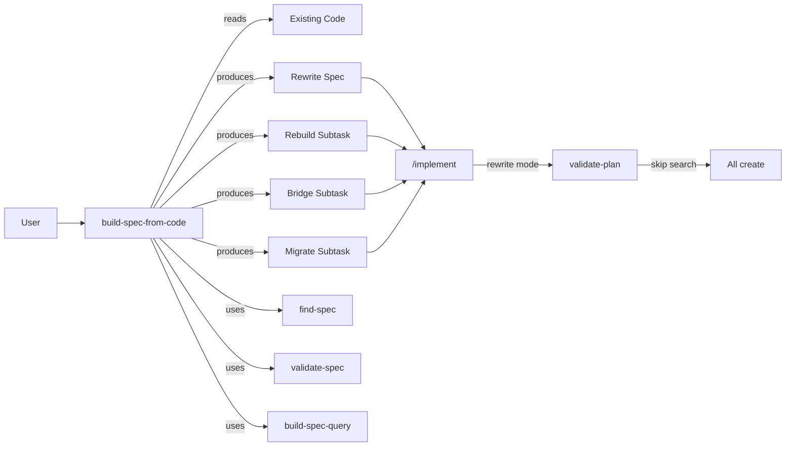
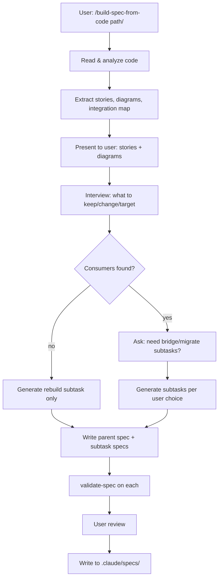

# build-spec-from-code

## Description

A skill that reads existing code (files or directory), analyzes current types, patterns, and dependencies, interviews the user about the desired target state, and produces a rewrite spec with `mode: rewrite` in frontmatter. The spec includes a `## Current State` section from code analysis and generates subtasks: rebuild (mode: rewrite), and optionally bridge + migrate (based on consumer analysis). Output is a standard build-spec format consumable by `/implement`.

## Input / Output

| | Detail |
|---|---|
| **In** | File paths or directory pointing at existing code |
| **Out** | Spec file with `mode: rewrite`, Current State section, and subtask specs (rebuild + optional bridge + migrate) |
| **Consumer** | `/implement` pipeline, `/build-spec` (for editing) |
| **Lifetime** | Spec files persist in `.claude/specs/` |

## User Stories

**As a developer, I want to point at existing code and have the skill extract what it does as user stories**
so that I have a functional understanding of the code's capabilities before deciding what to rewrite.
- Skill reads all files in the provided path(s)
- Extracts user-facing functionalities and system behaviors from the code (what it does, not how it's structured)
- Presents extracted stories in standard format: `As a [user/system], I want [goal] so that [reason]` with acceptance criteria derived from the code's observable behavior
- Edge cases from the code (error paths, guard statements, fallbacks, boundary conditions) are extracted as acceptance criteria within the relevant stories — not a separate section
- User confirms, adjusts, or adds stories — these become the spec's user stories for the target state
- Generates diagrams from the code to visualize how it works:
  - **Flow diagram**: data/control path through the main functionalities
  - **Sequence diagram**: interactions between types for key operations (especially async, delegate, notification patterns)
  - **Connection diagram**: dependencies, consumers, integration points
- Presents diagrams to user before interview — "Here's how the code works. What do you want to change?"
- Diagrams carry into the spec's `## Diagrams` section (current state diagrams + target state diagrams after interview)
- Acceptance: extracted stories cover the code's full functional surface including edge case handling (no missed capabilities, no missed error paths, no hallucinated features)

**As a developer, I want to describe the desired target architecture through an interview and get a rewrite spec**
so that I can run `/implement` to build the new version.
- Interview asks: what to keep, what to change, pain points, desired patterns, target architecture
- Shows discovered consumers and asks whether bridge/migrate subtasks are needed
- Produces spec with: `mode: rewrite` in frontmatter, `## Current State` (from analysis), `## User Stories` (target behavior), `## Technical Requirements` (target types/patterns), `## Design Decisions`
- Generates subtasks:
  1. Rebuild component (`mode: rewrite`) — greenfield implementation
  2. Bridge old→new interface (if consumers found and user confirms) — normal mode
  3. Migrate consumers (if user confirms) — normal mode
- Each subtask gets its own SPEC-NNN via find-spec `next-number`
- Buildability gate (`validate-spec --interactive`) runs on all specs

## Technical Requirements

### Skills Reused

- **find-spec** — spec numbering (`next-number`), ancestor loading
- **validate-spec** — buildability gate (`--interactive`)
- **build-spec-query** — path resolution (`resolve-path`)
- **parse-frontmatter** — reading existing spec frontmatter

### Analysis Approach

- LLM reads code via Read + Grep tools (no new script)
- Extracts types, protocols, dependencies, consumers
- Uses Grep to find callers of public interfaces across the codebase

### Spec Format

- Standard build-spec format with additions:
  - `mode: rewrite` in YAML frontmatter
  - `## Current State` section summarizing existing architecture (from analysis)
- Subtask specs use standard format:
  - Rebuild subtask: `mode: rewrite` in frontmatter
  - Bridge/migrate subtasks: normal mode (no `mode` field)

### Current Integration Map

During analysis, extract a connection map of what the existing code connects to and how:
- **Protocols it conforms to** — which protocols, where they're defined
- **Protocols it exposes** — public APIs other code depends on
- **Dependencies it consumes** — injected or constructed, concrete or abstract
- **Consumers** — who calls its public methods, via what mechanism (direct, protocol, environment)
- **Integration points** — delegates, notifications, closures, environment values

This map feeds directly into the bridge subtask's technical requirements — it knows exactly what interfaces need to be preserved or adapted.

### Pipeline Integration

- `validate-plan` reads `mode: rewrite` from `arch.json`
- When `mode == rewrite`: skip all search phases, classify all components as `create` with empty `matches[]`
- Rebuild subtask runs `/implement` with greenfield behavior
- Bridge subtask runs `/implement` normally — validator finds both old and new types, uses the integration map to wire adapters

## Diagrams

### Connection Diagram

### Flow Diagram

## Connects To

| Direction | Target | How |
|-----------|--------|-----|
| upstream | build-spec | Reuses interview patterns, validate-spec, spec format, find-spec, build-spec-query |
| downstream | /implement | Produces specs consumed by the implement pipeline |
| downstream | validate-plan | Rewrite mode (`mode: rewrite`) causes skip of search phases, all components classified as `create` |
| reads | Target codebase | Reads existing code to extract Current State |

## Edge Cases

- **Code too large** — if target has 50+ files, suggest narrowing scope to a specific module or type first
- **Mixed concerns** — if analysis finds multiple unrelated responsibilities, suggest splitting into multiple rewrite specs (one per concern)
- **No clear boundary** — tightly coupled code with many consumers makes bridge subtask the bulk of work. Interview should surface this and let user decide scope.
- **Circular dependencies** — analysis may find cycles in the dependency graph. Flag and ask user how to break.

## Design Decisions

- **LLM analysis, not AST** — uses Read + Grep, no new Python script. Keeps it simple and language-flexible. Future S-26 (tree-sitter) would improve accuracy.
- **Interview after analysis** — show what exists before asking what to change. User makes informed decisions.
- **Conditional subtasks** — bridge/migrate only if consumers found AND user confirms. Avoids unnecessary work for isolated components.
- **`mode: rewrite` in frontmatter** — clean signal that flows through pipeline. validate-plan handles it internally, orchestrator unchanged.
- **Rebuild is greenfield** — the whole point of rewrite mode. Integration with old world is a separate subtask.
- **Functionalities over architecture** — analysis extracts what the code does (user stories), not how it's structured. Target architecture is decided in the interview, not inherited from current state.

## Definition of Done

- [ ] Skill reads file paths or directory argument
- [ ] Analysis extracts functionalities as user stories and builds integration map (protocols, dependencies, consumers, integration points)
- [ ] Analysis generates flow, sequence, and connection diagrams from the code
- [ ] Interview covers: what to keep, what to change, pain points, desired patterns, target architecture
- [ ] Parent spec written with `mode: rewrite` and `## Current State` section
- [ ] Rebuild subtask generated with `mode: rewrite`
- [ ] Bridge subtask conditionally generated (consumers found + user confirms)
- [ ] Migrate subtask conditionally generated (user confirms)
- [ ] `validate-spec` passes on all generated specs
- [ ] `/implement` can consume the rebuild subtask and produce greenfield code (validate-plan skips search)
- [ ] validate-plan handles `mode: rewrite` (S-43 implemented)
