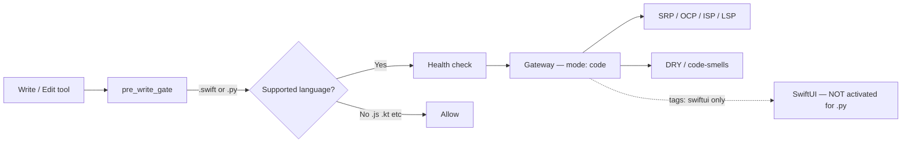
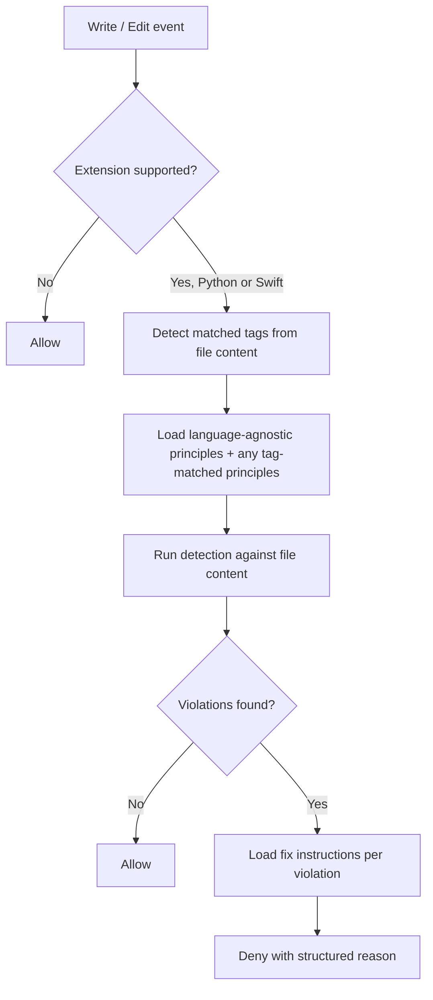

# Python Language Support for Principles

## Description

Extend the pre-write health check to recognise Python (`.py`) files as a supported language alongside Swift. When a Python file is written or edited, the same SOLID and DRY quality gate fires — detecting violations and blocking the write with structured fix guidance. Swift-specific principles (SwiftUI, structured concurrency, testing frameworks) do not activate for Python files because their tag patterns have no Python counterparts; only always-active, language-agnostic principles apply.

## Input / Output

|        | Detail |
|--------|--------|
| Input  | A Write or Edit tool event targeting a `.py` file, containing Python source code |
| Output | Allow (no violations) or deny with a structured violation list and per-violation fix instructions; same format as Swift denials |

## User Stories

### Story 1 — Python files are health-checked at write time

As a developer writing Python code (hooks, scripts, MCP servers), when I write or edit a `.py` file, the pre-write health check fires and reports SOLID/DRY violations so that Python code quality is enforced at write time.

**Acceptance Criteria:**
- AC1: A Write or Edit targeting any `.py` file triggers the health check — the gate does not short-circuit on extension
- AC2: When the Python file content contains a SOLID/DRY violation, the gate denies the write and includes the violation issue and fix in the denial reason
- AC3: When the Python file content has no violations, the gate allows the write without prompting
- AC4: The denial format for Python violations contains the same fields as Swift violations: `principle`, `metric_id`, `issue`, and `fix`

### Story 2 — Only language-agnostic principles activate for Python

As the system, when a `.py` file is written, only always-active principles (those with no tag requirements) are loaded — Swift-specific principles are not activated.

**Acceptance Criteria:**
- AC1: Principles with tags `swiftui`, `structured-concurrency`, `unit-test`, `ui-test`, or `xctest` are not activated when checking a Python file
- AC2: Principles with no tag requirements (SRP, OCP, ISP, LSP, DRY, code-smells) activate for Python files identically to Swift files
- AC3: A Python file that imports `asyncio` does not cause the structured-concurrency principle to activate

## Connects To

| Relationship | Target | Notes |
|---|---|---|
| Modifies | `hooks/code_health_check.py` | Adds Python to the supported language map |
| Reads (unchanged) | `hooks/pre_write_gate.py` | Accesses the language map as a module-level attribute of the health check module; no code change needed |
| Reads (unchanged) | `mcp-server/pipeline/server.py` | `search_codebase` and tag matching already language-agnostic |
| Reads (unchanged) | `references/principles/` | SRP, OCP, ISP, LSP, DRY, code-smells — all always-active |

## Diagrams

### Connection Diagram

### Flow Diagram

## Technical Requirements

- The supported language map in `code_health_check.py` is a `dict[str, str]` constant that maps file extension strings to display names (e.g. `".swift" → "Swift"`). Add a single entry mapping `".py"` to `"Python"`. This is the only code change required.
- Fix instructions for Python violations are produced by the existing `load_fix_for_violation` MCP call already wired in the health check subprocess — no change needed; the call is language-agnostic.
- No changes to principle rule files, MCP servers, or `pre_write_gate.py` — those already behave correctly once the language map is extended.
- Existing Swift behaviour must be unaffected (no regression).

## Test Plan

### Unit Tests — code_health_check

- When the `.py` extension is looked up in the supported language map, the result is a non-empty string (`"Python"`)
- When the `.js` extension is looked up, the result is absent (unsupported — gate allows without check)
- When the `.swift` extension is looked up, the result is `"Swift"` (no regression)

### Integration Tests — pre_write_gate

- When a Write is called for a `.py` file path, `_run_health` is invoked (gate does not short-circuit on extension)
- When a Write is called for a `.py` file with clean content, the gate allows without output
- When a Write is called for a `.py` file with a violation, the gate denies with a reason containing the violation
- When a Write is called for a `.py` file containing a class with multiple unrelated responsibilities, `_check()` returns a non-empty violations list containing at least one entry with a non-empty `metric_id`
- When a Write is called for a `.kt` file path, `_run_health` is not invoked (unsupported extension)

## Definition of Done

- [ ] `.py` maps to `"Python"` in the supported language map in `code_health_check.py`
- [ ] All unit tests pass for Python extension detection
- [ ] All integration tests pass confirming the gate fires on `.py` and not on unsupported extensions
- [ ] No regression on Swift file behaviour — existing test suite green
- [ ] `test_unsupported_extension_allows_without_gateway` remains passing (confirms `.js` still bypasses)
