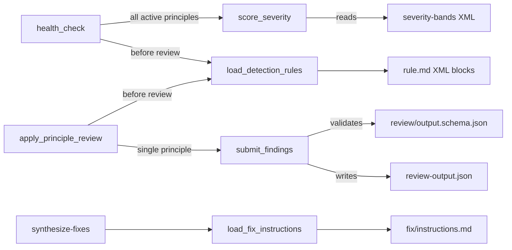
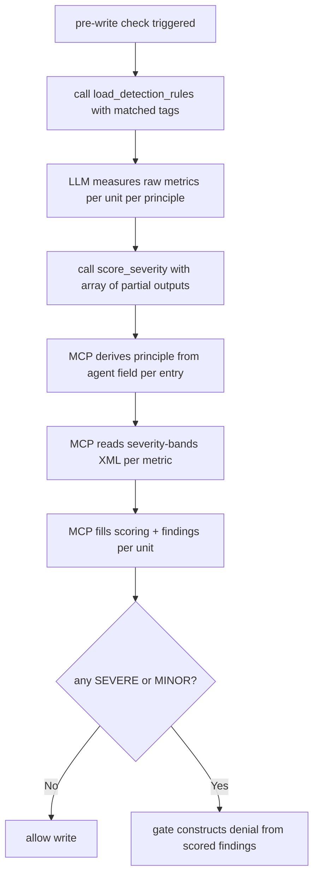
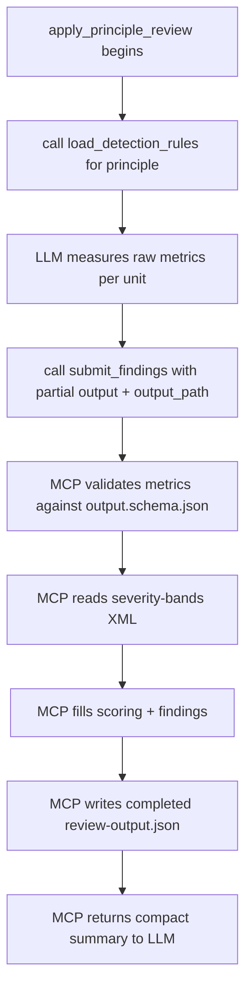

# LLM Measures, MCP Scores

## Description

Split principle review into two distinct responsibilities: the LLM reads detection instructions from the MCP, measures raw metrics per unit, and submits a partial output document; the MCP applies severity bands deterministically, fills the scoring and findings sections, and either returns the completed document (health check path) or writes it to disk (review pipeline path). A fourth tool lets synthesize-fixes load fix instructions per metric ID without reading principle folders directly. Together the four tools remove LLM judgment from severity scoring, make findings reproducible and traceable, and centralise file I/O in the MCP layer.

The shared data contract is the **partial output document**: the existing per-principle `review/output.schema.json` structure with `agent`, `principle`, `files[].units[].metrics` filled by the LLM, and `scoring` and `findings` absent — the MCP fills those sections deterministically.

## Input / Output

|        | Detail |
|--------|--------|
| `load_detection_rules` in | Principle name or matched tags |
| `load_detection_rules` out | Structured detection instructions and metric definitions per principle |
| `score_severity` in | Array of partial output documents — one per active principle (health check activates multiple simultaneously) |
| `score_severity` out | Same array with `scoring` and `findings` filled per unit — no file written |
| `submit_findings` in | Output path + single partial output document (review pipeline processes one principle at a time) |
| `submit_findings` out | Completed document written to output path; compact summary returned |
| `load_fix_instructions` in | Metric ID (e.g. `SRP-1`) |
| `load_fix_instructions` out | Fix instruction text for that metric, frontmatter stripped |

## User Stories

### Story 1 — Load detection rules

As the system, when the LLM begins a principle review, it calls the MCP to load detection instructions and metric definitions for the target principle, so it receives exactly what to measure and how — without reading rule files directly.

**Acceptance Criteria:**
- AC1: When a principle whose rule.md contains XML detection blocks is requested, the response contains structured per-metric detection instructions and definitions
- AC2: When a principle whose rule.md has no XML detection blocks is requested, the full rule.md content is returned as a fallback — no error
- AC3: When matched tags are passed, only active principles (those whose tag requirements are satisfied) are returned

### Story 2 — Health check scoring (array, no file write)

As the system, when the LLM finishes detecting violations during a pre-write health check, it calls the MCP with an array of partial output documents — one per active principle — and the MCP scores every unit across all principles deterministically, returning the completed documents so the gate can construct its allow/deny response.

**Acceptance Criteria:**
- AC1: When an array of partial outputs is submitted, each entry is scored independently and the response contains the same array with `scoring` and `findings` filled for every unit in every entry
- AC2: When a unit's metric values match the SEVERE band in the principle's severity-bands definition, the scored result for that unit is SEVERE
- AC3: When a unit's metric values match no severity band, the scored result is COMPLIANT (safe default, no error)
- AC4: When a metric value key in the partial output does not match the expected keys in the severity-bands definition, the MCP returns an error for that entry — no partial scoring written
- AC5: No file is written — `score_severity` is a pure scoring operation

### Story 3 — Review pipeline submission (single principle, file write)

As the system, when the LLM finishes a full principle review, it calls the MCP with a single partial output document and the target output path; the MCP validates the metrics against the principle's output schema, scores, fills `scoring` and `findings`, writes the completed document to disk, and returns a compact summary.

**Acceptance Criteria:**
- AC1: When a valid single-principle partial output and output path are submitted, the completed document is written to the output path and a summary is returned
- AC2: When the partial output references a metric ID not present in any rule.md, the MCP returns an error and writes no file
- AC3: When an empty files array is submitted, a clean-status document is written and the summary reports COMPLIANT
- AC4: The MCP derives the principle folder from the `agent` field in the partial output — no separate principle parameter is required

### Story 4 — Load fix instructions per metric

As the system, when synthesize-fixes needs fix guidance for a finding, it calls `load_fix_instructions` with the metric ID and the MCP returns the relevant fix instructions — so synthesize-fixes does not read principle folders directly.

**Acceptance Criteria:**
- AC1: When a known metric ID is requested, the fix instruction text for that metric is returned with frontmatter stripped
- AC2: When an unknown metric ID is requested, an error is returned that names the unrecognised ID

## Connects To

| Relationship | Target | Notes |
|---|---|---|
| New tools added to | `mcp-server/docs/server.py` | `load_detection_rules`, `score_severity`, `load_fix_instructions` |
| New tool added to | `mcp-server/pipeline/server.py` | `submit_findings` (writes output files — pipeline concern) |
| Modifies format of | `references/principles/*/rule.md` | Add `<detection id="X">`, `<definition id="X">`, `<severity-bands id="X">` XML blocks |
| Validation contract | `references/principles/*/review/output.schema.json` | Existing schemas validate both partial input and completed output — no new schema needed |
| Caller updated | `skills/apply-principle-review/SKILL.md` | Use `load_detection_rules`; use `submit_findings` instead of Write tool |
| Caller updated | `hooks/code_health_check.py` | Use `load_detection_rules`; use `score_severity` with all active principles |
| Caller updated | `skills/synthesize-fixes/SKILL.md` | Use `load_fix_instructions` instead of direct file reads |

## Diagrams

### Connection Diagram

### Flow Diagram — Health Check Path

### Flow Diagram — Review Pipeline Path

## Technical Requirements

- The shared data contract is the partial output document: the structure defined in the per-principle `review/output.schema.json` with `agent`, `principle`, `timestamp`, and `files[].units[].metrics` filled; `scoring` and `findings` absent or empty. The MCP completes the document and returns or writes it.
- Severity bands are defined in rule.md as `<severity-bands id="X">` XML blocks — self-describing with expected measurement keys and threshold rules. The MCP reads them at call time; no thresholds are hardcoded in tool code. The Testing framework rule.md already uses this pattern and serves as the reference format.
- The MCP derives the principle folder from the `agent` field in the partial output (e.g. `"srp"` → `references/principles/SRP/`). No separate principle parameter is needed.
- `score_severity` is a pure function — it scores and returns, never writes. `submit_findings` scores and writes. Same scoring logic, different side effects.
- `submit_findings` validates the metrics section against the principle's `review/output.schema.json` before scoring. An invalid payload returns an error without touching the output file.

## Test Plan

### Unit Tests — score_severity

- When an array containing one SRP partial output with `cohesion_groups: 2` for a unit is submitted, the response for that unit has `final_severity: SEVERE`
- When an array containing one SRP partial output with `verb_count: 2, cohesion_groups: 1` is submitted, the response has `final_severity: COMPLIANT`
- When metric values match no severity band, the result is COMPLIANT (safe default)
- When a metric value key does not match the severity-bands expected keys, an error is returned for that entry
- When an array of two partial outputs (different principles) is submitted, both are scored and returned
- No file is written by `score_severity` under any condition

### Unit Tests — submit_findings

- When a valid single-principle partial output and output path are submitted, the output file exists after the call and the summary is returned
- When an empty files array is submitted, a clean-status file is written and the summary is COMPLIANT
- When a metric ID in the partial output is not present in any rule.md, no file is written and an error is returned

### Unit Tests — load_detection_rules

- When a principle with XML detection blocks is requested, the result contains per-metric detection instructions
- When a principle without XML detection blocks is requested, the result is the full rule.md content with no error
- When matched tags are passed, only active principles are returned

### Unit Tests — load_fix_instructions

- When a known metric ID is requested, fix instruction text is returned with frontmatter stripped
- When an unknown metric ID is requested, an error is returned naming the unrecognised ID

## Definition of Done

- [x] `load_detection_rules` tool added — returns structured detection blocks or falls back to full rule.md
- [x] `score_severity` tool added — accepts arrays of partial outputs, applies authoritative `bands:` frontmatter deterministically, and returns completed output without writing a file
- [x] `submit_findings` tool added — validates, scores, writes output files, and returns a summary
- [x] `load_fix_instructions` tool added — returns fix instruction text per metric ID
- [x] `rule.md` for at least SRP contains structured detection and definition blocks plus authoritative YAML severity bands
- [x] `apply-principle-review` uses `load_detection_rules` and server-side findings submission
- [x] `synthesize-fixes` uses server-provided fix instructions
- [x] The health-check path uses structured detection rules and server-side deterministic scoring/submission
- [x] Focused scoring, submission, detection-rule, and fix-instruction unit tests pass
