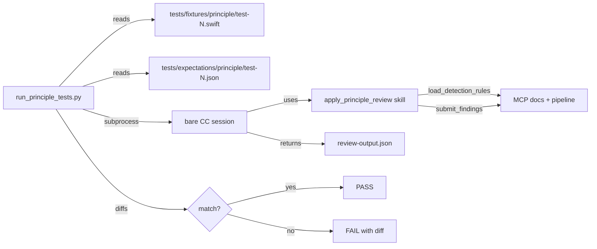
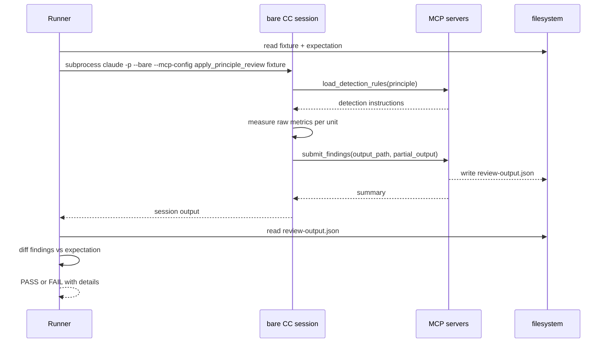

# Principle Review Test Harness

## Description

A test harness that validates the end-to-end detect-and-score flow of `apply_principle_review` for every active principle. For each principle, blind fixture Swift files (no comments, annotations, or names that hint at the expected outcome) cover each severity band. A test runner spins a bare Claude Code session with the required MCP tools, invokes `apply_principle_review` on a fixture, and asserts the output findings match a separate expectation manifest on metric ID, severity, and unit name. When an assertion fails, the output names exactly which principle, metric, fixture, expected value, and actual value differ — pointing directly to the detection instruction in rule.md that needs tightening.

## Input / Output

|        | Detail |
|--------|--------|
| Input | Fixture Swift files at `tests/fixtures/<principle>/test-N.swift` (blind code, no hints); expectation manifests at `tests/expectations/<principle>/test-N.json` — each finding specifies metric ID, severity, unit name, and the expected raw metric key-value pairs measured by the LLM |
| Output | Pass/fail per fixture with detailed diff on failure: principle, metric ID, fixture path, expected vs actual findings (including which metric values or severity differed) |

## User Stories

### Story 1 — Per-principle fixture tests

As the system, when `apply_principle_review` runs on a blind fixture file, the output findings match the corresponding expectation manifest exactly — same metric IDs, severities, and unit names, in any order — so the detection instructions for that principle are confirmed correct for that severity band.

**Acceptance Criteria:**
- AC1: For each fixture file, a corresponding expectation manifest exists specifying the expected findings as a list of entries — each entry contains `metric_id`, `severity`, `unit_name`, and a `metrics` map of expected raw measurement key-value pairs (e.g. `{cohesion_groups: 2}` for SRP-2)
- AC2: When output findings match the expectation manifest (order-insensitive), the test passes
- AC3: When output contains a finding not present in the expectation manifest, the test fails and the failure message names the unexpected metric ID, severity, and unit name
- AC4: When the expectation manifest contains a finding absent from the output, the test fails and the failure message names the missing metric ID, severity, and unit name
- AC5b: When a finding's raw metric values differ from the expectation manifest (e.g. output reports `cohesion_groups: 1` but expectation says `cohesion_groups: 2`), the test fails and the failure message shows both the expected and actual metric values — distinguishing a measurement failure from a scoring failure
- AC5: Fixture files contain no comments, variable names, or type names that encode or hint at the expected severity or metric — the LLM must detect from code structure alone

### Story 2 — Full-pipeline test

As the system, when all active principles are applied simultaneously to a single multi-violation fixture file, each principle's findings are independently correct and the test reports per-principle pass/fail.

**Acceptance Criteria:**
- AC1: A multi-violation fixture file exists that contains distinct violations triggerable by at least two different principles
- AC2: When the full-pipeline test runs, each active principle is scored independently against the fixture
- AC3: Each principle's findings are compared against its own expectation manifest entry — a failure in one principle does not mask failures in another
- AC4: The test output reports pass/fail per principle with the same detailed diff format as Story 1

### Story 3 — Failure diagnostics

As a developer, when a fixture test fails because actual findings differ from expected, the failure output is precise enough to identify the exact detection instruction in rule.md that needs tightening — without requiring manual investigation.

**Acceptance Criteria:**
- AC1: Every test failure output includes: principle name, metric ID, fixture file path, expected findings (as listed in the manifest), and actual findings (as returned by the session)
- AC2: When a bare CC session times out, the failure output includes the fixture path and the timeout duration
- AC3: The failure format is consistent — the same structure for missing findings, unexpected findings, and timeout failures

## Connects To

| Relationship | Target | Notes |
|---|---|---|
| Validates | `skills/apply-principle-review/SKILL.md` | The skill being exercised end-to-end |
| Reads (detection source) | `references/principles/*/rule.md` | Detection instructions tightened when tests fail |
| New directory | `tests/fixtures/<principle>/` | Blind Swift fixture files, one per severity band per principle |
| New directory | `tests/expectations/<principle>/` | Expectation manifests mapping fixture filename to expected findings |
| New file | `tests/run_principle_tests.py` | Test runner — invokes bare CC session per fixture, diffs output |
| Requires | MCP config with docs + pipeline servers | Same servers used in production pipeline |
| Blocked by | SPEC-012 — LLM measures, MCP scores | Tests validate the new scoring flow introduced in SPEC-012 |

## Diagrams

### Connection Diagram

### Sequence Diagram — per-fixture test run

## Technical Requirements

- Fixture files must be syntactically valid Swift files that compile without errors. They must not contain comments or identifiers that encode the expected severity or metric (e.g. a class named `SevereViolation` is not acceptable).
- Expectation manifests are JSON files. Each manifest contains a `findings` array where each entry specifies `metric_id`, `severity`, `unit_name`, and a `metrics` object with the expected raw measurement key-value pairs. Example: `{"findings": [{"metric_id": "SRP-2", "severity": "SEVERE", "unit_name": "DataManager", "metrics": {"cohesion_groups": 2}}]}`. The `metrics` field enables distinguishing a measurement failure (LLM counted wrong) from a scoring failure (MCP applied wrong band).
- The test runner compares actual vs expected findings using set equality (order-insensitive). Extra findings in the actual output fail the test.
- The bare CC session timeout is configurable; the default for the test harness is 120 seconds per fixture.
- Initial fixture coverage: one fixture per severity band (COMPLIANT, MINOR where the band exists, SEVERE) for each always-active principle (SRP, OCP, ISP, LSP, DRY, code-smells). The multi-violation full-pipeline fixture covers at least two principles.

## Test Plan

### Integration Tests — run_principle_tests.py

- When a fixture whose expectation specifies SRP-2 SEVERE with `cohesion_groups: 2` is reviewed, the test passes only if the output contains a finding with metric_id SRP-2, severity SEVERE, the expected unit name, and `cohesion_groups: 2` in the metrics section
- When output reports correct severity but wrong metric values (e.g. `cohesion_groups: 3` when `2` is expected), the test fails and the message shows the metric value diff
- When a fixture whose expectation specifies COMPLIANT is reviewed and the output contains no findings, the test passes
- When the output contains a finding not in the expectation manifest, the test fails and the failure message names the unexpected finding's metric_id, severity, and unit_name
- When the expectation specifies a finding the output does not contain, the test fails and the failure message names the missing metric_id
- When findings match in reverse order from the expectation, the test passes (order-insensitive)
- When the bare CC session exceeds the timeout, the test fails with the fixture path and timeout duration in the message
- When the full-pipeline test runs, each principle's findings are compared independently and the report lists pass/fail per principle

## Definition of Done

- [ ] `tests/fixtures/<principle>/` directories created for all always-active principles with at least one fixture per severity band — files are blind (no hints in code or names)
- [ ] `tests/expectations/<principle>/` directories created with one JSON manifest per fixture, specifying metric_id, severity, and unit_name per expected finding
- [ ] Multi-violation fixture and its full-pipeline expectation manifest created
- [ ] `tests/run_principle_tests.py` written — invokes bare CC session per fixture, diffs output against expectation, reports pass/fail with detailed failure messages
- [ ] All fixture tests pass for all always-active principles
- [ ] Full-pipeline test passes
- [ ] Failure output format confirmed: names principle, metric ID, fixture path, expected findings, actual findings on every failure
