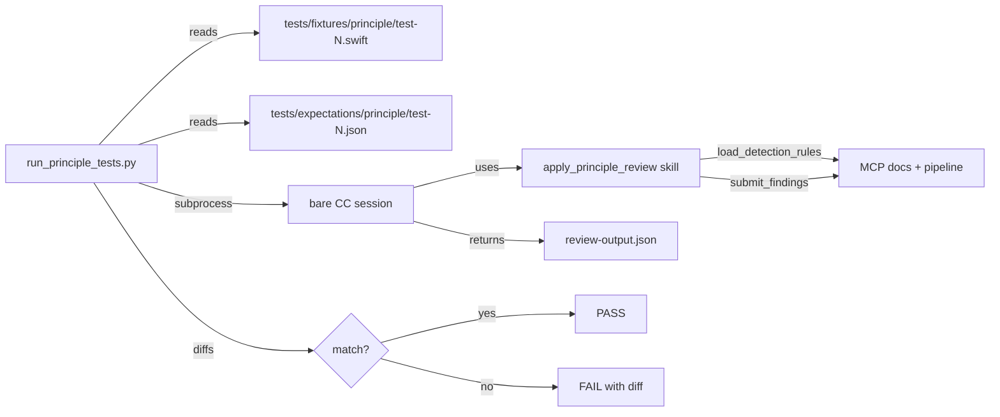
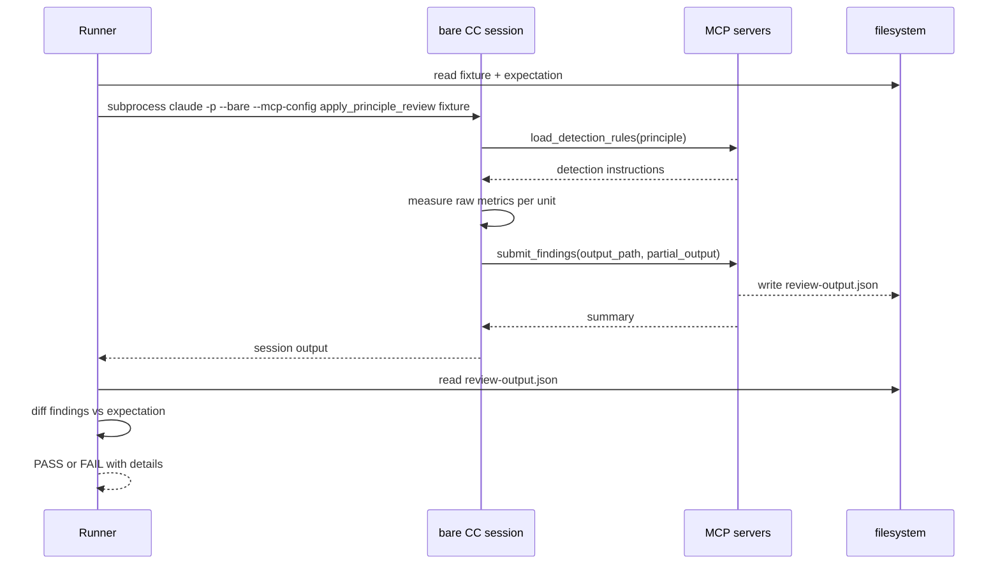

# Principle Review Test Harness

## Description

A generic reusable test harness end-to-end to validate apply-principle-review flow and health-check
## Input / Output

|        | Detail |
|--------|--------|
| Input | Blind fixture files and their paired expectation files under `tests/` (mirroring `references/`; see Folder Convention) — each finding specifies metric ID, severity, unit name, and the expected raw metric key-value pairs measured by the LLM |
| Output | Pass/fail per fixture with detailed diff on failure: principle, metric ID, fixture path, expected vs actual findings (including which metric values or severity differed) |

## User Stories

### Story 1 — Per-principle fixture tests

As a developer I need a pipeline that can run tests for specific principle in reference folder (can be solid, can be ui tests, can be testing) so I can validate how the system 
performs

**Acceptance Criteria:**
- AC1: I can pass mode health check or principle review and the pipeline will select what to test
- AC2: I can pass config file or it can use solid-coder.config.tomt file to decide what model to use as health checker.
- AC3: I can specify which principle and metric to test.
- AC4: When no principle passed, the test runs against all principles.
- AC5: When principle passed and not metrics specificed, 
- AC6: Fixture files contain no comments, variable names, or type names that encode or hint at the expected severity or metric — the LLM must detect from code structure alone
- AC7: We pass file for review and expected principle and metric 
- AC8: If only file passed the system assumes that it's tested against all principles and all metrics

### Story 2 — Full-pipeline test


**Acceptance Criteria:**
- AC1: A multi-violation fixture file exists that contains distinct violations triggerable by at least two different principles
- AC2: When the full-pipeline test runs, each active principle is scored independently against the fixture
- AC3: Each principle's findings are compared against its own expectation file — a failure in one principle does not mask failures in another
- AC4: The test output reports pass/fail per principle with the same detailed diff format as Story 1

### Story 3 — Failure diagnostics

As a developer, when a fixture test fails because actual findings differ from expected, the failure output is precise enough to identify the exact detection instruction in rule.md that needs tightening — without requiring manual investigation.

**Acceptance Criteria:**
- AC1: Every test failure output includes: principle name, metric ID, fixture file path, expected findings (as listed in the expectation file), and actual findings (as returned by the session)
- AC2: When a bare CC session times out, the failure output includes the fixture path and the timeout duration
- AC3: The failure format is consistent — the same structure for missing findings, unexpected findings, and timeout failures

## Connects To

| Relationship | Target | Notes |
|---|---|---|
| Validates | `skills/apply-principle-review/SKILL.md` | The skill being exercised end-to-end |
| Reads (detection source) | `references/principles/*/rule.md` | Detection instructions tightened when tests fail |
| New directory | `tests/fixtures/<principle>/` | Blind Swift fixture files, one per severity band per principle |
| New directory | `tests/<category>/<principle>/expectations/` | Expectation files paired to fixtures by stem, holding expected findings |
| New file | `tests/run_principle_tests.py` | Test runner — invokes bare CC session per fixture, diffs output |
| Requires | MCP config with docs + pipeline servers | Same servers used in production pipeline |
| Blocked by | SPEC-012 — LLM measures, MCP scores | Tests validate the new scoring flow introduced in SPEC-012 |

## Diagrams

### Connection Diagram



### Sequence Diagram — per-fixture test run



## Technical Requirements

- Fixture files must be syntactically valid Swift files that compile without errors. They must not contain comments or identifiers that encode the expected severity or metric (e.g. a class named `SevereViolation` is not acceptable).
- Expectation files are JSON. Each file contains a `findings` array where each entry specifies `metric_id`, `severity`, `unit_name`, and a `metrics` object with the expected raw measurement key-value pairs. Example: `{"findings": [{"metric_id": "SRP-2", "severity": "SEVERE", "unit_name": "DataManager", "metrics": {"cohesion_groups": 2}}]}`. The `metrics` field enables distinguishing a measurement failure (LLM counted wrong) from a scoring failure (MCP applied wrong band).
- The test runner compares actual vs expected findings using set equality (order-insensitive). Extra findings in the actual output fail the test.
- The bare CC session timeout is configurable; the default for the test harness is 120 seconds per fixture.
- Initial fixture coverage: one fixture per severity band (COMPLIANT, MINOR where the band exists, SEVERE) for each always-active principle (SRP, OCP, ISP, LSP, DRY, code-smells). The multi-violation full-pipeline fixture covers at least two principles.

## Test Plan

### Integration Tests — run_principle_tests.py

- When a fixture whose expectation specifies SRP-2 SEVERE with `cohesion_groups: 2` is reviewed, the test passes only if the output contains a finding with metric_id SRP-2, severity SEVERE, the expected unit name, and `cohesion_groups: 2` in the metrics section
- When output reports correct severity but wrong metric values (e.g. `cohesion_groups: 3` when `2` is expected), the test fails and the message shows the metric value diff
- When a fixture whose expectation specifies COMPLIANT is reviewed and the output contains no findings, the test passes
- When the output contains a finding not in the expectation file, the test fails and the failure message names the unexpected finding's metric_id, severity, and unit_name
- When the expectation specifies a finding the output does not contain, the test fails and the failure message names the missing metric_id
- When findings match in reverse order from the expectation, the test passes (order-insensitive)
- When the bare CC session exceeds the timeout, the test fails with the fixture path and timeout duration in the message
- When the full-pipeline test runs, each principle's findings are compared independently and the report lists pass/fail per principle

## Folder Convention

`tests/` mirrors `references/` exactly:

```
tests/
  principles/SRP/ OCP/ ISP/ LSP/ DRY/ code-smells/
  coding/apple/SwiftUI/ StructuredConcurrency/
  testing/unit/swift/
  validators/apple/ui-testing/
```

Each principle folder contains:
- `fixtures/fixture-N.<ext>` — blind code, no violation hints in filenames or identifiers
- `expectations/fixture-N.json` — paired to its fixture by shared stem; `{"findings": [{metric_id, severity, unit_name, metrics}]}`

Discovery is convention-based — no manifest file. The principle is derived from the folder path;
flow, backend, and timeout are CLI flags. See SPEC-014 for the harness contract.

## Subtasks

| # | Spec | Scope | Status |
|---|------|-------|--------|
| 1 | SPEC-014 | Harness infrastructure — CLI runner, harness package, convention-based discovery | draft |
| 2 | SPEC-015 | SRP fixtures + expectations (migrates existing srp2-severe.swift) | draft |
| 3 | SPEC-016 | OCP fixtures + expectations | draft |
| 4 | SPEC-017 | ISP fixtures + expectations | draft |
| 5 | SPEC-018 | LSP fixtures + expectations | draft |
| 6 | SPEC-019 | DRY fixtures + expectations | draft |
| 7 | SPEC-020 | code-smells fixtures + expectations | draft |
| 8 | SPEC-021 | multi-violation fixture + expectations (SRP + OCP) | draft |
| 9 | SPEC-022 | SwiftUI fixtures + expectations | draft |
| 10 | SPEC-023 | StructuredConcurrency fixtures + expectations | draft |
| 11 | SPEC-024 | unit testing fixtures + expectations | draft |
| 12 | SPEC-025 | UI testing fixtures + expectations | draft |

## Definition of Done

- [ ] SPEC-014 done — harness infrastructure complete
- [ ] SPEC-015 through SPEC-021 done — all always-active principles + multi-violation
- [ ] SPEC-022 through SPEC-025 done — all conditional principles
- [ ] `run_principle_tests.py` exits 0 for all principles
- [ ] Reasoning files written for every test run
