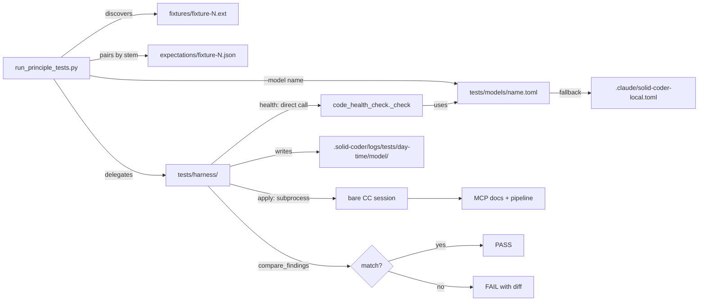
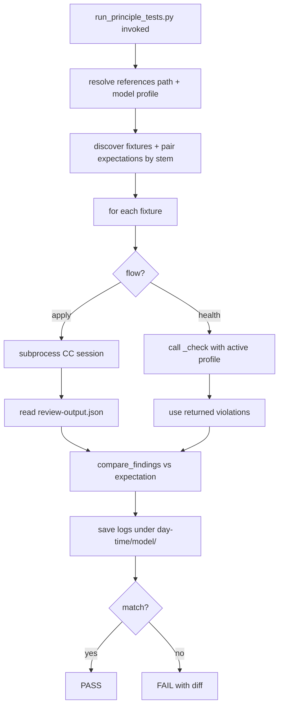
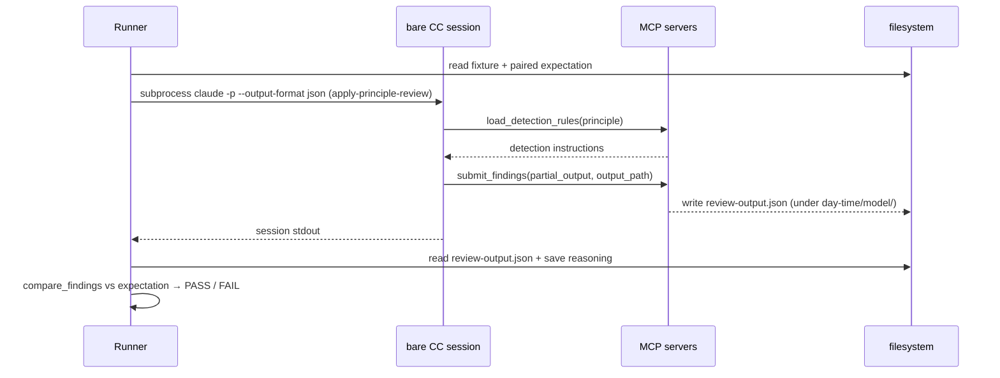

# Principle Test Harness — Infrastructure

## Description

Build the generic, reusable test-runner infrastructure that drives every principle integration
test. Establishes the `tests/` tree mirroring `references/`, a convention that auto-discovers each
fixture and pairs it with its expectation file by name, and a standalone CLI runner that executes
each fixture through the apply-principle-review and health-check flows. The same fixtures run
against different model profiles (each a `tests/models/<name>.toml`) by naming the profile at the
CLI, with outputs timestamped and namespaced per profile. No fixture or expectation files are
authored here — structure and machinery only; fixtures arrive in SPEC-015 onward.

## Input / Output

|   | Detail |
|---|--------|
| Input | `tests/<category-path>/fixtures/fixture-N.<ext>` (blind code); `tests/<category-path>/expectations/fixture-N.json` (paired by stem); optional `tests/models/<name>.toml` model profile; CLI flags select principle, flow, fixture, model, mode, timeout |
| Output | `run_principle_tests.py` exits 0/1 with a PASS/FAIL line per fixture+flow (line names the model); raw flow output saved to `.solid-coder/logs/tests/<day-time>/<model>/<category-path>/<fixture-stem>-<flow>.txt` (a fresh timestamped run dir each invocation). Consumed by the developer at the terminal and by SPEC-015+ which add fixtures/expectations under the `tests/` tree. |

## User Stories

### Story 1 — CLI runner discovers fixtures and executes the selected flows

As the system, when `run_principle_tests.py` is invoked with a references path, it resolves the
matching `tests/` folder, discovers every fixture, pairs each with its expectation by name, runs
the selected flow(s) under the resolved model profile, and reports PASS/FAIL per fixture+flow with
raw output saved to disk.

**Acceptance Criteria:**
- AC1: `--principle references/principles/SRP` (or any valid `references/` path) maps to the
  same-suffix `tests/` path and discovers every `fixtures/fixture-N.<ext>`, pairing each with
  `expectations/<same-stem>.json`.
- AC2: `--flow apply` runs apply-principle-review via a subprocess CC session; `--flow health`
  calls the health `_check()` directly; omitting `--flow` runs both flows.
- AC3: `--fixture fixture-1.swift` restricts the run to that single fixture.
- AC4: `--model <name>` loads `tests/models/<name>.toml` as the complete model profile for the
  run (backend, model name, host, inference params). Omitting `--model` uses the project
  `.claude/solid-coder-local.toml` as-is. Adding a new provider means creating a new
  `tests/models/<name>.toml` — no code change required.
- AC5: `--mode direct|e2e` selects invocation depth; default `direct`. `direct` is implemented;
  `e2e` is reserved — the flag is accepted but prints `"e2e mode not yet implemented"` to stderr
  and exits 1.
- AC6: Exit code is 0 when all selected fixtures pass, 1 when any fail.
- AC7: Per-fixture line names the model and flow, e.g.
  `PASS [qwen] principles/SRP fixture-1.swift [health]` or
  `FAIL [claude] principles/SRP fixture-1.swift [apply] — see reasoning`.
- AC8: `--timeout N` overrides the default 120s per-fixture timeout.

### Story 2 — Fixtures pair with expectations by convention

As the system, each fixture is bound to its expected findings by a naming convention, and a
fixture with no expectation is a hard error rather than a silent skip.

**Acceptance Criteria:**
- AC1: `fixtures/fixture-1.swift` pairs with `expectations/fixture-1.json`; a fixture with no
  matching expectation file prints the missing path to stderr and exits 1.
- AC2: Expectation format is `{"findings": [{"unit_name": "X", "metric_id": "SRP-2", "severity": "SEVERE", "metrics": {"cohesion_groups": 2}}]}`;
  the `metrics` field is optional and skipped from comparison when absent.
- AC3: An expectation whose `findings` list is empty marks the fixture compliant; the test passes
  only if the flow reports no findings.
- AC4: Comparison is order-insensitive (set equality); an actual finding absent from the
  expectation fails the test.
- AC5: The apply flow asserts `unit_name` + `metric_id` + `severity` + `metrics` (when present).
  The health flow asserts only each violation's `principle` (strict — the health path carries no
  `metric_id`); the expected principle is the prefix of each expectation `metric_id` (e.g.
  `SRP-2` → `SRP`). There is no relaxation based on backend.

### Story 3 — Reasoning is always captured, per run and per model

As a developer, when any test runs (pass or fail), the raw flow output is saved to a timestamped
run directory under the active model's namespace so a measurement failure can be diagnosed, two
models compared on the same fixture, and runs compared over time without overwriting each other.

**Acceptance Criteria:**
- AC1: apply flow — the CC session stdout is saved to
  `.solid-coder/logs/tests/<day-time>/<model>/<category-path>/<fixture-stem>-apply.txt`.
- AC2: health flow — the violations list returned by `_check()` is serialized and saved to
  `.solid-coder/logs/tests/<day-time>/<model>/<category-path>/<fixture-stem>-health.txt`.
- AC3: `<day-time>` is a per-invocation run timestamp (e.g. `2026-06-01_14-30-05`); `<model>` is
  the `--model` profile name, or the `backend` value from the project toml when `--model` is
  omitted. Each run writes a fresh `<day-time>` directory (runs are preserved, not overwritten);
  within a run, different profiles write to separate `<model>` subdirectories.

### Story 4 — Failure output pinpoints the detection instruction

As a developer, when a fixture test fails the output names the principle, metric_id, fixture
path, expected vs actual findings, and labels measurement-vs-scoring failures — precise enough
to find the `rule.md` instruction to tighten.

**Acceptance Criteria:**
- AC1: Missing finding: `MISSING: unit=X metric_id=Y severity=Z`.
- AC2: Unexpected finding: `UNEXPECTED: unit=X metric_id=Y severity=Z`.
- AC3: Metric value mismatch: `METRIC DIFF: cohesion_groups expected=2 actual=1 [MEASUREMENT FAILURE]`.
- AC4: Timeout: `TIMEOUT: <fixture_path> after <N>s`.
- AC5: The reasoning file path is included in every failure line.

## Technical Requirements

- `tests/` mirrors `references/` exactly. Path mapping: a `references/<suffix>` argument resolves
  to `tests/<suffix>` (e.g. `references/principles/SRP` → `tests/principles/SRP`;
  `references/coding/apple/SwiftUI` → `tests/coding/apple/SwiftUI`).
- Discovery is convention-based — **no manifest file and no YAML**. A fixture
  `fixtures/fixture-N.<ext>` is bound to `expectations/fixture-N.json` by shared stem. The
  principle is derived from the folder path; flow, model, mode, and timeout come from CLI flags.
  No new third-party dependency is introduced — the harness uses only the Python standard library
  (`subprocess`, `json`, `pathlib`, `argparse`, `unittest`) plus `hook_utils.load_toml` for TOML
  parsing (which already handles the `tomllib`/`tomli` backport split at Python 3.9).
- Fixtures: `fixtures/fixture-N.<ext>` — numeric names only, no violation hints in filenames or
  identifiers.
- Expectations: JSON at `expectations/<stem>.json`, format
  `{"findings": [{"unit_name", "metric_id", "severity", "metrics"?}]}`; `metrics` optional. The
  metric_ids named in a fixture's expectation define what that fixture tests — no separate metric
  selector is needed.
- Model profiles live in `tests/models/<name>.toml`. Each file is a complete `[llm]` (and
  optionally `[inference]`) block specifying `backend`, `model`, `host`, etc., loaded via
  `hook_utils.load_toml`. `--model <name>` loads that file as the active profile; the harness
  injects it into `hooks/hc_config.py` via the `SOLID_CODER_TEST_MODEL_PROFILE` environment
  variable (set to the resolved absolute path of the profile file before calling `_check()`) so
  `_check()` uses the profile's backend without mutating the project
  `.claude/solid-coder-local.toml`. `hc_config._read_config_file` checks this variable first and
  loads the override path when set. When `--model` is omitted, the project toml is used as-is and
  the resolved `backend` value names the output directory. Adding a new backend/provider means
  creating a new profile file — no code change required.
- Output namespacing: reasoning files and the intermediate `review-output.json` are written under
  `.solid-coder/logs/tests/<day-time>/<model>/` so different runs and different models never
  overwrite each other. `<day-time>` is a per-invocation run timestamp; `<model>` is the
  `--model` profile name, or the resolved `backend` value from the project toml. `.solid-coder/`
  is a runtime artifact directory and must be gitignored (it is distinct from the existing
  underscore `.solid_coder/` pipeline-output directory).
- Invocation depth: `--mode direct|e2e` (default `direct`). `direct` runs the health flow via
  `_check()` and the apply flow via a bare apply-principle-review session, as specified here.
  `e2e` (write-file-triggers-the-PreToolUse-gate for health; full `/review` for apply) is reserved
  — the flag is accepted but prints `"e2e mode not yet implemented"` to stderr and exits 1; its
  implementation is a follow-up spec. Both modes share one fixture/expectation set.
- apply flow: invokes `skills/apply-principle-review/SKILL.md` via a subprocess CC session run
  from the project root using `hook_utils.run_claude_bare`, which calls
  `claude -p <prompt> --output-format json --bare --mcp-config <json_string>` (confirmed flags;
  `--mcp-config` takes an inline JSON string, not a file path). The `<json_string>` is an
  `mcpServers` block wiring two stdio servers — `docs` → `python3 mcp-server/server.py` and
  `pipeline` → `python3 mcp-server/pipeline/server.py` (the same two servers
  `hooks/code_health_check.py` wires). Before invoking, the runner builds a
  minimal `review-input.json` for the fixture (one file, a single whole-file unit with
  `has_changes: true`) per the prepare-review-input schema. The `<prompt>` invokes the
  `apply-principle-review` skill following its argument contract (`<principle-folder> <code-files>`
  — see `skills/apply-principle-review/SKILL.md`): the derived principle folder, the
  `review-input.json` path, and an absolute `output_path`. `submit_findings` writes
  `review-output.json` to that `output_path`, co-located under the run's
  `.solid-coder/logs/tests/<day-time>/<model>/` directory; the runner reads it back once. The
  apply flow runs in a Claude CC session (model-invariant in v1).
- health flow: calls `hooks/code_health_check._check(content, path, language, parent_session_id)`
  directly, where `content` is the fixture file's text, `path` is its absolute path, `language`
  is derived from the file extension via `code_health_check.SUPPORTED_EXTENSIONS` (e.g. `.swift`
  → `"Swift"`), and `parent_session_id` is `""` (no parent session in the test harness). The function returns a list of violation objects (each carrying
  `principle`, `issue`, and `fix` fields) or `None`/empty for compliant fixtures; the harness
  consumes this list directly without re-parsing. The backend/model comes from the active model
  profile via `SOLID_CODER_TEST_MODEL_PROFILE`. The same `expectations/fixture-N.json` serves
  both flows; for the health flow the comparison reduces each expected finding to the `principle`
  prefix of its `metric_id` (e.g. `SRP-2` → `SRP`) and compares the resulting principle set
  strictly. The apply flow uses the full `metric_id`.
- The harness provides two invoker functions: one that runs a fixture through the apply flow and
  one through the health flow. Both return a findings list on success, raise `TimeoutError` on
  timeout, and raise `RuntimeError` on infrastructure failure (subprocess error, unreadable
  output file, etc.). The caller (`run_principle_tests.py`) catches these and emits the
  corresponding TIMEOUT or FAIL line.
- The harness provides a diff computation function and a formatting function. The diff function
  compares expected and actual findings order-insensitively (set equality) and returns a list of
  MISSING, UNEXPECTED, and METRIC DIFF entries. The formatting function renders per-fixture status
  lines (Story 1 AC7 format) and failure detail lines (Story 4 format) including the reasoning
  file path.
- Default per-fixture timeout is 120s, configurable via `--timeout`.
- Harness code lives in a `tests/harness/` package; the CLI entry point is
  `tests/run_principle_tests.py`. The harness's own unit tests use `unittest` and are runnable via
  `python3 -m unittest discover` under `tests/harness/tests/`. The `hc_config` seam change is
  covered by the existing `hooks/tests/` suite. No pytest test files or marks are introduced in
  this subtask.
- Multi-principle fixtures are out of scope and deferred to SPEC-021.

## Connects To

| Relationship | Target | Notes |
|---|---|---|
| Implements | SPEC-013 — principle-review-test-harness | Core deliverable of this subtask |
| Required by | SPEC-015 through SPEC-025 | All fixture subtasks depend on this infrastructure |
| Invokes | `skills/apply-principle-review/SKILL.md` | Subprocess CC session for the apply flow |
| Invokes | `hooks/code_health_check._check()` | Direct call for the health flow; returns `[{principle, issue, fix}]` |
| Modifies (testability seam) | `hooks/hc_config.py` | Read `SOLID_CODER_TEST_MODEL_PROFILE` env var (absolute path to profile toml) to override the active config without mutating the project toml |
| Reads | `tests/models/<name>.toml` | Model profiles; absent → falls back to project toml |
| Reads | `.claude/solid-coder-local.toml` | Project model config fallback |
| Activates | `mcp-server/server.py` (docs) + `mcp-server/pipeline/server.py` (pipeline) | MCP servers for the apply-flow CC session |
| Writes | `.solid-coder/logs/tests/<day-time>/<model>/` | Reasoning + review-output, timestamped per run, per model (gitignored) |

## Diagrams

### Connection Diagram

### Flow Diagram

### Sequence Diagram — apply flow per fixture

## Test Plan

### Unit Tests — harness.compare_findings
- When expected and actual finding sets are identical, returns no diff.
- When actual contains a finding absent from expected, returns an UNEXPECTED entry.
- When expected contains a finding absent from actual, returns a MISSING entry.
- When a matched finding's metric value differs, returns a METRIC DIFF entry labelled
  MEASUREMENT FAILURE.
- When expected and actual are both empty, passes (compliant fixture).
- When findings match in reverse order, passes (order-insensitive).

### Unit Tests — discovery / pairing
- When a fixture has a same-stem expectation, the pair is discovered.
- When a fixture has no matching expectation file, raises a clear error naming the expected path.
- When an expectation's `findings` list is empty, the pair is treated as a compliant expectation.

### Unit Tests — model profile loading
- When `--model qwen` is given and `tests/models/qwen.toml` exists, its `[llm]` values are used.
- When `--model <name>` is given and the profile file does not exist, raises a clear error naming
  the expected path.
- When `--model` is omitted, the project `.claude/solid-coder-local.toml` is used and the
  resolved `backend` value names the output directory.

### Unit Tests — output namespacing
- When the same fixture runs under two profiles in one run, reasoning is written to two `<model>`
  subdirectories under the same `<day-time>` run dir.
- When the harness runs twice, each invocation writes a separate `<day-time>` directory (runs are
  preserved, not overwritten).

### Unit Tests — mode + path resolution
- When `--mode e2e` is passed, the runner exits with the deferral message; default is `direct`.
- When given `references/principles/SRP`, resolves to `tests/principles/SRP`.
- When given `references/coding/apple/SwiftUI`, resolves to `tests/coding/apple/SwiftUI`.

### Integration — run_principle_tests.py (manual, requires CC + MCP servers)
- When a fixture's expectation matches the apply-flow output, the run exits 0.
- When the expectation names a finding the output omits, the run exits 1 with a MISSING line.
- When a fixture exceeds the timeout, the run exits 1 with a TIMEOUT line naming the fixture path
  and duration.
- When the same SRP fixture runs under `--model claude` and `--model qwen`, each writes reasoning
  to its own `.solid-coder/logs/tests/<day-time>/<model>/` directory.

## Definition of Done

- [ ] `tests/` tree exists mirroring `references/` (`principles/`, `coding/`, `testing/`, `validators/`).
- [ ] `tests/models/` directory exists with at least `claude.toml` as an example profile.
- [ ] `tests/harness/` package provides: fixture↔expectation discovery, references→tests path
      resolver, model-profile loading, diff computation (order-insensitive set equality with
      MISSING/UNEXPECTED/METRIC DIFF entries), output formatting (per-fixture status line +
      failure detail lines), apply-flow invoker, health-flow invoker.
- [ ] `hooks/hc_config.py` gains a testability seam: reads `SOLID_CODER_TEST_MODEL_PROFILE` env var
      (absolute path to a profile toml) and uses it as the active config when set; covered by the
      existing `hooks/tests/` suite.
- [ ] `tests/run_principle_tests.py` accepts `--principle`, `--flow`, `--fixture`, `--model`,
      `--mode`, `--timeout`, and auto-discovers fixtures.
- [ ] `--mode e2e` is accepted and exits with a clear deferral message (e2e is a follow-up spec).
- [ ] Reasoning + intermediate review-output are written under
      `.solid-coder/logs/tests/<day-time>/<model>/` on a real run; `.solid-coder/` is gitignored.
- [ ] The fixture/expectation convention and model-profile mechanism are documented (short README
      in `tests/`).
- [ ] Harness, discovery, profile-loading, and namespacing unit tests pass via
      `python3 -m unittest discover`.
