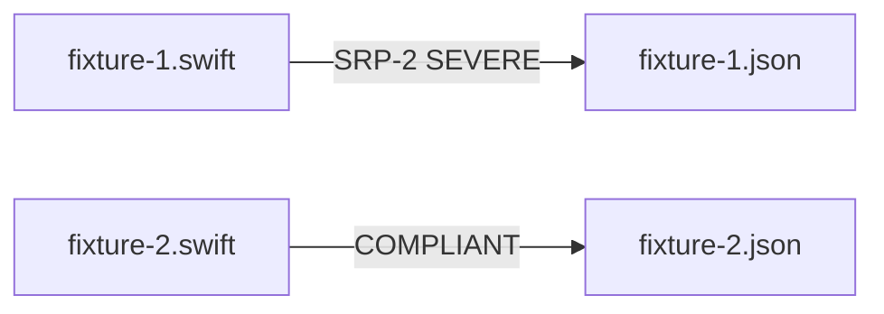

# SRP — Fixtures and Expectations

## Description

Create the SRP fixture files and their paired expectation files under `tests/principles/SRP/`. Migrates the existing `tests/fixtures/SRP/srp2-severe.swift` to the new structure. The SRP fixtures serve as the reference implementation validating the SPEC-014 runner works end-to-end for both flows.

## Input / Output

|   | Detail |
|---|--------|
| Input | `references/principles/SRP/rule.md` — metric definitions and severity bands (SRP-1 verb_count, SRP-2 cohesion_groups, SRP-3 stakeholder_count) |
| Output | `tests/principles/SRP/fixtures/fixture-N.swift`, `tests/principles/SRP/expectations/fixture-N.json` (stem-paired) |

## User Stories

### Story 1 — SRP fixtures cover all severity bands

As the system, when `run_principle_tests.py --principle references/principles/SRP` is run, each fixture produces the findings listed in its paired expectation file for both apply-principle-review and health-check flows.

**Acceptance Criteria:**
- AC1: `fixture-1.swift` — class with 2 disjoint cohesion groups; expectation: SRP-2 SEVERE `cohesion_groups: 2`
- AC2: `fixture-2.swift` — single-concern class; expectation: empty findings (COMPLIANT)
- AC3: Fixture filenames contain no violation hints — no metric IDs, severity words, or principle names in the code or type names
- AC4: Both apply and health flows are exercised via the runner's `--flow` flag (default runs both)
- AC5: `run_principle_tests.py --principle references/principles/SRP` exits 0

## Technical Requirements

- Migrate `tests/fixtures/SRP/srp2-severe.swift` → `tests/principles/SRP/fixtures/fixture-1.swift` (rename only, content unchanged)
- `tests/fixtures/SRP/` directory may be removed after migration
- Expectation format: `{"findings": [{"unit_name": "...", "metric_id": "SRP-2", "severity": "SEVERE", "metrics": {"cohesion_groups": 2}}]}`
- Compliant fixture expectation: `{"findings": []}`
- Expectations are paired to fixtures by filename stem (`fixture-1.swift` ↔ `fixture-1.json`); the apply flow reviews the entire file (`changed_ranges: null`)
- SRP-2 is the primary metric targeted; SRP-1 and SRP-3 may also appear if the fixture triggers them, and expectations must match exactly

## Connects To

| Relationship | Target | Notes |
|---|---|---|
| Depends on | SPEC-014 — harness infrastructure | Runner and expectation format must exist |
| Validates | `references/principles/SRP/rule.md` | Detection instructions confirmed via passing tests |

## Diagrams

## Test Plan

### Integration Tests — run_principle_tests.py (requires INTEGRATION=1)
- When fixture-1.swift is reviewed for SRP, output contains SRP-2 SEVERE with cohesion_groups: 2
- When fixture-2.swift is reviewed for SRP, output contains no findings
- When both flows run on fixture-1.swift, both apply-review and health-check detect the violation

## Definition of Done

- [x] `tests/principles/SRP/fixtures/fixture-1.swift` — 2-cohesion-group class, no violation hints
- [x] `tests/principles/SRP/fixtures/fixture-2.swift` — single-concern class, no violation hints
- [x] `tests/principles/SRP/expectations/fixture-1.json` — SRP-2 SEVERE finding with metrics
- [x] `tests/principles/SRP/expectations/fixture-2.json` — empty findings
- [ ] `run_principle_tests.py --principle references/principles/SRP` exits 0
