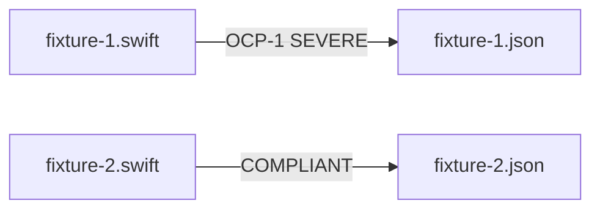

# OCP — Fixtures and Expectations

## Description

Create stem-paired OCP fixture and expectation files under `tests/principles/OCP/`. Covers the OCP-1 sealed variation point metric (SEVERE) and a protocol-injected compliant example.

## Input / Output

|   | Detail |
|---|--------|
| Input | `references/principles/OCP/rule.md` — OCP-1 sealed_variation_points, OCP-2 testability metrics |
| Output | `tests/principles/OCP/fixtures/fixture-N.swift` paired with `tests/principles/OCP/expectations/fixture-N.json` |

## User Stories

### Story 1 — OCP fixtures cover sealed-point violation and compliant injection

As the system, when `run_principle_tests.py --principle references/principles/OCP` runs, each fixture produces findings matching its expectation for both flows.

**Acceptance Criteria:**
- AC1: `fixture-1.swift` — class with at least one internally constructed, non-helper, non-factory concrete dependency; expectation: OCP-1 SEVERE
- AC2: `fixture-2.swift` — same class refactored with protocol-typed injected dependencies; expectation: empty findings
- AC3: No violation hints in fixture filenames or type names
- AC4: `run_principle_tests.py --principle references/principles/OCP` exits 0

## Technical Requirements

- OCP expectations record the deterministic server-scored result produced from the measured raw metrics
- Expectation `metrics` field is optional for OCP; include if the LLM reliably reports a count
- Helper exceptions (DateFormatter, JSONEncoder, etc.) must NOT be the sealed point — use a business-logic dependency

## Connects To

| Relationship | Target | Notes |
|---|---|---|
| Depends on | SPEC-014 — harness infrastructure | |
| Validates | `references/principles/OCP/rule.md` | |

## Diagrams

## Test Plan

### Integration Tests (requires INTEGRATION=1)
- When fixture-1.swift is reviewed for OCP, output contains OCP-1 SEVERE
- When fixture-2.swift is reviewed for OCP, output contains no findings

## Definition of Done

- [x] `tests/principles/OCP/fixtures/fixture-1.swift` — sealed-point violation, no hints
- [x] `tests/principles/OCP/fixtures/fixture-2.swift` — protocol-injected, no hints
- [x] `tests/principles/OCP/expectations/fixture-1.json`
- [x] `tests/principles/OCP/expectations/fixture-2.json`
- [ ] `run_principle_tests.py --principle references/principles/OCP` exits 0
