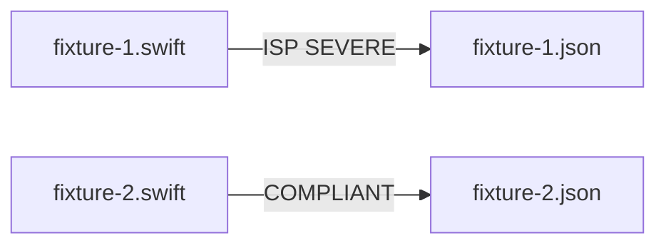

# ISP — Fixtures and Expectations

## Description

Create stem-paired ISP fixture and expectation files under `tests/principles/ISP/`. Targets the fat-protocol / low-conformer-coverage violation (SEVERE) and a focused protocol (COMPLIANT).

## Input / Output

|   | Detail |
|---|--------|
| Input | `references/principles/ISP/rule.md` — protocol_width, conformer_coverage, protocol_cohesion metrics |
| Output | `tests/principles/ISP/fixtures/fixture-N.swift` paired with `tests/principles/ISP/expectations/fixture-N.json` |

## User Stories

### Story 1 — ISP fixtures cover fat-protocol violation and narrow compliant protocol

As the system, when `run_principle_tests.py --principle references/principles/ISP` runs, each fixture produces findings matching its expectation.

**Acceptance Criteria:**
- AC1: `fixture-1.swift` — protocol with 8+ methods where at least one conformer stubs 4+ methods (coverage below 60%); expectation: ISP SEVERE
- AC2: `fixture-2.swift` — focused 3-method protocol with full conformer; expectation: empty findings
- AC3: No violation hints in names or filenames
- AC4: `run_principle_tests.py --principle references/principles/ISP` exits 0

## Technical Requirements

- ISP expectations record deterministic server scoring from the measured raw metrics
- Stubbed methods: empty body `{}` or trivial `return []` / `return nil` — not real implementations

## Connects To

| Relationship | Target | Notes |
|---|---|---|
| Depends on | SPEC-014 | |
| Validates | `references/principles/ISP/rule.md` | |

## Diagrams

## Test Plan

### Integration Tests (requires INTEGRATION=1)
- When fixture-1.swift is reviewed for ISP, output contains ISP SEVERE finding
- When fixture-2.swift is reviewed for ISP, output contains no findings

## Definition of Done

- [x] `tests/principles/ISP/fixtures/fixture-1.swift`
- [x] `tests/principles/ISP/fixtures/fixture-2.swift`
- [x] `tests/principles/ISP/expectations/fixture-1.json`
- [x] `tests/principles/ISP/expectations/fixture-2.json`
- [ ] `run_principle_tests.py --principle references/principles/ISP` exits 0
