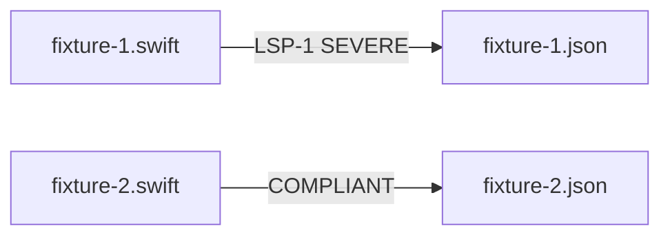

# LSP — Fixtures and Expectations

## Description

Create stem-paired LSP fixture and expectation files under `tests/principles/LSP/`. Targets the LSP-1 type-check dispatch violation (SEVERE) and a polymorphic compliant example.

## Input / Output

|   | Detail |
|---|--------|
| Input | `references/principles/LSP/rule.md` — type_checking, contract_compliance, empty_methods metrics |
| Output | `tests/principles/LSP/fixtures/fixture-N.swift` paired with `tests/principles/LSP/expectations/fixture-N.json` |

## User Stories

### Story 1 — LSP fixtures cover type-check dispatch and polymorphic compliant

As the system, when `run_principle_tests.py --principle references/principles/LSP` runs, each fixture produces findings matching its expectation.

**Acceptance Criteria:**
- AC1: `fixture-1.swift` — function using `as?` casts to dispatch differently per subtype; expectation: LSP-1 SEVERE
- AC2: `fixture-2.swift` — same dispatch via protocol method, no casts; expectation: empty findings
- AC3: No violation hints in names or filenames
- AC4: `run_principle_tests.py --principle references/principles/LSP` exits 0

## Technical Requirements

- LSP expectations record deterministic server scoring from the measured raw metrics
- Framework-forced casts (e.g. `response as? HTTPURLResponse`) are exceptions per rule.md — do NOT use these in fixture-1; use user-defined class hierarchy

## Connects To

| Relationship | Target | Notes |
|---|---|---|
| Depends on | SPEC-014 | |
| Validates | `references/principles/LSP/rule.md` | |

## Diagrams

## Test Plan

### Integration Tests (requires INTEGRATION=1)
- When fixture-1.swift is reviewed for LSP, output contains LSP-1 SEVERE
- When fixture-2.swift is reviewed for LSP, output contains no findings

## Definition of Done

- [x] `tests/principles/LSP/fixtures/fixture-1.swift`
- [x] `tests/principles/LSP/fixtures/fixture-2.swift`
- [x] `tests/principles/LSP/expectations/fixture-1.json`
- [x] `tests/principles/LSP/expectations/fixture-2.json`
- [ ] `run_principle_tests.py --principle references/principles/LSP` exits 0
