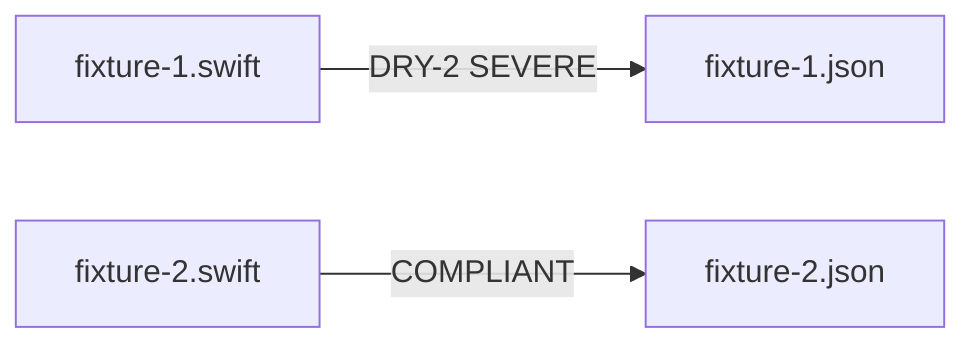

# DRY — Fixtures and Expectations

## Description

Create stem-paired DRY fixture and expectation files under `tests/principles/DRY/`. Targets the DRY-2 inlined-duplication metric (SEVERE) and a shared-abstraction compliant example.

## Input / Output

|   | Detail |
|---|--------|
| Input | `references/principles/DRY/rule.md` — reuse_misses, inlined_duplications, missing_abstractions metrics |
| Output | `tests/principles/DRY/fixtures/fixture-N.swift` paired with `tests/principles/DRY/expectations/fixture-N.json` |

## User Stories

### Story 1 — DRY fixtures cover inlined duplication and shared abstraction

As the system, when `run_principle_tests.py --principle references/principles/DRY` runs, each fixture produces findings matching its expectation.

**Acceptance Criteria:**
- AC1: `fixture-1.swift` — two functions with identical 6+ line logic blocks differing only in label/tag; expectation: DRY-2 SEVERE
- AC2: `fixture-2.swift` — same logic extracted to a shared private helper; expectation: empty findings
- AC3: No violation hints in names or filenames
- AC4: `run_principle_tests.py --principle references/principles/DRY` exits 0

## Technical Requirements

- DRY expectations record deterministic server scoring from the measured raw metrics
- The duplication in fixture-1 must be structural (same algorithm, not just similar variable names)
- Expectation `metrics` may include `inlined_duplications: 1` if LLM reliably reports it

## Connects To

| Relationship | Target | Notes |
|---|---|---|
| Depends on | SPEC-014 | |
| Validates | `references/principles/DRY/rule.md` | |

## Diagrams

## Test Plan

### Integration Tests (requires INTEGRATION=1)
- When fixture-1.swift is reviewed for DRY, output contains DRY-2 SEVERE
- When fixture-2.swift is reviewed for DRY, output contains no findings

## Definition of Done

- [x] `tests/principles/DRY/fixtures/fixture-1.swift`
- [x] `tests/principles/DRY/fixtures/fixture-2.swift`
- [x] `tests/principles/DRY/expectations/fixture-1.json`
- [x] `tests/principles/DRY/expectations/fixture-2.json`
- [ ] `run_principle_tests.py --principle references/principles/DRY` exits 0
