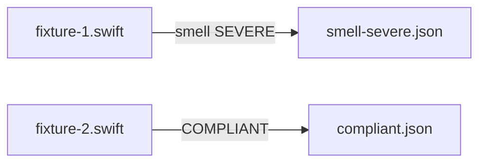

# code-smells — Fixtures and Expectations

## Description

Create code-smells fixture files, expectation manifests, and manifest.yaml under `tests/principles/code-smells/`. Targets at least one detectable code smell (SEVERE) and a clean compliant example.

## Input / Output

|   | Detail |
|---|--------|
| Input | `references/principles/code-smells/rule.md` and `references/principles/code-smells/code/instructions.md` — smell definitions |
| Output | `tests/principles/code-smells/fixtures/fixture-N.swift`, `tests/principles/code-smells/expectations/*.json`, `tests/principles/code-smells/manifest.yaml` |

## User Stories

### Story 1 — code-smells fixtures cover a detectable smell and clean code

As the system, when `run_principle_tests.py --principle references/principles/code-smells` runs, each fixture produces findings matching its expectation.

**Acceptance Criteria:**
- AC1: `fixture-1.swift` — code with at least one clearly detectable smell per rule.md; expectation: SEVERE finding with the smell's metric_id
- AC2: `fixture-2.swift` — clean code with no smells; expectation: empty findings
- AC3: No violation hints in names or filenames
- AC4: `run_principle_tests.py --principle references/principles/code-smells` exits 0

## Technical Requirements

- Read `references/principles/code-smells/code/instructions.md` to identify which smells are detectable
- Choose the smell with the clearest structural signature so the LLM reliably triggers it
- code-smells has no `review/` subfolder — health_check flow may not apply; manifest should only list apply_principle_review

## Connects To

| Relationship | Target | Notes |
|---|---|---|
| Depends on | SPEC-014 | |
| Validates | `references/principles/code-smells/rule.md` | |

## Diagrams

## Test Plan

### Integration Tests (requires INTEGRATION=1)
- When fixture-1.swift is reviewed for code-smells, output contains a SEVERE finding
- When fixture-2.swift is reviewed for code-smells, output contains no findings

## Definition of Done

- [ ] `tests/principles/code-smells/fixtures/fixture-1.swift`
- [ ] `tests/principles/code-smells/fixtures/fixture-2.swift`
- [ ] `tests/principles/code-smells/expectations/smell-severe.json`
- [ ] `tests/principles/code-smells/expectations/compliant.json`
- [ ] `tests/principles/code-smells/manifest.yaml`
- [ ] `run_principle_tests.py --principle references/principles/code-smells` exits 0
