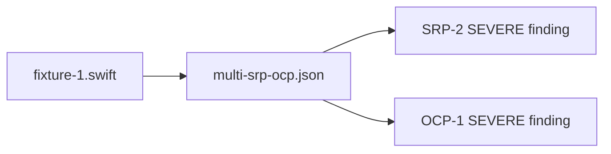

# Multi-Violation — Cross-Principle Fixture

## Description

Create a single Swift fixture that triggers violations in at least two always-active principles simultaneously, plus its expectation manifest and manifest.yaml under `tests/principles/multi-violation/`. Validates that per-principle findings are independent — a failure in one principle does not mask findings from another.

## Input / Output

|   | Detail |
|---|--------|
| Input | `references/principles/SRP/rule.md` and `references/principles/OCP/rule.md` — the two targeted principles |
| Output | `tests/principles/multi-violation/fixtures/fixture-1.swift`, `tests/principles/multi-violation/expectations/multi-srp-ocp.json`, `tests/principles/multi-violation/manifest.yaml` |

## User Stories

### Story 1 — Multi-violation fixture triggers SRP and OCP independently

As the system, when `run_principle_tests.py --principle references/principles/multi-violation` runs, the single fixture produces findings from both SRP and OCP, and each principle's findings are evaluated independently.

**Acceptance Criteria:**
- AC1: `fixture-1.swift` contains a class with 2 disjoint cohesion groups (SRP-2 SEVERE) AND at least one internally-constructed non-helper dependency (OCP-1 SEVERE)
- AC2: Expectation manifest lists both an SRP finding and an OCP finding
- AC3: For apply_principle_review flow: manifest runs the review twice — once for SRP, once for OCP — and both produce their respective findings
- AC4: For health_check flow: single `_check()` call produces violations for both principles
- AC5: No violation hints in fixture filename or type names
- AC6: `run_principle_tests.py --principle references/principles/multi-violation` exits 0

## Technical Requirements

- Manifest entry for apply_principle_review must specify which principle to run (SRP vs OCP separately)
- Multi-principle manifest entry format: each test entry specifies `principle` alongside `fixture` and `expectation`
- The expectation file contains findings from both principles; the comparison scopes by principle when evaluating
- Existing `tests/fixtures/multi-violation/multi.swift` may serve as the basis for `fixture-1.swift`

## Connects To

| Relationship | Target | Notes |
|---|---|---|
| Depends on | SPEC-014 — harness infrastructure | |
| Validates | SRP and OCP detection simultaneously | |

## Diagrams

## Test Plan

### Integration Tests (requires INTEGRATION=1)
- When fixture-1.swift is reviewed for SRP, output contains SRP-2 SEVERE
- When fixture-1.swift is reviewed for OCP, output contains OCP-1 SEVERE
- When fixture-1.swift is run through health check, violations for both principles appear
- When SRP finding is missing from output, failure message names SRP not OCP

## Definition of Done

- [ ] `tests/principles/multi-violation/fixtures/fixture-1.swift`
- [ ] `tests/principles/multi-violation/expectations/multi-srp-ocp.json`
- [ ] `tests/principles/multi-violation/manifest.yaml` with entries for SRP and OCP apply flows plus health flow
- [ ] `run_principle_tests.py --principle references/principles/multi-violation` exits 0
