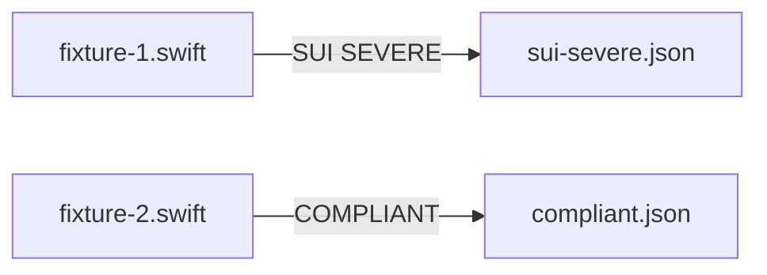

# SwiftUI — Fixtures and Expectations

## Description

Create SwiftUI fixture files, expectation manifests, and manifest.yaml under `tests/coding/apple/SwiftUI/` — mirroring `references/coding/apple/SwiftUI/`. Targets SwiftUI-specific best-practice violations (e.g. view purity SUI-2, modifier chain length SUI-3) and compliant examples.

## Input / Output

|   | Detail |
|---|--------|
| Input | `references/coding/apple/SwiftUI/rule.md` — SUI metrics and severity bands |
| Output | `tests/coding/apple/SwiftUI/fixtures/fixture-N.swift`, `tests/coding/apple/SwiftUI/expectations/*.json`, `tests/coding/apple/SwiftUI/manifest.yaml` |

## User Stories

### Story 1 — SwiftUI fixtures cover key best-practice violations

As the system, when `run_principle_tests.py --principle references/coding/apple/SwiftUI` runs, each fixture produces findings matching its expectation.

**Acceptance Criteria:**
- AC1: At least one SEVERE fixture targeting a documented SwiftUI metric (read rule.md to identify the primary one)
- AC2: At least one COMPLIANT fixture — clean SwiftUI view following all documented rules
- AC3: No violation hints in fixture filenames or type names
- AC4: `run_principle_tests.py --principle references/coding/apple/SwiftUI` exits 0
- AC5: Manifest activation tag `swiftui` is included so the principle is conditionally activated

## Technical Requirements

- SwiftUI fixtures must import SwiftUI and use SwiftUI types so the conditional tag detection triggers
- Read `references/coding/apple/SwiftUI/rule.md` to identify which metrics and severity bands exist before writing fixtures

## Connects To

| Relationship | Target | Notes |
|---|---|---|
| Depends on | SPEC-014 | |
| Validates | `references/coding/apple/SwiftUI/rule.md` | |

## Diagrams

## Test Plan

### Integration Tests (requires INTEGRATION=1)
- When fixture-1.swift is reviewed for SwiftUI, output contains a SEVERE finding
- When fixture-2.swift is reviewed for SwiftUI, output contains no findings

## Definition of Done

- [ ] `tests/coding/apple/SwiftUI/fixtures/fixture-1.swift` — SEVERE violation
- [ ] `tests/coding/apple/SwiftUI/fixtures/fixture-2.swift` — COMPLIANT
- [ ] `tests/coding/apple/SwiftUI/expectations/sui-severe.json`
- [ ] `tests/coding/apple/SwiftUI/expectations/compliant.json`
- [ ] `tests/coding/apple/SwiftUI/manifest.yaml`
- [ ] `run_principle_tests.py --principle references/coding/apple/SwiftUI` exits 0
