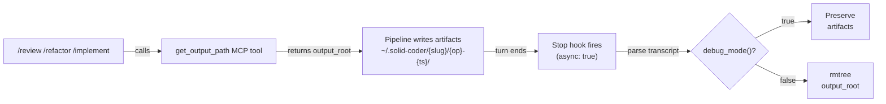
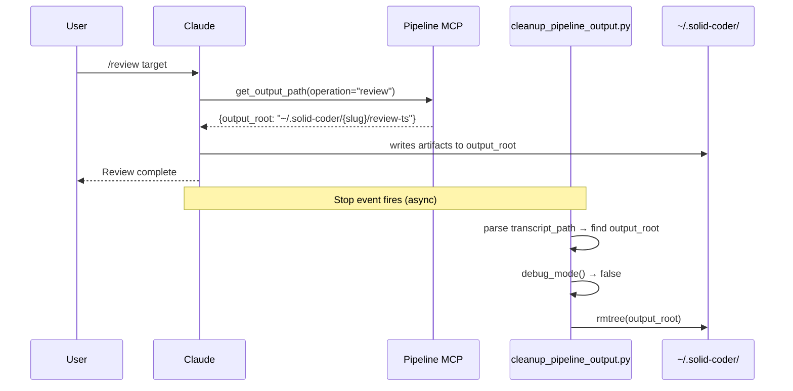

# Pipeline Output Cleanup via Async Stop Hook

## Description

When a developer runs `/review`, `/refactor`, or `/implement`, the pipeline writes intermediate artifacts (findings, plans, reports, arch files) to `~/.solid-coder/{project-slug}/{operation}-{timestamp}/`. These directories accumulate over time with no automatic cleanup. This feature adds an async `Stop` hook that fires after every assistant turn, parses the session transcript to find `get_output_path` MCP tool calls made during that turn, and deletes each returned `output_root` directory unless `debug_mode()` returns true. The hook runs in the background (`async: true`) so it never blocks the user from sending the next message.

## Input / Output

|   | Detail |
|---|--------|
| Input | Claude Code `Stop` hook event payload: `{ "transcript_path": "...", "cwd": "...", "session_id": "...", "stop_reason": "end_turn" \| "max_tokens" \| ... }` |
| Input | `solid-coder-local.toml` — `[llm] debug = true/false` read via `debug_mode()` in `hooks/hc_config_llm.py` |
| Output | Deleted directories: each `output_root` returned by `get_output_path` during the session turn, if `debug_mode()` is false |
| Output | Preserved directories: same paths, when `debug_mode()` is true |
| Side effect | Hook registered in `settings.json` under `Stop` with `async: true`; fires silently after every turn |

## User Stories

### Story 1 — Automatic cleanup after pipelines

As a developer, when I finish a `/review`, `/refactor`, or `/implement` command, I want the intermediate pipeline artifacts deleted automatically so `~/.solid-coder/` does not accumulate stale directories.

**Acceptance Criteria:**
- After `/review` completes, the directory `~/.solid-coder/{slug}/review-{ts}/` is removed within 5 seconds of the assistant turn ending.
- After `/refactor` completes, `~/.solid-coder/{slug}/refactor-{ts}/` is removed.
- After `/implement` completes, `~/.solid-coder/{slug}/implement-{spec}-{ts}/` is removed.
- If the transcript contains zero `get_output_path` calls, no directories are touched and the hook exits in under 50 ms.
- The hook does not delete the user's source code — only directories under `~/.solid-coder/`.
- A regular conversation turn (no pipeline tools called) results in no filesystem changes.

### Story 2 — Preserve artifacts during debugging

As a developer debugging the pipeline, when I set `[llm] debug = true` in `solid-coder-local.toml`, I want all pipeline output directories preserved so I can inspect metrics, plans, and review-output.json files.

**Acceptance Criteria:**
- When `debug_mode()` returns `true`, the hook exits without deleting any directories.
- When `debug_mode()` returns `false` (default), directories are deleted.
- The `debug` flag is read from `solid-coder-local.toml` on every hook invocation — changing the value takes effect on the next pipeline run without restarting Claude Code.
- Removing the `debug` key from the toml or setting it to `0` / `false` results in `debug_mode()` returning `false`.

## Technical Requirements

- **Hook script location:** `hooks/cleanup_pipeline_output.py` — follows the existing hook pattern (reads JSON event from stdin, exits 0 on success).
- **Transcript parsing:** read `transcript_path` JSONL line by line; find `tool_result` blocks whose content JSON contains an `output_root` key; collect all unique values. Do not fail if a line is malformed — skip it.
- **Deletion:** `shutil.rmtree(output_root, ignore_errors=True)` per path. Only delete paths that exist and are under `Path.home() / ".solid-coder"` — reject any other path as a safety guard.
- **Hook registration:** `settings.json` Stop hook entry: `{ "type": "command", "command": "python3 ${CLAUDE_PROJECT_DIR}/hooks/cleanup_pipeline_output.py", "async": true }`. Registered via the `update-config` skill.
- **No new dependencies** — uses only stdlib (`json`, `shutil`, `pathlib`, `sys`). Reads `debug_mode()` from existing `hooks/hc_config_llm.py`.
- **Test coverage:** unit tests in `hooks/tests/test_cleanup_pipeline_output.py` covering: transcript parsing with zero/one/multiple `get_output_path` results, safety guard rejecting paths outside `~/.solid-coder/`, debug mode skip, and malformed JSONL tolerance.

## Connects To

| Direction | Module | Relationship |
|-----------|--------|-------------|
| Upstream | `mcp-server/pipeline/server.py` — `get_output_path` tool | Produces the `output_root` paths this hook cleans up |
| Upstream | `hooks/hc_config_llm.py` — `debug_mode()` | Read to decide whether to delete or preserve |
| Upstream | Claude Code Stop hook event | Provides `transcript_path` containing tool call results |
| Downstream | `~/.solid-coder/{slug}/` subdirectories | Directories removed by this hook |
| Downstream | `settings.json` Stop hooks array | Hook registered here to receive Stop events |

## Diagrams

## Test Plan

### Unit Tests — TranscriptParser

- When the transcript JSONL contains one `tool_result` block with `{"output_root": "/path"}`, parsing returns `["/path"]`.
- When the transcript contains multiple `get_output_path` results, parsing returns all unique paths in order.
- When the transcript contains no `tool_result` blocks with `output_root`, parsing returns an empty list.
- When a JSONL line is malformed JSON, that line is skipped and the rest are parsed successfully.
- When the same `output_root` appears twice in the transcript, it appears once in the result (deduplication).

### Unit Tests — SafetyGuard

- When `output_root` is under `~/.solid-coder/`, deletion proceeds.
- When `output_root` is outside `~/.solid-coder/` (e.g. `/tmp/foo`), the path is skipped and a warning is logged.
- When `output_root` does not exist, `rmtree` is called with `ignore_errors=True` and the hook exits 0.

### Unit Tests — DebugMode

- When `debug_mode()` returns `True`, the hook exits without calling `rmtree`.
- When `debug_mode()` returns `False`, the hook calls `rmtree` for each valid path.

### Unit Tests — Hook Entry Point

- When `transcript_path` is absent from the event, the hook exits 0 without error.
- When the event JSON is malformed, the hook exits 0 without error.

## Definition of Done

- [ ] `hooks/cleanup_pipeline_output.py` implemented and all unit tests pass.
- [ ] Stop hook registered in `settings.json` with `async: true` and `command` pointing to the script.
- [ ] Running `/review` on a fixture file results in the output directory being deleted after the turn ends (confirmed by checking `~/.solid-coder/`).
- [ ] Running `/review` with `[llm] debug = true` leaves the output directory in place.
- [ ] Hook exits 0 on a regular chat turn that made no `get_output_path` calls.
- [ ] No source code files outside `~/.solid-coder/` are touched in any test scenario.
- [ ] `hooks/tests/test_cleanup_pipeline_output.py` added and green.
