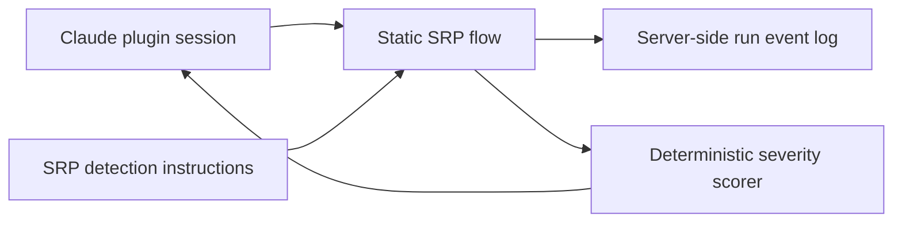
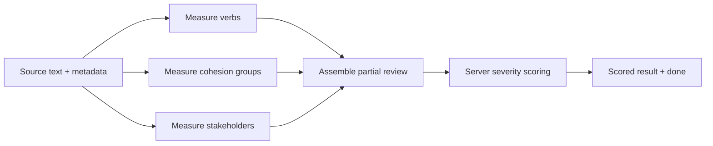
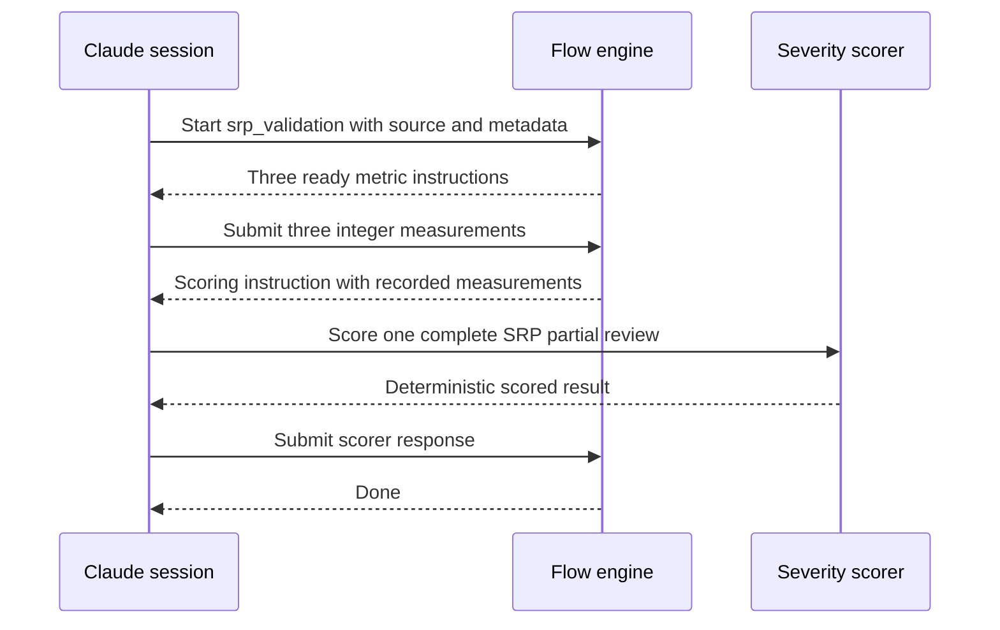

# Static SRP Validation Flow

## Description

Prove that Single Responsibility Principle review can run as a structured flow whose metric measurements are independently produced, schema-validated, recorded server-side, and deterministically scored. This proof of concept covers SRP only and uses a static project-level flow; dynamic principle selection, rule-file migration, other principles, and Codex flow discovery are follow-up work.

## Input / Output

| | Detail |
|---|---|
| Input | Source text plus its file path, unit name, unit kind, and ISO-8601 timestamp, supplied as flow parameters by a transient Claude session |
| Intermediate output | Three independently validated integer measurements: distinct verb count, cohesion-group count, and stakeholder count; retained in the flow run event log |
| Final output | The existing deterministic scoring service's response for one schema-complete SRP partial review document; returned to the driving session and retained in the flow event log |
| Consumer | The driving Claude session, which reports the scored SRP violations after the flow reaches its terminal state |

## User Stories

### Story 1 — Measure each SRP signal independently

As the review system, I want each SRP metric measured from the same source text in an independent ready step so that one holistic response cannot silently skip a metric.

**Acceptance Criteria:**

- On flow start, the verb-count, cohesion-group, and stakeholder-count steps are all ready and none depends on another metric step.
- Each metric step receives the exact source text supplied by the caller.
- Each metric step accepts only an integer value under its declared output name.
- Submitting all three valid metric outputs records them in the run event log and makes the scoring step ready.
- Omitting a declared metric or submitting a non-integer value rejects the submission and leaves the scoring step unavailable.

### Story 2 — Score the complete measurement set deterministically

As the review system, I want the three measurements assembled into the established SRP partial-review contract and passed to the existing server scorer so that the flow never invents or duplicates severity thresholds.

**Acceptance Criteria:**

- The scoring step receives the exact three recorded integer measurements and the caller-provided file and unit metadata.
- The scoring step calls the existing severity-scoring MCP capability with one schema-complete SRP partial review document.
- The flow defines no SRP severity thresholds and does not ask the model to judge a severity.
- The existing violating SRP example produces a completed scoring response containing at least one SRP violation when driven through a real Claude plugin session.
- The real Claude verification starts the flow by bare name from the project flow directory and reaches the terminal `done` state.
- A scorer error or malformed scorer response is rejected by the final output schema and consumes the flow's normal bounded retry budget.

## Technical Requirements

- The static flow is resolved from the project's `.solid-coder/harness/flows/` search location under the bare name `srp_validation`.
- Metric prompts use the current SRP detection instructions as their behavioral source. This proof of concept does not migrate or duplicate the severity bands.
- The final step constructs the established review document fields: timestamp, file path, unit name, unit kind, and an SRP metrics object containing the three measured values.
- The accepted unit-kind values match the existing unified review-output contract. The live fixture uses `class`.
- Final output validation requires the scorer's top-level results collection but leaves the scorer-owned result body intact.
- XML severity blocks remain a deprecated exposed contract during this proof of concept; removing that field belongs to the later rule-format migration.
- Codex transcript parsing and Codex fallback search paths are explicitly outside this feature.

## Connects To

| Direction | Target | Relationship |
|---|---|---|
| Upstream | SPEC-012 — LLM Measures, MCP Scores | Owns the authoritative SRP metric and deterministic scoring contracts |
| Upstream | SPEC-030 — Core Flow Engine | Provides dependency readiness, interpolation, validation, and event-log persistence |
| Upstream | SPEC-031 — Flow Harness MCP Tools | Exposes flow start, advance, and status operations to the driving session |
| Input knowledge | `references/principles/SRP/rule.md` | Supplies the current SRP definitions and detection instructions |
| Input fixture | `references/principles/SRP/Examples/user-database-manager-violation.swift` | Provides the violating source used for live verification |
| Follow-up | Dynamic principle-flow composition | Will select and assemble per-principle flows after this static proof succeeds |

## Diagrams

### Connection Diagram

### Flow Diagram

### Sequence Diagram

## Test Plan

### Unit Tests — Static SRP flow definition

- When the project flow is loaded by bare name with the project directory configured, the resolved flow contains three independent initial steps and one dependent scoring step.
- When the flow starts with valid source metadata, all three metric prompts contain the supplied source text.
- When all three integer measurements are submitted, the next ready prompt contains each exact measured value and the supplied metadata.
- When a metric output is missing or non-integer, output validation rejects the submission and does not make scoring ready.
- When the final scorer response contains a results collection, output validation accepts it and the run reaches `done`.
- When the final scorer response lacks a results collection, output validation rejects it and keeps the scoring step ready within its bounded retry budget.

### Live Test — Claude plugin session

- When a real Claude session starts `srp_validation` by bare name with the violating SRP example, drives every ready step, and uses the server scorer, the flow reaches `done` and reports at least one SRP violation.

## Definition of Done

- [x] Project-level `srp_validation` flow exists and loads by bare name in the configured Claude project environment.
- [x] Three independent metric steps enforce integer output schemas.
- [x] Final step assembles all measurements and delegates severity to the existing server scorer.
- [x] Automated tests cover load, parallel readiness, interpolation, metric rejection, final schema rejection, and successful completion.
- [x] Existing focused flow and scoring suites remain green.
- [x] Real Claude plugin session reaches `done` and returns at least one SRP violation for the existing violating example.
- [x] Handover records the proof result, remaining rule-format work, and Codex exclusions.
