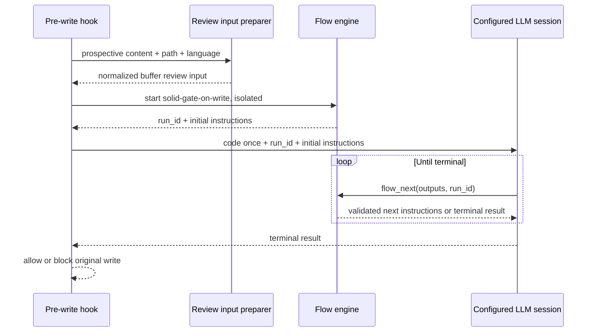

# Bundled SOLID Workflows and Gate-on-Write Migration

## Description

Ship three stable workflows—`solid-review`, `solid-gate-on-write`, and `solid-refactor`—through the workflow package system. `solid-refactor` composes `solid-review`. The pre-write code-quality gate stops constructing and sending its own aggregated health-check prompt; it deterministically prepares the candidate code as normalized review input, starts `solid-gate-on-write` as an isolated run, and drives that run through the configured LLM backend until the workflow returns an allow/deny result.

## Input / Output

| Workflow | Input | Output |
|---|---|---|
| `solid-review` | Normalized review input for changes, folders, files, or a buffer | Schema-validated per-principle measurements, deterministic findings, and review artifacts |
| `solid-gate-on-write` | Prospective post-write buffer, target path, language, session metadata, and candidate tags | Deterministic `allow` or `deny` result with structured violations and fix guidance |
| `solid-refactor` | The same review target plus refactor limits | Initial `solid-review` results, synthesized fixes, applied changes, verification, and residual findings |

## User Stories

### US-1: Run the bundled review workflow

As a developer, I want one stable `solid-review` workflow so review behavior is reusable from a direct command, another workflow, or an integration.

**Acceptance Criteria:**
- The plugin distributes a package whose declared ID is `solid-review`.
- It accepts the established normalized `review-input` contract rather than inventing another target format.
- It reviews SRP, OCP, LSP, ISP, and DRY using explicit metric procedures and schema-validated outputs; server-side scoring remains authoritative.
- Each required metric is represented by an independently completable/validatable step or subflow output, so a model cannot silently omit a metric in a single holistic response.
- Per-principle results are aggregated only after every required principle output is present and valid.
- A client package declaring `id: solid-review` is rejected as a catalog collision; bundled workflow behavior cannot be replaced implicitly.

### US-2: Run the write gate as a workflow

As a developer, when an agent proposes a source write, I want the existing write hook to execute `solid-gate-on-write` instead of sending a separate hand-built review prompt.

**Acceptance Criteria:**
- The existing content simulator produces the exact prospective post-write content before any LLM call.
- Deterministic preparation normalizes that content as `source_type: buffer`, including target path, language/import-derived tags, timestamp, units when available, and the full candidate source.
- The shared `prepare_review_input` application service supports this buffer input. It remains exposed through MCP for agent callers, while the hook calls the same application service directly rather than opening an MCP loopback connection.
- The hook starts an isolated `solid-gate-on-write` run before starting the child LLM session.
- The child session's bootstrap prompt is a generic flow envelope containing the prepared code once, the `run_id`, and the initial ready-step instructions returned by the flow engine.
- The child session advances only through `flow_next(run_id=...)`; every step output is schema-validated and recorded before the next instruction is returned.
- The old `HealthPromptBuilder` detection/workflow prompt path is removed from gate execution; there is no direct-prompt fallback that can produce different review semantics.
- `code_review_on_write_enabled = false` still bypasses the gate. When enabled, flow failure, timeout, malformed output, or an unfinished run fails closed with a diagnostic and leaves run evidence available.

### US-3: Reuse review from refactor

As a developer, I want `solid-refactor` to invoke `solid-review` rather than carry a second copy of review instructions.

**Acceptance Criteria:**
- The plugin distributes a package whose declared ID is `solid-refactor`.
- Its initial analysis is an aliased workflow-ID include of `solid-review`.
- It consumes the included review group's structured outputs to synthesize and apply fixes.
- Its verification review invokes `solid-review` again; it does not copy principle detection prompts into the refactor package.
- The run terminates with residual findings when the configured attempt/iteration cap is exhausted.

### US-4: Keep gate and review measurements comparable

As a maintainer, I want the gate and full review paths to share the same principle measurement workflows so accuracy comparisons remain apples-to-apples.

**Acceptance Criteria:**
- `solid-review` and `solid-gate-on-write` compose the same plugin-private per-principle measurement packages.
- Principle detection procedures have one authoritative source used to generate or load workflow instruction content; handwritten copies in gate prompt files are forbidden.
- The same prepared buffer run produces the same required metric keys and deterministic scores whether invoked through the gate workflow or through `solid-review`.
- Run evidence captures model/backend profile, elapsed time, tool-reported usage when available, per-step outputs, retry counts, and terminal status.
- Accuracy, token, and duration tests report each completed run independently and exclude cancelled/incomplete runs explicitly.

## Workflow Packaging

```text
{plugin}/workflows/
  review/solid-review/workflow.yaml
  gates/solid-gate-on-write/workflow.yaml
  refactor/solid-refactor/workflow.yaml
  internal/
    principles/
      srp/workflow.yaml
      ocp/workflow.yaml
      lsp/workflow.yaml
      isp/workflow.yaml
      dry/workflow.yaml
```

- The public IDs are `solid-review`, `solid-gate-on-write`, and `solid-refactor`.
- Internal principle packages are reusable implementation details and still have explicit IDs for validated composition.
- Public callers never address installed package paths.

## Gate Execution Sequence



## Connects To

| Direction | Target | Relationship |
|---|---|---|
| Upstream | SPEC-035 Workflow Packages | Provides stable IDs, bundled discovery, collision protection, and composition |
| Upstream | SPEC-034 Static SRP Validation Flow | Supplies the measured evidence that stepwise SRP instructions are repeatable |
| Upstream | SPEC-012 and SPEC-029 | Provide deterministic scoring, batch submission, and fix submission |
| Upstream | SPEC-028 | Provides isolated configured-backend sessions and explicit run IDs |
| Replaces | Direct pre-write health-check prompt assembly | Gate execution becomes a flow run |
| Reuses | Existing review-input schema and preparation boundary | Normalizes direct review and prospective-write inputs consistently |

## Test Plan

- Validate every bundled package and every workflow-ID include without starting an LLM.
- Run `solid-review` against the established SRP fixture and assert every step/output pair plus final score.
- Run a five-principle fixture through `solid-review` and prove no principle or required metric is missing.
- Run `solid-gate-on-write` through the real pre-write hook for compliant and violating buffers; assert allow/deny, run completion, and recorded evidence.
- Assert the gate invokes no direct `HealthPromptBuilder` review path.
- Assert prepared candidate code appears once in the bootstrap prompt and all subsequent instructions come from flow results.
- Force malformed output, timeout, and runner failure; assert fail-closed behavior and preserved run diagnostics.
- Attempt to publish a client package under each bundled public ID and prove catalog construction rejects every collision.
- Run `solid-refactor` and assert both initial and verification review groups resolve from `solid-review`.
- Repeat the same fixed fixture/model profile through gate and review workflows; compare metric accuracy, tokens, and elapsed time from complete runs.

## Definition of Done

- [ ] All three public workflow packages are shipped and start by stable ID.
- [ ] `solid-review` covers SRP, OCP, LSP, ISP, and DRY with complete validated metrics.
- [ ] Gate-on-write uses `solid-gate-on-write`; direct health-review prompt execution is removed.
- [ ] Candidate-write preparation is deterministic and shared with the MCP-facing review-input boundary.
- [ ] `solid-refactor` includes `solid-review` for both initial and verification analysis.
- [ ] Client packages cannot override bundled workflow IDs; collisions fail with actionable diagnostics.
- [ ] Live gate/review/refactor tests and token/time/accuracy evidence pass on the locked model profile.
