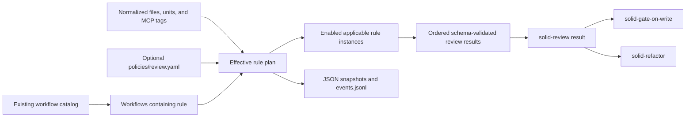
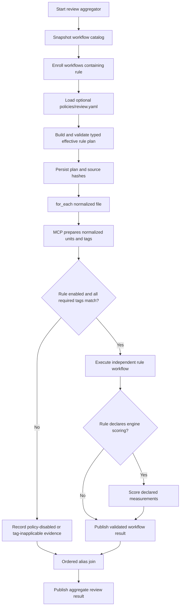
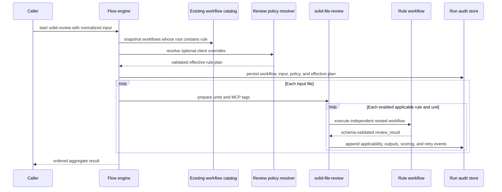

# Executable Rule Workflows and Client Review Policy

## Description

Replace review-time `rule.md` parsing with executable rule workflow packages discovered through the existing workflow catalog. The presence of a minimal `rule:` section enrolls an otherwise ordinary workflow into `solid-review`; scoring remains optional workflow behavior rather than a requirement of rule identity. Clients may add namespaced rule workflows anywhere under the existing project workflow root and may optionally provide one project review policy that overrides enablement and supported scoring values without replacing bundled implementations.

## Input / Output

| | Detail |
|---|---|
| Input | Bundled and project `workflow.yaml` packages from the existing catalog, normalized review files and units with MCP-detected tags, and optional `{project}/.solid-coder/policies/review.yaml` |
| Output | A typed effective rule plan, independently validated per-rule results, optional authoritative scores for metric-based rules, one aggregate review result, and durable audit evidence |
| Consumers | `solid-review`; transitively `solid-gate-on-write` and `solid-refactor`; client-authored review aggregators |

## User Stories

### US-1: Define, discover, execute, customize, and audit executable review rules

As a workflow author, I want a minimal marker to enroll an ordinary workflow as a review rule so bundled and client rules share one execution and audit contract without forcing every rule to implement metric scoring.

**Acceptance Criteria:**

- A workflow becomes an executable review rule only when its root declares `rule`; an ordinary workflow without that section retains the existing workflow contract and is never enrolled merely because of its folder name.
- `rule: {}` is valid and means the rule is enabled by default and applicable to every normalized review unit.
- The only optional base rule fields are `category` for reporting and `tags` for applicability. The workflow root `id`, `name`, and `description` remain authoritative and are not duplicated inside `rule`.
- Every tag listed by a rule must be present in the MCP-detected unit tags for the rule to be applicable. The model cannot provide, remove, or change tags or applicability decisions.
- Existing project and plugin workflow roots remain the only catalog roots. Discovery stays recursive, category folders keep no runtime semantics, and no review-specific folder or TOML search-path setting is added.
- A client rule may live under any client-chosen category beneath `{project}/.solid-coder/workflows/`; adding its namespaced package enrolls it in the next `solid-review` catalog snapshot without modifying bundled workflow YAML.
- Workflow-ID collision rules from SPEC-035 continue to apply. A client workflow cannot replace a bundled workflow or rule ID, and a collision prevents the review run from starting.
- `solid-review` normalizes every supported target into an ordered files collection and invokes the same `solid-file-review` workflow through `for_each`; a one-file review is the same path with one collection item.
- `solid-file-review` uses an MCP-owned preparation operation to split a file into normalized units and tags, then expands every enabled and applicable rule workflow independently for each unit through the existing nested-workflow materialization, retry, replay, and fan-in machinery.
- Independent rule execution means each rule has its own validated steps and result rather than sharing one aggregated prompt. Serial versus bounded concurrent scheduling remains an engine configuration concern and does not change rule semantics.
- Every rule workflow publishes one schema-validated root `review_result`. A rule may produce that result directly without declaring metrics or scoring.
- A metric-based rule may optionally declare measurement and engine-owned scoring steps. Only those steps define measurement IDs, evidence schemas, bands, and deterministic severity; the base `rule` section does not require or duplicate them.
- For an engine-scored rule, the model returns only declared measurement values and evidence and cannot supply or alter severity. For a non-scored rule, the workflow's validated result is accepted with audit metadata identifying the result as workflow-produced rather than engine-scored.
- `solid-gate-on-write` and `solid-refactor` reuse `solid-review`; they do not maintain separate rule registries or copies of rule instructions.
- `{project}/.solid-coder/policies/review.yaml` is optional, project-owned, and singular. Bundled packages do not ship a client policy and clients do not create one policy per rule.
- Policy may enable or disable any rule by workflow ID. Metric disablement or scoring-band overrides are valid only when the targeted workflow declares the corresponding engine-owned scoring contract; attempting a metric override against a non-scored rule fails validation at the policy location.
- Policy cannot change workflow identity, tags, prompts, steps, schemas, executable resources, or root outputs. Policy records parse into typed structures rather than dynamic application-layer maps.
- A policy-disabled rule starts no workflow instance and consumes no model turn. Audit distinguishes policy-disabled, tag-inapplicable, failed, and completed rules.
- Workflow defaults are applied first and the optional client policy second. The effective rule plan is snapshotted before the first rule executes and includes bundled/client provenance, source paths, content hashes, applicability metadata, effective enablement, scoring source, and every supported override.
- For every override, audit preserves the authored default, client-requested value, effective value, policy source, and optional client reason. Client workflow definitions and referenced-resource hashes are included in the resolved workflow provenance.
- Required run artifacts are `workflow.yaml`, `review-input.json`, `effective-rule-plan.json`, optional `review-policy.yaml`, `run-metadata.json`, append-only `events.jsonl`, and `review-result.json`; runtime events are never serialized as YAML.
- The event stream records rule discovery/enrollment, per-unit tag applicability, policy disablement, measurement completion/failure, scoring decisions, retries, and published results with rule, file, unit, and nested-workflow identities.
- Replay and resume use the resolved workflow snapshot, effective plan, and JSONL events and never reread current packages or policy. Later workflow or policy edits affect only new runs.
- Audit persistence is required: failure to persist the initial snapshots or an execution event fails the run and cannot produce an allow decision for gate-on-write.
- General engine, backend, concurrency, timeout, session, and audit-retention configuration remains in `.solid-coder/config.toml`; review-specific enablement and scoring overrides remain in the review policy.
- The legacy `.solid-coder/severity-bands.yml` hierarchy is not consulted by executable rules. Supported enablement and band overrides migrate to the single project review policy without root-to-leaf ambient merging.
- Once bundled review, gate, refactor, scoring, and fix consumers use executable rule packages, review-time `rule.md` loaders and duplicate detection/severity sources are removed. Historical completed specs may describe the superseded implementation, but runtime behavior has one workflow source of truth.

## Technical Requirements

### Rule workflow contract

The minimal rule extension stays inside the ordinary workflow package contract. An always-applicable client rule may declare an empty marker and return a validated result without scoring:

```yaml
id: acme-no-force-unwrap
name: No Force Unwraps
description: Reports force unwraps with source evidence.

rule: {}

inputs:
  - name: review_unit
    schema_file: review-unit.schema.json

steps:
  - id: inspect
    prompt: |
      Inspect this unit for force unwraps and return the normalized review result
      with reasoning and source evidence.

      {{params.review_unit}}
    outputs:
      - name: review_result
        type: data
        schema_file: review-result.schema.json

outputs:
  - name: review_result
    type: data
    value: "{{steps.inspect.outputs.review_result}}"
    schema_file: review-result.schema.json
```

Conditional applicability adds only the optional rule metadata:

```yaml
id: acme-swiftui-accessibility
name: ACME SwiftUI Accessibility

rule:
  category: accessibility
  tags:
    - swiftui
```

- `rule` forbids unknown fields. It is decoded once into a typed rule declaration.
- Omitting `tags` and declaring an empty tag list have the same always-applicable meaning.
- Rule tags are requirements, not descriptive labels: every declared value must exist in the normalized unit's detected tags.
- Examples, patterns, schemas, and scripts remain ordinary package resources and are loaded only through explicit workflow references.
- Materialization does not silently modify rule prompts. Instructions and exceptions required by a rule remain explicit in its authored steps.
- Root `review_result` is required even when the internal workflow has multiple measurements, scoring, or aggregation steps.

### Optional metric scoring contract

Metric scoring is an optional workflow-step contract rather than part of basic rule identity. A scored bundled or client rule may use an engine-owned scoring step:

```yaml
steps:
  - id: measure_verbs
    prompt: |
      Measure distinct responsibility verbs and return the value plus evidence.
      {{params.review_unit}}
    outputs:
      - name: value
        type: data
        schema:
          type: integer
          minimum: 0
      - name: evidence
        type: data
        schema_file: verb-evidence.schema.json

  - id: score
    type: score_rule
    depends_on: [measure_verbs]
    measurements:
      - metric_id: SRP-1
        name: verb_count
        value: "{{steps.measure_verbs.outputs.value}}"
        evidence: "{{steps.measure_verbs.outputs.evidence}}"
        bands:
          - severity: minor
            operator: greater_than_or_equal
            value: 3
          - severity: severe
            operator: greater_than
            value: 5
```

- Measurement, band, and evidence collections decode into typed records; application logic does not pass raw dictionaries or positional tuples.
- Metric IDs and measurement names are unique within the scoring step and are the policy-addressable scoring coordinates.
- Every band declares a supported severity, operator, and comparison value of the measurement's validated type.
- A policy-disabled measurement must not leave an enabled dependency or root output unresolved; effective-plan validation rejects incoherent overrides before execution.
- The scoring step consumes values and evidence from the same workflow instance and publishes the normalized review result without an LLM scoring call.
- A rule without `type: score_rule` has no metric override surface. Whole-rule enablement remains available through policy.

### Review execution topology

`solid-review` uses one path for one or many files:

```yaml
id: solid-review
name: SOLID Review

inputs:
  - name: review_input
    schema_file: review-input.schema.json

steps:
  - include:
      workflow: solid-file-review
    as: file_reviews
    for_each: "{{params.review_input.files}}"
    with:
      review_file: "{{item}}"

  - id: aggregate_files
    depends_on: [file_reviews]
    type: script
    file: aggregate-review-results.py
    executor: python3
    args:
      - "{{workflows.file_reviews.results}}"
    outputs:
      - name: review_result
        type: data
        schema_file: review-result.schema.json

outputs:
  - name: review_result
    type: data
    value: "{{steps.aggregate_files.outputs.review_result}}"
    schema_file: review-result.schema.json
```

- The engine exposes one typed rule-set execution operation to `solid-file-review`; it selects catalog entries whose parsed workflow contains `rule`, applies effective policy and tags per normalized unit, and materializes matching workflow instances through the existing SPEC-037 nested-workflow runtime.
- This operation does not introduce authored automatic/manual selection modes or a second include grammar. It is the review-domain adapter between the catalog's typed rule entries and the existing child-workflow execution machinery.
- Rule results are ordered by source file, unit, and stable catalog workflow ID, independent of completion order.
- Empty file/unit collections and zero applicable rules complete through existing empty fan-in behavior without model turns.

### Client review policy contract

The only client policy location is `{project}/.solid-coder/policies/review.yaml`:

```yaml
version: 1
rules:
  - workflow_id: acme-no-force-unwrap
    enabled: false
    reason: This check is enforced by the compiler configuration.

  - workflow_id: solid-srp-review
    metrics:
      - id: SRP-3
        enabled: false
        reason: Stakeholder count is advisory in this project.

      - id: SRP-1
        measurements:
          - name: verb_count
            bands:
              - severity: severe
                operator: greater_than
                value: 8
                reason: Larger orchestration units are accepted here.
```

- Omitting the file preserves package defaults.
- Omitting a rule, metric, measurement, or band record preserves that workflow default.
- Rule enablement applies to scored and non-scored rules. Metric and band records are accepted only for matching engine-scoring declarations.
- Each override may carry a reason that is copied verbatim into the effective plan and audit events.
- Policy never adds workflow packages or rewrites review composition; the ordinary workflow catalog and `rule` marker own enrollment.
- No parent-directory policy chain is merged. One resolved project policy is snapshotted for one run.

### Audit contract

Each review run preserves the existing resolved workflow snapshot plus review-specific evidence:

```text
<run-id>/
├── workflow.yaml
├── review-input.json
├── effective-rule-plan.json
├── review-policy.yaml          # only when the client supplied one
├── run-metadata.json
├── events.jsonl
└── review-result.json
```

- `workflow.yaml` contains the resolved executable workflow and selected child-workflow provenance; a separate copied workflow tree or catalog snapshot is not created.
- `effective-rule-plan.json` contains ordered typed records for every enrolled rule: workflow ID, bundled/client origin, source path, workflow and referenced-resource hashes, declared category/tags, effective enablement, scoring source, and policy decision.
- Every policy override record contains the workflow/metric/measurement coordinate, authored default, client-requested value, effective value, policy content hash, source path, and optional reason.
- Per-unit events preserve detected tags, required tags, applicability, disabled/skipped/completed state, measurement values and evidence, scoring bands and outcomes, retry information, and published result hashes.
- Events remain one JSON object per line in `events.jsonl`. YAML is used only for authored and snapshotted workflow/policy configuration.
- `run-metadata.json` records backend/model profile, session identifiers, elapsed time, and tool-reported usage when available.
- `review-result.json` identifies whether each result was engine-scored or produced directly by a non-scored workflow.
- The workflow snapshot, effective plan, policy snapshot, and append-only event stream are authoritative for replay. Any derived audit report must be reproducible from them.

## Connects To

| Direction | Target | Relationship |
|---|---|---|
| Parent | SPEC-036 Bundled SOLID Workflows | Supplies the bundled review, file-review, gate, refactor, and metric-based rule workflows |
| Upstream | SPEC-012 LLM Measures, MCP Scores | Supplies optional authoritative metric scoring while allowing non-scored client rules |
| Upstream | SPEC-035 Workflow Packages and Discovery | Supplies the unchanged recursive project/plugin catalog, stable workflow IDs, provenance, and collision rejection |
| Upstream | SPEC-037 Conditional Routing and Result Aggregation | Supplies file/unit fan-out, nested workflow materialization, root outputs, ordered results, skip evidence, and replay |
| Replaces | `references/**/rule.md` runtime loading | Moves rule enrollment and executable review behavior into workflow YAML |
| Replaces | `.solid-coder/severity-bands.yml` | Consolidates supported client rule/metric overrides into `.solid-coder/policies/review.yaml` |
| Configures | `.solid-coder/config.toml` | Leaves engine, backend, concurrency, timeout, session, and audit-retention settings in the existing TOML boundary; it does not add review search paths |

## Diagrams

### Connections



### Flow



### Sequence



## Test Plan

### Unit Tests — Rule workflow parsing and validation

- When a workflow omits `rule`, parsing produces an ordinary workflow with unchanged behavior.
- When a workflow declares `rule: {}`, parsing enrolls an always-applicable rule without requiring category, tags, metrics, or scoring.
- When a workflow declares category and tags, parsing retains those typed values without changing the workflow's root identity.
- When a rule repeats the workflow ID in rule metadata, validation rejects the redundant identity field.
- When `rule` contains an unknown field, validation fails at that field rather than silently accepting another activation or scoring source.
- When a rule omits the required root `review_result`, workflow loading fails before enrollment.
- When a rule publishes a schema-invalid result, its instance fails without publishing an aggregate entry.
- When a non-scored rule has no `score_rule` step, it remains valid and its result is marked workflow-produced.
- When a scored rule repeats a metric/measurement coordinate or declares an invalid band, loading fails at the scoring step.

### Unit Tests — Enrollment, applicability, and execution

- When the existing catalog contains ordinary and rule workflows across arbitrary category folders, only workflows containing `rule` are enrolled and no folder name changes the decision.
- When a namespaced client rule is added under `.solid-coder/workflows`, the next catalog snapshot enrolls it without changing bundled YAML or TOML search paths.
- When a client and bundled package share a workflow ID, collision validation fails before the effective plan is persisted.
- When a rule has no tags, it is applicable to every normalized unit.
- When a rule requires two tags, it executes only when both exist in the MCP-detected tag set and records the actual/required tags when either is absent.
- When model output contains different tags, applicability remains based on the normalized MCP-owned unit and the submitted tags have no effect.
- When normalized review input contains one file, the same file-review `for_each` path creates one file instance; multiple files create one ordered instance per file.
- When a file contains multiple units and multiple applicable rules, each rule/unit pair receives an independent workflow instance and validated result.
- When files, units, or applicable rules are empty, the review completes through empty fan-in without an agent turn.

### Unit Tests — Client policy and effective-plan replay

- When no policy exists at `.solid-coder/policies/review.yaml`, the effective plan preserves every enrolled rule default and records that no client policy was supplied.
- When policy disables one rule, no instance or model turn starts for that rule and the final result records a policy-disabled reason.
- When policy disables a metric belonging to a scored rule, its measurement and score are absent while the remaining coherent outputs complete.
- When policy replaces one measurement's severe band, scoring uses that band while every unspecified band remains at its workflow default.
- When policy targets a metric on a non-scored rule, flow start fails at that policy record and whole-rule enablement remains the only supported override.
- When policy names an unknown rule, metric, measurement, severity, or operator, flow start fails at the exact policy location.
- When policy attempts to change tags, a prompt, step, schema, workflow ID, output, or resource path, parsing rejects the unsupported field.
- When a policy disables a measurement required by another enabled step or root output, effective-plan validation fails before any model call.
- When workflow or policy files change after a run starts, replay and resume retain the original enrollment, effective plan, bands, and hashes; a new run sees the new files.
- When policy files exist in ancestor and child directories, only the resolved project policy is used and no root-to-leaf severity merge occurs.

### Unit Tests — Audit evidence

- When a client rule is enrolled, the effective plan records its client origin, source path, workflow hash, referenced-resource hashes, category, tags, scoring source, and enablement.
- When policy changes a band, the effective plan records the authored, client-requested, and effective values plus policy path, content hash, and reason.
- When one rule is disabled and another is tag-inapplicable, JSONL events preserve distinct decisions with file, unit, rule, required-tag, and detected-tag identities.
- When an engine-scored rule completes, its event records the measurement value, evidence, effective band, applied override state, and final severity.
- When a non-scored rule completes, its event and final result identify the scoring source as workflow-produced.
- When a review run resumes, state reconstructed from workflow, plan, and JSONL events reproduces enrollment, applicability, overrides, outputs, and ordering without rereading current client files.
- When any required initial snapshot or runtime event cannot be persisted, the run fails and gate-on-write cannot return allow.

### Integration Tests — Bundled and custom rule execution

- When the established SRP fixture runs through `solid-srp-review`, every declared measurement step returns its expected value/evidence shape and deterministic scoring matches the locked baseline without reading `rule.md`.
- When normalized input contains a SwiftUI view and a non-view Swift unit, `solid-review` runs always-applicable rules for both units, runs the SwiftUI-tagged rule only for the view, and aggregates results in file, unit, and workflow-ID order.
- When a namespaced non-scored client rule package is added beneath any client-selected category folder, the next review enrolls and executes it without modifying bundled workflow YAML or TOML.
- When a client attempts to publish a bundled workflow ID, catalog construction fails and no policy can authorize the override.
- When policy disables the client rule and overrides a bundled score, the run audit contains the client workflow provenance, disable reason, bundled default, requested band, effective band, and resulting score.
- When gate and refactor invoke `solid-review`, their enrolled rule IDs, effective bands, and measurement schemas match a direct review started with the same input and policy snapshot.
- When legacy `severity-bands.yml` and `rule.md` files contain conflicting values after migration, executable rule workflow results use only workflow defaults plus the optional client review policy.

## Definition of Done

- [ ] The workflow schema accepts `rule: {}` plus optional category/tags and enrolls only marked workflows without changing ordinary workflow behavior.
- [ ] Rule discovery reuses the existing recursive project/plugin catalog; category folders have no semantics and no review search-path configuration is added.
- [ ] One-file and multi-file reviews share the same file-review `for_each` path, and each unit runs every enabled applicable rule independently.
- [ ] Every rule publishes the shared root `review_result`; metric/scoring declarations remain optional workflow steps.
- [ ] Engine-scored rules keep severity authoritative while non-scored client rules remain valid and audibly identified.
- [ ] One optional `.solid-coder/policies/review.yaml` supports whole-rule enablement for every rule and metric/band overrides only for scored rules.
- [ ] Effective plans preserve client workflow provenance and authored/requested/effective override values before execution.
- [ ] Workflow/input/plan/policy/result snapshots and append-only JSONL events provide replayable audit evidence; events are never stored as YAML.
- [ ] Replay never rereads current workflow or policy state, and missing audit persistence prevents a successful gate decision.
- [ ] `config.toml` remains the runtime and audit-retention configuration boundary without review-specific path or scoring duplication.
- [ ] Bundled review execution no longer reads `rule.md` or `.solid-coder/severity-bands.yml`, and obsolete runtime loaders are removed after caller migration.
- [ ] Unit and integration tests prove ordinary-workflow compatibility, client-rule enrollment, collisions, tag applicability, optional scoring, policy validation, audit provenance, ordered aggregation, and replay.
