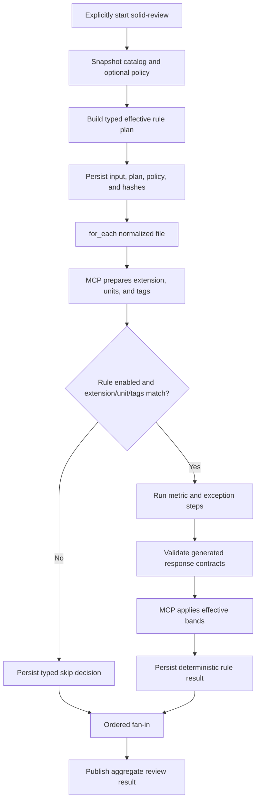

# Executable Rule Workflows and Client Review Policy

## Implementation Progress

Completed:

- `rule: {}` plus optional typed `scope` and `match` selectors is parsed and validated; exact file-extension, typed unit-kind, and tag included/excluded selectors compile into reusable workflow conditions.
- Rule discovery reuses the recursive project/plugin workflow catalog, its stable workflow IDs, provenance, and collision rejection.
- Rule enrollment is explicit to the review domain. Catalog discovery does not automatically run workflows.
- The singular `{project}/.solid-coder/policies/review.yaml` is loaded as typed policy data. An absent file produces an explicit default resolution; malformed policy fails with its source path.
- A stable effective plan records workflow origin, path, hash, authored applicability, enablement, policy path/hash, and the authored/requested/effective enablement decision.
- Unknown rule IDs fail plan construction. The effective plan and verbatim authored policy are persisted before execution.
- Typed `metric` and `exception` steps generate and validate the required scalar/boolean plus reasoning/evidence response contracts.
- MCP deterministically scores validated metric observations, applies exception classification, and publishes typed metric, exception, and rule-result audit events plus normalized artifacts beneath `results/review/`.
- Direct rule runs publish a typed aggregate and an identified per-rule projection beneath `results/review/<workflow-id>/<rule-instance-id>/`; the same layout supports future composite rule instances.
- The bundled `workflows/review/rules/srp` package is authored from the SRP `rule.md` detection and exception blocks and replaces the flat SRP POC with three typed metric steps, one distinct exception step, and MCP finalization; no executable flat SRP flow remains.
- The locked SRP fixture passes the same exact metric/result assertions through both Codex and Claude live profiles without reading `rule.md` for execution.
- The bundled `workflows/review/rules/ocp` package preserves the OCP-1/OCP-2 detection blocks, the complete exception block, and all three legacy scalar observations. `testable_direct_count` uses `OCP-3`, matching the legacy review output schema's explicit identifier and resolving the contradictory OCP-2 frontmatter nesting without dropping the observation.
- The locked OCP violation fixture passes exact OCP-1/OCP-2/OCP-3 values, exception classification, MCP severity, events, and persisted-result assertions through both Codex and Claude live profiles.
- SRP and OCP live tests share one backend-neutral executable-rule assertion base; rule tests supply scenario data without duplicating model runners, event checks, result checks, or artifact validation.
- SRP and OCP deterministic flow tests share one typed scenario-driven contract for canonical instruction parity, generated response rejection, MCP scoring, compliant-by-exception behavior, and persisted result assertions. Subsequent rules add only typed metric/source expectations.
- The bundled `workflows/review/rules/lsp` package preserves all three authored LSP detection procedures, the complete NoOp exception, and all four legacy scalar observations. `fatal_error_methods` uses `LSP-3` and `empty_methods` uses `LSP-4`, giving the two independently scored observations their proper stable policy coordinates.
- The locked LSP violation fixture passes exact `0 / 0 / 1 / 0` observations, exception classification, MCP severity, events, and persisted-result assertions through both Codex and Claude live profiles.
- SRP, OCP, and LSP now use the same typed deterministic and backend-neutral live contracts; adding a rule supplies scenario data rather than another test runner.
- The bundled `workflows/review/rules/isp` package preserves the ISP-1/ISP-2/ISP-3 detection blocks, all three scalar schemas and bands, the complete exception criteria, and protocol-only applicability. Non-protocol units are filtered by typed applicability; single-conformer and default-implementation criteria adjust only ISP-2 instead of incorrectly waiving ISP-1 or ISP-3.
- The locked ISP violation fixture passes exact `10 / 50 / 2` observations, exception classification, MCP severity, events, and persisted-result assertions through both Codex and Claude live profiles.
- A paired non-protocol ISP fixture executes through an isolated `rules: all` bundle and proves every ISP child step is audibly skipped, no model session starts, the empty rule set completes, and no ISP result is published.
- SRP, OCP, LSP, and ISP share the same typed deterministic and backend-neutral live contracts, including a reusable unit-kind applicability assertion.
- One backend-neutral live workflow contract accepts typed scenarios, recursively preserves the complete canonical run, and organizes model evidence by backend, domain, and scenario.
- The explicit `include: { rules: all }` source expands marked catalog rules in stable workflow-ID order without auto-running ordinary workflows.
- Included rule identity survives qualification, runtime materialization, durable workflow snapshots, and replay; composite validation evaluates each child rule's real metric and exception steps under its own workflow ID.
- Composite rule runs deterministically finalize and persist each materialized rule instance, then publish one ordered aggregate review result with worst-severity selection.
- `rule.scope` is the typed `unit | file` execution granularity and defaults to `unit`. `rules: all` preserves unit fan-out while materializing file-scoped rules once for the normalized file under the same nested identity, snapshot, replay, and result machinery.
- The bundled `workflows/review/rules/dry` package preserves the DRY-1/DRY-2/DRY-3 detection blocks and complete exception block. It reviews one immutable normalized unit, gives the canonical DRY-2 metric step the reviewed code directly, uses typed MCP-owned `source.search` for proposed sibling, proposed cross-file, and repository evidence, asks the model only for lexical semantic terms, summary-level candidate selection, and selected-candidate classifications, and leaves scoring to MCP. Candidate assessment separates reuse (`EXACT`, `EXTENSIBLE`, `PARTIAL`, `NOT_SUITABLE`) from implementation duplication (`IDENTICAL`, `STRUCTURAL`, `SIMILAR`, `NOT_DUPLICATE`), with independent reasoning and evidence for each axis.
- Deterministic DRY flow coverage proves ordered agent/operation transitions, exact reviewed-unit exclusion, proposed-context precedence over stale disk paths, same-file and multi-file patch candidate retention, exact selected-candidate validation, engine-owned project-root/search execution, model-owned file inspection, canonical instruction parity, exact MCP scoring, and continued within-unit DRY-2 evidence when source search returns no candidates.
- The locked DRY violation fixture runs in an isolated one-file project and passes exact `0 / 2 / 1` observations, exception classification, MCP severity, operation audit, and persisted-result assertions through both Codex and Claude live profiles. A second isolated repository scenario proves that a conforming implementation is `NOT_SUITABLE` as a replacement for its protocol and `NOT_DUPLICATE` when it contains no duplicated implementation, producing exact `0 / 0 / 0` observations through both live profiles. Live execution separates the fixture project root from the plugin root so repository search is deterministic while durable session evidence remains beneath the plugin repository's test artifacts.
- The bundled `code-smells`, `swiftui`, `structured-concurrency`, `unit-testing`, and `ui-testing` packages preserve their canonical detection procedures, authored exceptions, scalar schemas, severity bands, and typed applicability. All five use the shared deterministic parity/scoring/audit contract.
- The bundled file-scoped `frontmatter` package preserves FM-1 through FM-5, including metric-specific exclusions and vocabulary checks, while using the shared generated no-rule-wide-exception contract. Its existing violation fixture passes canonical instruction, scoring, exception, and persisted-audit assertions.
- SwiftUI `SUI-1` retains `body_nesting_depth` and `view_expression_count` as two named audited observations under one policy metric ID. Each observation is independently validated and scored, and the rule result selects the worst authored severity without inventing metric IDs.
- Deterministic Swift source analysis supplies the activation tags required by the migrated Apple rules: `swiftui` at file scope, `view` at unit scope, `structured-concurrency` from parsed concurrency syntax, and distinct `unit-test`/`ui-test` tags from parsed testing signals.

Remaining:

- Apply the effective project policy during rule materialization so disabled metrics start no session and effective scoring bands reach the finalizer.
- Consume normalized review targets from SPEC-041 and exact extension, typed unit kind, and auditable tags/evidence from SPEC-040; the review-domain matcher materializes ordered rule/unit instances internally.
- Replace the remaining legacy flat rule-tag callers with the typed `match` declaration.
- Integrate the effective policy with `rules: all` materialization so policy disablement and scoring overrides are applied before child sessions start.
- Complete replay projection and idempotent result publication from snapshots/events, including skipped-rule and retry audit identities.
- Migrate the remaining bundled review, gate, and refactor workflows, then remove the legacy runtime rule/severity loaders after parity evidence exists for every migrated rule.

## Description

Replace review-time `rule.md` parsing with executable rule workflow packages. A root `rule` marker enrolls an otherwise ordinary workflow into the explicitly selected `solid-review` rule set. Rule authors declare what the model must measure and whether the inspected unit is an exception; MCP validates those answers, applies deterministic scoring, and publishes the normalized review result.

Clients may add namespaced rule packages under the existing project workflow root and may optionally override enablement or scoring in one project review policy. They cannot replace bundled workflow IDs, prompts, schemas, applicability matchers, or executable resources.

V1 gate-affecting rules are metric-backed. A subjective or binary check is represented as a boolean metric, so the model never chooses severity. Advisory workflows without deterministic scoring remain ordinary explicitly invoked workflows and are not enrolled as gate-affecting rules by this contract.

## Input / Output

| | Detail |
|---|---|
| Input | Bundled and project `workflow.yaml` packages, normalized review files/units with exact extension, typed unit kind, MCP-detected tags/evidence, and optional `{project}/.solid-coder/policies/review.yaml` |
| Output | A typed effective rule plan, validated metric and exception observations, deterministic decisions, one aggregate review result, and replayable audit evidence |
| Consumers | `solid-review`; transitively `solid-gate-on-write` and `solid-refactor` |

## User Stories

### US-1: Author an executable review rule without programming the scoring engine

As a workflow author, I want to express measurement prompts and simple severity thresholds in the workflow YAML so MCP can ask the model for observations and score them consistently.

**Acceptance Criteria:**

- A workflow is enrolled as a review rule only when its root declares `rule`.
- `rule: {}` means enabled by default and applicable to every normalized review unit.
- The only optional rule metadata fields are `scope` and `match`; unknown or duplicated identity fields are rejected.
- `scope` is the typed enum `unit | file` and defaults to `unit`. A unit-scoped rule receives one normalized unit; a file-scoped rule receives one normalized file containing its complete snapshotted content and ordered units.
- `match` may select exact file extensions, unit kinds, and MCP-detected tags through the same `included`/`excluded` structure.
- Missing `match` or a missing matcher dimension means everything in that dimension is included except explicitly excluded values.
- Exclusion always wins. A value authored in both `included` and `excluded` is rejected before execution.
- Included file extensions and unit kinds use any-match semantics because a file/unit has one value in each dimension. Included tags use all-required semantics because a unit may carry multiple tags. Any excluded tag makes the rule inapplicable.
- Model output cannot add, remove, or change file identity, unit kind, tags, or applicability decisions.
- Every executable V1 rule declares at least one `type: metric` step and exactly one `type: exception` step.
- A metric step declares one stable `metric_id`, one prompt, one scalar value schema, and one or more deterministic severity bands.
- Metric IDs are unique within a rule workflow and are the policy-addressable scoring coordinates.
- V1 metric values are JSON integer, number, string, or boolean scalars. Compound expressions and arbitrary evaluator plugins are outside this spec.
- A metric step automatically requires the model to return `value` plus non-empty `additional_info.reasoning` and `additional_info.evidence`.
- The exception step automatically requires `is_exception` plus non-empty `additional_info.reasoning` and `additional_info.evidence`.
- Generated response requirements are included in the agent request and validated as step output. Authors do not copy output schemas into every rule package.
- Missing, wrongly typed, empty, or unaudited output fails that step and follows the existing retry contract.
- The model never returns severity, score, applicability, or policy decisions.
- MCP waits until all required metric and exception observations are complete, applies the effective bands, and generates the normalized rule result without another model call.
- A matching exception produces an auditable compliant exception decision rather than silently discarding measurements.
- When multiple bands match one value, the highest configured severity wins. When none match, that metric is compliant.
- The rule result is the worst non-excepted metric decision under the configured severity ordering.
- Rule authors do not declare a root `review_result`, a `score_rule` step, or an LLM scoring/aggregation prompt. The review-domain finalizer owns that output.
- Ordinary agent, process, condition, `for_each`, and nested-workflow steps remain available around metric and exception steps.

### US-2: Discover and run the applicable rule set explicitly

As a review caller, I want one explicit review operation to select applicable rules while the general workflow catalog remains lookup-only.

**Acceptance Criteria:**

- Existing project and plugin workflow roots remain the only catalog roots. Discovery is recursive and category folders have no runtime semantics.
- Adding a namespaced client package beneath `{project}/.solid-coder/workflows/` enrolls it in the next review catalog snapshot without changing bundled YAML or TOML search paths.
- Workflow-ID collision rules from SPEC-035 apply unchanged; clients cannot replace bundled rules.
- Merely discovering a marked workflow never schedules it. Rules execute only through `solid-review`, an authored nested-workflow reference, or an explicit `flow_start` selection.
- `solid-unit-review` declares one explicit `include: { rules: all }` extension point. It resolves every workflow marked with `rule:` from the snapshotted catalog; folder names do not enroll or activate workflows.
- The rule-set include accepts the same runtime controls as an included workflow group and supplies the standard typed `review_unit` input to every enrolled rule.
- `solid-review` normalizes one or many files into one ordered collection and uses the same `solid-file-review` `for_each` path for both cases.
- MCP materializes every enabled file-scoped rule exactly once per applicable file before unit fan-out. It rejects file-inapplicable rules before either scope starts, then materializes every enabled and unit-applicable unit-scoped rule independently for each remaining unit using the existing nested-workflow, retry, replay, and fan-in machinery.
- File-scoped rules receive the complete immutable normalized file snapshot, not a reread path. A prospective buffer therefore analyzes the candidate content, and a multi-file review exposes each normalized file to its own file-scoped rule instance.
- A policy-disabled or matcher-inapplicable rule starts no agent session and consumes no model turn.
- Results are ordered by file, unit, and stable workflow ID, independent of completion order.
- Empty file/unit/rule collections complete through the existing empty fan-in behavior.

### US-3: Override supported review behavior without replacing rule packages

As a client, I want one small review policy to disable checks or tune thresholds while retaining bundled instructions and auditable defaults.

**Acceptance Criteria:**

- The only policy location is `{project}/.solid-coder/policies/review.yaml`.
- Omitting the policy preserves workflow defaults.
- A policy may enable/disable a rule, enable/disable a declared metric, or replace declared severity bands by workflow ID and metric ID.
- Policy cannot change workflow identity, match declaration, prompts, steps, value schemas, resources, or outputs.
- Unknown workflow IDs, metric IDs, severities, operators, or unsupported value types fail before any model call.
- Workflow defaults are applied first and the project policy second; project values take precedence only at explicitly authored override coordinates.
- Disabling a metric is valid only if at least one metric remains enabled. A rule with no effective metrics is rejected before execution.
- Every override may include a client reason.
- The effective plan records authored default, client-requested value, effective value, policy path/hash, and optional reason.
- The legacy `.solid-coder/severity-bands.yml` hierarchy is not consulted by executable rules.

### US-4: Audit and replay every review decision

As a maintainer, I want to explain exactly what the model observed and what MCP decided, including client overrides, retries, exceptions, and skipped rules.

**Acceptance Criteria:**

- Before the first rule executes, the run persists the resolved workflow snapshot, normalized review input, effective rule plan, optional verbatim review policy, and run metadata.
- The effective plan includes workflow/resource hashes, origin, match declaration, effective metrics/bands, and every override decision.
- Append-only events record enrollment, file-extension matching, unit-kind matching, tag matching, policy disablement, metric completion/failure, exception classification, scoring decisions, retries, and publication with file/unit/rule/step identities.
- Metric events retain the validated value, reasoning, evidence, effective matching band, and resulting severity.
- Exception events retain `is_exception`, reasoning, evidence, and the classification step identity.
- Published results retain whether a decision was compliant, violating, or compliant-by-exception and identify MCP as the scoring authority.
- Runtime events are JSONL, never YAML.
- Replay and resume reconstruct state from the run snapshots and `events.jsonl`; they never reread current workflow or policy files.
- Workflow or policy changes after a run starts affect only new runs.
- Failure to persist a required snapshot or event fails the run and cannot produce an allow decision for gate-on-write.

### US-5: Port the existing rule corpus without semantic drift

As a maintainer, I want each existing runtime rule migrated into an executable workflow independently so changing the execution mechanism does not silently change what the model detects or how MCP scores it.

**Acceptance Criteria:**

- The migration inventory is exactly SRP, OCP, LSP, ISP, DRY, code-smells, frontmatter, SwiftUI, structured-concurrency, Swift unit-testing, and Swift UI-testing. A rule is removed from the inventory only by an explicit product decision, never because its legacy format is inconvenient to translate.
- Bundled rule packages live beneath `workflows/review/rules/<rule-id>/workflow.yaml`. Built-in rule IDs are `srp`, `ocp`, `lsp`, `isp`, `dry`, `code-smells`, `frontmatter`, `swiftui`, `structured-concurrency`, `unit-testing`, and `ui-testing`; they do not repeat the plugin or review name. The folder is organizational; the root `rule:` marker remains the only enrollment mechanism.
- Rules migrate one at a time in this order: align SRP, then OCP, LSP, ISP, DRY, code-smells, frontmatter, SwiftUI, structured-concurrency, Swift unit-testing, and Swift UI-testing. Each rule passes its focused parsing, scoring, exception, fixture, applicability, and audit tests before the next rule is changed.
- Migration preserves the authored detection procedure, exception criteria, metric observations, scalar constraints, and severity-band semantics from the current `references/principles/<rule>/rule.md` and review output schema.
- Detection and exception instruction bodies are moved without editorial rewriting. Only transport-specific text that tells the model to choose severity, assemble the legacy aggregate envelope, or load another runtime instruction file is removed because the flow engine and MCP now own those operations.
- Every independently scored scalar observation becomes a typed `metric` step using the current generated response contract: `value` plus required `additional_info.reasoning` and `additional_info.evidence`.
- Every rule has one distinct `exception` step containing that rule's complete authored exception criteria. The model classifies the supplied unit and returns only `is_exception`, reasoning, and evidence; MCP applies the classification after all required metric observations are present.
- Migrated prompts receive the same normalized `review_unit` value and do not reread source files, fetch current workflow files, or depend on `rule.md` at execution time.
- Health-check, full changes review, and other review entrypoints use the same review execution mode. Their trigger and normalized input may differ, but rule activation does not depend on an invocation profile. Legacy `profile` metadata is not promoted into a flow-engine runtime selector; every enrolled rule uses its authored scope, file-extension, unit-kind, tag, policy, and workflow-condition applicability.
- Existing rule-specific applicability is preserved. For example, ISP remains limited to protocol/interface units and metric-specific triggers such as LSP inheritance analysis remain auditable rather than being treated as zero without explanation.
- DRY is unit-scoped for scoring. The canonical DRY-2 metric step receives the immutable target code directly, so repeated logic inside one unit remains detectable after source search excludes that exact unit without introducing a second authored detection prompt.
- DRY external search is composed from the MCP-owned typed operations in SPEC-040. The normalized review unit is the stable search target; a replaceable agent prompt returns only runtime synonyms or alternative names for code already supplied in its context.
- One unmarked nested DRY search workflow executes for the reviewed unit. It assembles the effective query through MCP, searches sibling units in the same source plus external repository units, exposes stable candidate IDs, frontmatter descriptions, and absolute inspection paths, validates the model's selected subset, then fans out classification. The model cannot choose roots, create identities, author exclusions, or call search operations; it reads each selected path with its normal file-reading tool before classifying it. MCP never injects candidate source into the prompt.
- Candidate classifications require two independent closed decisions plus non-empty reasoning and evidence for each: reuse is `EXACT`, `EXTENSIBLE`, `PARTIAL`, or `NOT_SUITABLE`; implementation duplication is `IDENTICAL`, `STRUCTURAL`, `SIMILAR`, or `NOT_DUPLICATE`. Equivalent declarations without implemented logical sequences may be directly reusable while remaining non-duplicative. Target/candidate association and exact selected-candidate coverage come from validated workflow instance identity and `for_each` completion rather than model-authored IDs or coverage claims.
- A metric may own more than one named scalar observation only when its authored scoring rule combines those observations. SwiftUI `SUI-1` retains `body_nesting_depth` and `view_expression_count` as separate audited observations and evaluates severe when either authored threshold matches; migration must not collapse them into a synthetic count or invent multiple metric IDs.
- MCP excludes only the exact reviewed unit from DRY search. Prepared prospective context supplies sibling and cross-file patch units, and every proposed path replaces its stale disk snapshot; unchanged repository paths remain eligible.
- If a legacy rule uses inconsistent or ambiguous metric identifiers, observation names, schema descriptions, or bands, migration of that rule stops and records the conflict for an explicit decision. The port does not silently rename, merge, split, drop, or reinterpret it.
- LSP explicitly resolves one such legacy identity conflict: the current source groups `fatal_error_methods` and `empty_methods` under LSP-3 even though they are independently scored metrics. The executable rule uses the corrected coordinates `LSP-3` and `LSP-4`; migration evidence still identifies the shared authored detection block from which both measurement prompts were ported.
- A migrated rule's result uses the normalized `RuleReviewResult` contract. Compatibility assertions compare the canonical observation values, exception decision, and deterministic severity rather than preserving the obsolete legacy aggregate JSON envelope.
- After all eleven packages have parity evidence and all review/gate callers use them, runtime loading of `references/**/rule.md`, legacy review instructions, legacy review output schemas, and `.solid-coder/severity-bands.yml` is removed. Reference examples and fix guidance remain until their owning refactor workflows migrate.

## Technical Requirements

### Bundled rule migration contract

```text
workflows/
└── review/
    ├── rules/
    │   ├── srp/workflow.yaml
    │   ├── ocp/workflow.yaml
    │   ├── lsp/workflow.yaml
    │   ├── isp/workflow.yaml
    │   ├── dry/
    │   │   ├── workflow.yaml
    │   │   └── search-target/workflow.yaml
    │   ├── code-smells/workflow.yaml
    │   ├── swiftui/workflow.yaml
    │   ├── structured-concurrency/workflow.yaml
    │   ├── unit-testing/workflow.yaml
    │   ├── ui-testing/workflow.yaml
    │   └── frontmatter/workflow.yaml
    └── bundles/
        ├── solid-unit-review/workflow.yaml
        ├── solid-file-review/workflow.yaml
        ├── solid-files-review/workflow.yaml
        └── solid-review/workflow.yaml
```

- Every package has one stable workflow ID matching its directory name; directory placement itself has no selection semantics.
- `rule.scope` controls only materialization granularity. It does not change catalog enrollment, match semantics, policy coordinates, or result ownership.
- Unit-scoped results are ordered by file, unit, and workflow ID. File-scoped results are ordered by file and workflow ID and do not invent a synthetic unit identity.
- `srp` is reconstructed from `references/principles/SRP/rule.md` at the final package location. The adapted workflow POC is not treated as the instruction source, and the discarded flat `.solid-coder/harness/flows/srp_validation.yaml` format is not retained as a second implementation.
- A migration comparison records, for every rule, its source detection blocks, exception block, observation keys and scalar schemas, authored bands, applicability/profile constraints, destination steps, and parity tests.
- Engine-generated response instructions may be appended to model prompts, but materialization never rewrites the authored detection or exception text.
- Metric steps and the exception step may execute independently when their authored logic is independent. A dependency is declared only when the exception or metric procedure actually consumes an earlier typed observation.
- LSP performs one analysis call scoped to the exact normalized unit, then publishes separate typed output lanes for type-check ownership, concrete-inheritance trigger/relationships, and contract implementations. Each metric consumes only its lane, so fatal/empty protocol implementations cannot contaminate LSP-2. Concrete inheritance requires an override of a concrete base; protocol conformance is not an inheritance trigger. Contract implementations include only method bodies present in that exact unit, and a protocol declaration must not inherit implementations from a conformer in another unit or ready step.
- OCP metrics and whole-unit exception classification consume the same typed behavioral-dependency analysis. OCP-3 excludes dependencies marked as exceptions; "dependency-free" requires an empty behavioral-dependency array. Signature-only pure-data values are not behavioral dependencies, so an abstraction that declares only such values may satisfy the dependency-free exception, while using pure-data dependencies does not make an otherwise behavioral unit itself a pure-data structure.
- ISP candidate discovery fans out one model inspection per bounded search candidate. Each candidate path is read with the model's normal file-reading tool and produces exactly one closed `CONFORMER | DEFAULT_PROVIDER | NOT_RELEVANT` assessment; a conformer assessment contains one `MEANINGFUL | EMPTY | STUB | DELEGATED | MISSING` decision per declared requirement. The engine therefore cannot silently treat an omitted candidate as a non-conformer.
- ISP cohesion uses one deterministic usage-matrix definition: each requirement receives a binary vector across ordered conformers (`1` for `MEANINGFUL` or `DELEGATED`, `0` for `EMPTY`, `STUB`, or missing), requirements with identical vectors form one group, and `ISP-3` is the count of distinct vectors. Semantic-topic grouping and graph-connectivity grouping are not valid alternatives.
- When rule applicability skips the source step of a child `for_each`, the engine resolves that iteration source as an audited empty fan-out instead of attempting to interpolate a nonexistent output. Nested contexts expose skipped dependencies under the same child-local identities used for completed outputs; unrelated output interpolation remains strict.
- MCP finalization waits for every enabled, applicable metric and the exception classification. A skipped metric-specific trigger is represented by a typed, audited applicability outcome; it is not fabricated as a measured zero.

### Rule workflow contract

The rule marker provides applicability metadata only:

```yaml
rule:
  scope: unit
  match:
    file_extensions:
      included: [".swift"]
    unit_kinds:
      included: [class, struct]
      excluded: [function]
    tags:
      included: [ui]
      excluded: [test, generated]
```

- `scope` is optional materialization metadata and defaults to `unit`; `file` is the only other supported value.
- `match` is optional applicability metadata. Its only fields are `file_extensions`, `unit_kinds`, and `tags`.
- Each matcher dimension uses the same optional `included` and `excluded` fields. Missing `included` means all values minus `excluded`; missing `excluded` means no exclusions.
- File extensions are normalized lowercase exact suffixes with a leading dot. They are not inferred language names.
- Unit kinds are closed typed values including `class`, `struct`, `enum`, `protocol`, `extension`, `actor`, `function`, and `document`.
- Tags express every remaining semantic classification, including UI/framework, concurrency, test, generated, specification, and client-defined concepts.
- Included extensions/unit kinds are alternatives; all included tags are required. Any excluded value wins and produces an auditable skip decision.
- Empty included/excluded lists normalize to the same behavior as absent lists. Duplicate values and included/excluded intersections fail validation.
- `rule` forbids unknown fields and is decoded once into a typed declaration.
- Package examples, scripts, and other resources are loaded only through explicit workflow references.
- Materialization does not rewrite authored prompts.

Metric and exception steps are first-class typed workflow entries. A compact SRP rule is:

```yaml
id: srp
name: Single Responsibility Review
description: Measures responsibility signals and reports deterministic SRP severity.
max_turns: 10

rule: {}

steps:
  - id: verb_count
    type: metric
    metric_id: SRP-1
    prompt: |
      Count the distinct responsibility verbs performed by this unit.
      Return only the requested value, reasoning, and precise source evidence.

      {{params.review_unit}}
    value:
      type: integer
      minimum: 0
    scoring:
      minor:
        operator: greater_than_or_equal
        value: 3
      severe:
        operator: greater_than
        value: 5

  - id: cohesion_groups
    type: metric
    metric_id: SRP-2
    prompt: |
      Count independent cohesion groups in this unit.
      {{params.review_unit}}
    value:
      type: integer
      minimum: 0
    scoring:
      severe:
        operator: greater_than_or_equal
        value: 2

  - id: stakeholder_count
    type: metric
    metric_id: SRP-3
    prompt: |
      Count distinct stakeholder groups that can independently cause this unit to change.
      {{params.review_unit}}
    value:
      type: integer
      minimum: 0
    scoring:
      severe:
        operator: greater_than_or_equal
        value: 2

  - id: classify_exception
    type: exception
    prompt: |
      Decide whether this unit matches an authored SRP exception.
      Return the boolean decision, reasoning, and precise source evidence.
      {{params.review_unit}}
```

`review_unit` is a standard typed parameter supplied by the review-domain runner. Rule authors reference it as `{{params.review_unit}}`; they do not duplicate a review-unit schema in each package.

The engine-generated metric response contract is equivalent to:

```yaml
value: <validated scalar>
additional_info:
  reasoning: <non-empty string>
  evidence: <non-empty string>
```

The engine-generated exception response contract is equivalent to:

```yaml
is_exception: <boolean>
additional_info:
  reasoning: <non-empty string>
  evidence: <non-empty string>
```

These shapes are engine contracts, not copied schema files. At the YAML boundary they decode into typed models. Application logic does not pass raw dictionaries or positional tuples.

### Scoring contract

- Supported V1 operators are `equals`, `not_equals`, `greater_than`, `greater_than_or_equal`, `less_than`, and `less_than_or_equal`.
- Each severity entry contains exactly one operator/value pair.
- Operator and comparison values must be compatible with the metric scalar type.
- Severity ordering comes from the existing canonical severity model; policy may tune bands but may not redefine ordering.
- All scoring is deterministic and local. The finalizer consumes typed validated observations and returns typed decisions.
- A boolean smell can be represented without a special rule language:

```yaml
  - id: force_unwrap_present
    type: metric
    metric_id: ACME-1
    prompt: Determine whether the unit contains a prohibited force unwrap.
    value:
      type: boolean
    scoring:
      severe:
        operator: equals
        value: true
```

### Client review policy contract

```yaml
version: 1
rules:
  - workflow_id: acme-no-force-unwrap
    enabled: false
    reason: This check is enforced by the compiler configuration.

  - workflow_id: srp
    metrics:
      - id: SRP-3
        enabled: false
        reason: Stakeholder count is advisory in this project.

      - id: SRP-1
        scoring:
          minor:
            operator: greater_than_or_equal
            value: 4
          severe:
            operator: greater_than
            value: 8
        reason: Larger orchestration units are accepted here.
```

- Policy uses the same scoring-band shape as workflow defaults.
- A metric-level `scoring` value replaces that metric's authored band set atomically; partial implicit band merging is not performed.
- Omitting a rule or metric preserves its workflow default.
- One resolved project policy is snapshotted per run; no parent-directory policy chain is merged.

### Review execution topology

`solid-review` collects the current changes and fans out through one reusable file workflow:

```yaml
id: solid-review
name: SOLID Review

steps:
  - id: changes
    type: operation
    operation: source.collect_changes

  - include:
      workflow: solid-file-review
    as: file_reviews
    depends_on: [changes]
    for_each: "{{steps.changes.outputs.files}}"
    with:
      review_file: "{{item}}"
```

`solid-file-review` asks the source namespace for normalized units and fans out through one reusable unit workflow:

```yaml
id: solid-file-review
name: SOLID File Review

inputs:
  - name: review_file
    schema_file: review-file.schema.json

steps:
  - id: analyze
    type: operation
    operation: source.analyze
    with:
      source: "{{params.review_file}}"

  - include:
      workflow: solid-unit-review
    as: unit_reviews
    depends_on: [analyze]
    for_each: "{{steps.analyze.outputs.units}}"
    with:
      review_unit: "{{item}}"
```

`solid-unit-review` owns the explicit catalog extension point:

```yaml
id: solid-unit-review
name: SOLID Unit Review

inputs:
  - name: review_unit
    schema_file: review-unit.schema.json

steps:
  - include:
      rules: all
    as: rule_reviews
    with:
      review_unit: "{{params.review_unit}}"
```

`rules: all` means every workflow marked with root `rule:` in the run's snapshotted catalog. It does not mean every workflow beneath a folder named `review`. The resolver expands those catalog members into ordinary child workflow instances in stable workflow-ID order. It applies effective policy enablement, file-extension matching, unit-kind matching, and tag matching before any rule step starts, and preserves every disabled/inapplicable member as a typed skip decision. A rule's authored workflow-level `when` remains an additional intrinsic condition after policy and matcher eligibility.

The source form, rule membership, stable ordering, workflow hashes, and effective policy are frozen for the run. Adding a client rule affects the next catalog snapshot without editing bundled aggregate YAML; merely discovering it outside an explicit `rules: all` boundary never executes it.

The SPEC-041 preparation boundary accepts working-tree changes, file, files, folder, Git range, resolved pull request, buffer, and code-block targets. It returns typed normalized review input rather than an application-layer dictionary. Candidate tags come from the snapshotted effective rule plan; callers and models cannot invent the tag vocabulary. Each normalized file records its exact extension and file tags/evidence; each unit records its typed kind plus inherited and unit tags/evidence. Rule activation requires effective policy enablement and all three matcher dimensions to pass.

Source analysis belongs to the dedicated `source` MCP namespace because review, gate, refactor, test, and client workflows may all consume it. SPEC-040 owns typed change collection, file/text analysis, unit extraction, technology detection, detector configuration, and evidence. It also extracts useful behavior from the existing pipeline `prepare_review_input` implementation rather than duplicating it.

Source analysis returns exact extension, typed unit kind, and verified tags with source evidence. File-level tags such as `ui`, `test`, or `generated` may be inherited by contained units, while unit-level tags such as `view` or `reducer` apply only to the matching unit. Callers and model output cannot assert tags without MCP detection evidence.

Rule-set expansion and child-workflow materialization are internal review-domain services invoked by the explicit `rules: all` include after source analysis. The `flow-engine.start`/`flow-engine.next` lifecycle remains the only public workflow lifecycle, so review does not introduce a competing start operation or a model-facing rule selector.

### Audit contract

```text
<run-id>/
├── workflow.yaml
├── review-input.json
├── effective-rule-plan.json
├── review-policy.yaml          # only when authored
├── run-metadata.json
├── events.jsonl
└── results/
    └── review/
        ├── result.json         # ordered aggregate review projection
        ├── srp/
        │   └── <rule-instance-id>/
        │       └── result.json
        └── ocp/
            └── <rule-instance-id>/
                └── result.json
```

- `workflow.yaml` is the resolved executable workflow snapshot with child provenance.
- `effective-rule-plan.json` contains ordered typed records for every enrolled rule and effective metric/band.
- `events.jsonl` is authoritative append-only runtime evidence.
- `results/review/<workflow-id>/<rule-instance-id>/result.json` is one deterministic rule-execution projection. MCP assigns the path-safe stable rule-instance ID; model output and raw source paths never choose artifact locations.
- `results/review/result.json` is the ordered aggregate projection for the run. A directly started rule uses the same layout with one rule instance; a composite review stores every file/unit/rule instance beneath the same parent run.
- Derived reports must be reproducible from these artifacts.
- Production writes these artifacts directly beneath `~/.solid-coder/<project-slug>/runs/<run-id>/`; it does not write a second test-artifact copy.
- Live E2E evidence recursively copies the complete canonical run into `.solid-coder/.artifacts/test/<backend>/e2e/review/<scenario>/<artifact-id>/flow-run/`, preserving future nested results without maintaining a file allowlist.

## Connects To

| Direction | Target | Relationship |
|---|---|---|
| Parent | SPEC-036 Bundled SOLID Workflows | Supplies bundled review, file-review, gate, refactor, and rule workflows |
| Upstream | SPEC-012 LLM Measures, MCP Scores | Supplies the authoritative measure-then-score boundary |
| Upstream | SPEC-035 Workflow Packages and Discovery | Supplies catalog lookup, provenance, and collision rejection |
| Upstream | SPEC-037 Conditional Routing and Result Aggregation | Supplies fan-out, nested workflow materialization, ordered results, skip evidence, and replay |
| Upstream | SPEC-040 Source MCP Namespace | Supplies typed Git changes/ranges, exact extensions, source/document units, tags, evidence, and internal source operations |
| Upstream | SPEC-041 Review Target Normalization | Converges working tree, file(s), folder, Git range/PR, buffer, and code-block requests before rule matching |
| Replaces | `references/**/rule.md` runtime loading | Moves executable rule behavior into workflow YAML |
| Replaces | `.solid-coder/severity-bands.yml` | Moves supported project overrides into one review policy |

## Diagrams



## Test Plan

### Rule parsing and validation

- An ordinary workflow without `rule` retains unchanged behavior and is not enrolled.
- `rule: {}` parses as always applicable, but executable review validation requires metric and exception steps.
- Extension/unit/tag match selectors decode into typed values; unknown fields, duplicates, malformed extensions, and include/exclude intersections fail at the source field.
- Rule scope decodes into the closed `unit | file` enum; missing scope resolves to `unit`, and unknown scope fails before execution.
- Metric and exception entries decode into distinct typed step models rather than generic application maps.
- Missing/duplicate metric IDs, zero metric steps, zero/multiple exception steps, unsupported scalar schemas, empty scoring, invalid operators, incompatible comparison values, and unknown fields fail before execution.
- Generated metric/exception response schemas require non-empty reasoning/evidence and reject model-supplied severity/applicability fields.
- An ordinary non-rule workflow remains free to use generic agent outputs and root outputs.

### Policy and effective plan

- No policy preserves every authored rule, metric, and band default.
- Project rule/metric enablement and metric scoring replace only their declared coordinates and take precedence over package defaults.
- Unknown rule/metric/severity/operator fields fail with the policy path before any model call.
- Disabling the last effective metric fails plan construction.
- Policy cannot mutate prompts, match declarations, schemas, resources, or identities.
- The effective plan contains workflow/resource hashes and authored/requested/effective decisions for every override.
- Current workflow/policy changes do not affect replay; a new run sees them.

### Scoring and audit

- Every supported scalar/operator pair is evaluated deterministically.
- Highest matching severity wins; no match is compliant.
- A validated exception makes otherwise matching metrics compliant-by-exception while preserving observations and both evidence records.
- Missing/invalid observations retry and never reach scoring.
- Metric, exception, scoring, skip, retry, and publication events contain their typed identities and audit fields.
- Replay reconstructs the same effective state and review result without a model call or rereading authored files.
- Snapshot/event persistence failure prevents gate allow.

### Integration and E2E

- The SRP fixture runs through `srp`; MCP obtains SRP-1/2/3 values and exception evidence, applies the YAML bands, and matches the locked health-check baseline without reading `rule.md` at execution time.
- The LSP violation fixture runs through `lsp`; MCP obtains all four scalar observations and exception evidence, applies the independently addressable LSP-3 and LSP-4 bands, and produces the locked severe result without reading `rule.md` at execution time.
- The ISP violation fixture runs through `isp`; typed applicability admits protocol units only, MCP obtains width, minimum coverage, cohesion-group, and exception evidence, and local scoring produces the locked severe result without reading `rule.md` at execution time.
- An ISP fixture containing only non-protocol units produces no ISP observations or result; `rules: all` records the failed unit-kind condition for every skipped ISP child and starts no agent session.
- Each migrated rule has a focused fixture that locks its canonical observations, exception decision, deterministic severity, and emitted audit identities before the next rule is ported.
- A source-to-workflow parity test asserts that every legacy detection block, exception block, scalar observation, band, and applicable source selector is represented exactly once in the migration comparison; missing and duplicated mappings fail.
- SRP no longer executes through `.solid-coder/harness/flows/srp_validation.yaml`; its focused and live tests resolve the bundled `workflows/review/rules/srp/workflow.yaml` package by workflow ID.
- Code-smells and frontmatter participate in the same rule-selection process for health-check and full review. Neither rule is skipped merely because one review was triggered by a write gate and another was requested explicitly.
- Repeating the same SRP run through Codex and Claude preserves the same step/output contract and deterministic scoring; model observations, elapsed time, and token usage remain comparison data.
- One-file and multi-file inputs use the same `for_each` path; rule/unit instances are independent and aggregate in stable order.
- A mixed file proves a file-scoped rule sees sibling declarations in one model input while a unit-scoped rule still receives independent unit instances.
- A unit containing internally duplicated logic produces DRY-2 evidence even when `source.search` returns no sibling or external candidates.
- DRY search excludes the exact current normalized unit, retains sibling units from the same source, includes external repository units, and returns stable candidate IDs with descriptions and absolute inspection paths. The LLM selects promising IDs from those summaries, reads their files with its own file-reading tool, and submits exactly one evidenced reuse and duplication classification for every selected ID. MCP does not load candidate source into the prompt; it rejects missing, duplicate, unknown, unselected, and fabricated classifications.
- A selected DRY candidate that proves irrelevant after source inspection remains auditable through `NOT_SUITABLE` reuse and `NOT_DUPLICATE` implementation outcomes instead of disappearing from the submission.
- The isolated DRY violation fixture produces exact `DRY-1=0`, `DRY-2=2`, and `DRY-3=1` observations through both Codex and Claude; search and candidate-selection steps complete with an empty selected set, and MCP publishes the same severe result for both backends.
- An isolated temporary repository containing a reviewed protocol and a conforming implementation produces `NOT_SUITABLE` reuse and `NOT_DUPLICATE` implementation decisions, exact `DRY-1=0`, `DRY-2=0`, and `DRY-3=0` observations, and the same compliant MCP result through both Codex and Claude. The test provisions source files before execution and preserves the canonical run artifacts through the shared backend-neutral live infrastructure.
- Git-change preparation includes staged, unstaged, and untracked files, extracts changed ranges and normalized units, and produces the same typed review input consumed by explicit file/files/folder/buffer requests.
- Both Codex and Claude plugin manifests expose the `source` namespace; the broad pipeline server no longer registers `prepare_review_input` after SPEC-040 migration.
- Candidate tags are derived from the snapshotted effective rule plan, and unit tag decisions retain their detection evidence; neither a caller nor model output can activate an undeclared tag.
- Extension-specific alternatives can exclude `.swift` from a generic rule while a Swift-specific rule includes `.swift`; UI-specific alternatives can exclude `ui` from a generic rule while an UI rule includes it.
- Rules matching `.md` plus `spec` run only for specification documents, while always-applicable rules run for every normalized unit.
- A namespaced client rule is enrolled on the next snapshot; a bundled-ID collision fails before execution.
- A client rule added beneath any configured project workflow root appears beneath `rules: all` on the next run without changing bundled aggregate YAML; an ordinary unmarked workflow in the same folder does not appear.
- A `rules: all` group expands in stable workflow-ID order, applies policy and extension/unit/tag matching before starting child work, records skipped members with the decisive included/excluded value, and fans results in that same order.
- A project policy disable/override changes the effective execution and result while preserving authored/requested/effective audit evidence.
- `solid-gate-on-write` and `solid-refactor` consume the same `solid-review` plan and results rather than loading another rule source.
- Full non-live tests and the existing Codex/Claude flow-engine live E2E suites pass after migration.

## Definition of Done

- [ ] Workflow YAML supports typed `metric` and `exception` steps with generated validated response contracts.
- [ ] Every executable V1 review rule has at least one unique metric and exactly one exception classifier.
- [ ] MCP owns severity, finalization, and normalized review results; authored rules contain no scoring prompt or root result boilerplate.
- [ ] Discovery reuses the existing catalog and never auto-runs workflows outside explicit review selection.
- [ ] `solid-unit-review` explicitly expands all and only catalog workflows marked with `rule:` through `include: { rules: all }` without assigning runtime semantics to folder names.
- [ ] Review applies exact-extension, typed-unit-kind, MCP-owned-tag, and project-precedence policy before materializing independent rule/unit instances.
- [x] Typed rule scope materializes unit rules once per unit and file rules once per normalized file with stable audit identities.
- [ ] One optional review policy controls only rule/metric enablement and complete metric band replacement.
- [ ] Effective plans and events preserve source hashes, observations, exceptions, scoring, overrides, skips, retries, and publication.
- [ ] Replay uses only run snapshots/events and never rereads current workflow or policy state.
- [ ] Bundled SRP executes from YAML and can be compared with the current health-check fixture on accuracy, time, and token usage.
- [x] SRP, OCP, LSP, ISP, DRY, code-smells, frontmatter, SwiftUI, structured-concurrency, unit-testing, and ui-testing each execute from one bundled rule workflow with preserved detection, exception, observation, schema, band, and activation semantics.
- [x] Every rule migration has focused parity evidence before the next rule begins, and ambiguous legacy contracts are resolved explicitly rather than normalized silently.
- [ ] The temporary flat SRP POC is removed after its tests resolve the bundled SRP package.
- [ ] Gate and refactor reuse the same review workflow/results.
- [ ] Legacy `rule.md` and severity-band runtime readers are removed after all callers migrate.
- [ ] Focused, full non-live, and Codex/Claude flow-engine E2E tests pass.
