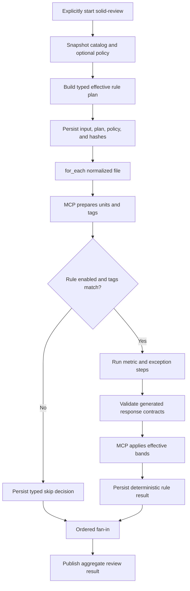

# Executable Rule Workflows and Client Review Policy

## Implementation Progress

Completed:

- `rule: {}` plus optional `category` and `tags` is parsed as typed rule metadata.
- Rule discovery reuses the recursive project/plugin workflow catalog, its stable workflow IDs, provenance, and collision rejection.
- Rule enrollment is explicit to the review domain. Catalog discovery does not automatically run workflows.
- The singular `{project}/.solid-coder/policies/review.yaml` is loaded as typed policy data. An absent file produces an explicit default resolution; malformed policy fails with its source path.
- A stable effective plan records workflow origin, path, hash, category, tags, enablement, policy path/hash, and the authored/requested/effective enablement decision.
- Unknown rule IDs fail plan construction. The effective plan and verbatim authored policy are persisted before execution.
- Typed `metric` and `exception` steps generate and validate the required scalar/boolean plus reasoning/evidence response contracts.
- MCP deterministically scores validated metric observations, applies exception classification, and publishes typed metric, exception, and rule-result audit events plus normalized artifacts beneath `results/review/`.
- Direct rule runs publish a typed aggregate and an identified per-rule projection beneath `results/review/<workflow-id>/<rule-instance-id>/`; the same layout supports future composite rule instances.
- The bundled `solid-srp-review` package replaces the flat SRP POC's model-scoring step with three metric steps, one exception step, and MCP finalization.
- The locked SRP fixture passes the same exact metric/result assertions through both Codex and Claude live profiles without reading `rule.md` for execution.
- One backend-neutral live workflow contract accepts typed scenarios, recursively preserves the complete canonical run, and organizes model evidence by backend, domain, and scenario.

Remaining:

- Apply the effective project policy during rule materialization so disabled metrics start no session and effective scoring bands reach the finalizer.
- Add the explicit review-domain operation that tags normalized units, selects applicable catalog rules, and materializes ordered rule/unit instances.
- Complete replay projection and idempotent result publication from snapshots/events, including skipped-rule and retry audit identities.
- Migrate the remaining bundled review, gate, and refactor workflows, then remove the legacy runtime rule/severity loaders.

## Description

Replace review-time `rule.md` parsing with executable rule workflow packages. A root `rule` marker enrolls an otherwise ordinary workflow into the explicitly selected `solid-review` rule set. Rule authors declare what the model must measure and whether the inspected unit is an exception; MCP validates those answers, applies deterministic scoring, and publishes the normalized review result.

Clients may add namespaced rule packages under the existing project workflow root and may optionally override enablement or scoring in one project review policy. They cannot replace bundled workflow IDs, prompts, schemas, tags, or executable resources.

V1 gate-affecting rules are metric-backed. A subjective or binary check is represented as a boolean metric, so the model never chooses severity. Advisory workflows without deterministic scoring remain ordinary explicitly invoked workflows and are not enrolled as gate-affecting rules by this contract.

## Input / Output

| | Detail |
|---|---|
| Input | Bundled and project `workflow.yaml` packages, normalized review files/units with MCP-detected tags, and optional `{project}/.solid-coder/policies/review.yaml` |
| Output | A typed effective rule plan, validated metric and exception observations, deterministic decisions, one aggregate review result, and replayable audit evidence |
| Consumers | `solid-review`; transitively `solid-gate-on-write` and `solid-refactor` |

## User Stories

### US-1: Author an executable review rule without programming the scoring engine

As a workflow author, I want to express measurement prompts and simple severity thresholds in the workflow YAML so MCP can ask the model for observations and score them consistently.

**Acceptance Criteria:**

- A workflow is enrolled as a review rule only when its root declares `rule`.
- `rule: {}` means enabled by default and applicable to every normalized review unit.
- The only optional rule metadata fields are `category` and `tags`; unknown or duplicated identity fields are rejected.
- Every declared tag must be present in the MCP-detected unit tags. Model output cannot add, remove, or change applicability tags.
- Every executable V1 rule declares at least one `type: metric` step and exactly one `type: exception` step.
- A metric step declares one stable `metric_id`, one prompt, one scalar value schema, and one or more deterministic severity bands.
- Metric IDs are unique within a rule workflow and are the policy-addressable scoring coordinates.
- V1 metric values are JSON integer, number, string, or boolean scalars. Compound expressions and arbitrary evaluator plugins are outside this spec.
- A metric step automatically requires the model to return `value` plus non-empty `additional_info.reasoning` and `additional_info.evidence`.
- The exception step automatically requires `is_exception` plus non-empty `additional_info.reasoning` and `additional_info.evidence`.
- Generated response requirements are included in the agent request and validated as step output. Authors do not copy output schemas into every rule package.
- Missing, wrongly typed, empty, or unaudited output fails that step and follows the existing retry contract.
- The model never returns severity, score, applicability, or policy decisions.
- MCP waits until all required metric and exception observations are complete, applies the effective bands, and generates the normalized rule result without another model call.
- A matching exception produces an auditable compliant exception decision rather than silently discarding measurements.
- When multiple bands match one value, the highest configured severity wins. When none match, that metric is compliant.
- The rule result is the worst non-excepted metric decision under the configured severity ordering.
- Rule authors do not declare a root `review_result`, a `score_rule` step, or an LLM scoring/aggregation prompt. The review-domain finalizer owns that output.
- Ordinary agent, process, condition, `for_each`, and nested-workflow steps remain available around metric and exception steps.

### US-2: Discover and run the applicable rule set explicitly

As a review caller, I want one explicit review operation to select applicable rules while the general workflow catalog remains lookup-only.

**Acceptance Criteria:**

- Existing project and plugin workflow roots remain the only catalog roots. Discovery is recursive and category folders have no runtime semantics.
- Adding a namespaced client package beneath `{project}/.solid-coder/workflows/` enrolls it in the next review catalog snapshot without changing bundled YAML or TOML search paths.
- Workflow-ID collision rules from SPEC-035 apply unchanged; clients cannot replace bundled rules.
- Merely discovering a marked workflow never schedules it. Rules execute only through `solid-review`, an authored nested-workflow reference, or an explicit `flow_start` selection.
- `solid-review` normalizes one or many files into one ordered collection and uses the same `solid-file-review` `for_each` path for both cases.
- MCP splits each file into normalized review units and tags, then materializes every enabled/applicable rule independently for each unit using the existing nested-workflow, retry, replay, and fan-in machinery.
- A policy-disabled or tag-inapplicable rule starts no agent session and consumes no model turn.
- Results are ordered by file, unit, and stable workflow ID, independent of completion order.
- Empty file/unit/rule collections complete through the existing empty fan-in behavior.

### US-3: Override supported review behavior without replacing rule packages

As a client, I want one small review policy to disable checks or tune thresholds while retaining bundled instructions and auditable defaults.

**Acceptance Criteria:**

- The only policy location is `{project}/.solid-coder/policies/review.yaml`.
- Omitting the policy preserves workflow defaults.
- A policy may enable/disable a rule, enable/disable a declared metric, or replace declared severity bands by workflow ID and metric ID.
- Policy cannot change workflow identity, category, tags, prompts, steps, value schemas, resources, or outputs.
- Unknown workflow IDs, metric IDs, severities, operators, or unsupported value types fail before any model call.
- Workflow defaults are applied first and the project policy second; project values take precedence only at explicitly authored override coordinates.
- Disabling a metric is valid only if at least one metric remains enabled. A rule with no effective metrics is rejected before execution.
- Every override may include a client reason.
- The effective plan records authored default, client-requested value, effective value, policy path/hash, and optional reason.
- The legacy `.solid-coder/severity-bands.yml` hierarchy is not consulted by executable rules.

### US-4: Audit and replay every review decision

As a maintainer, I want to explain exactly what the model observed and what MCP decided, including client overrides, retries, exceptions, and skipped rules.

**Acceptance Criteria:**

- Before the first rule executes, the run persists the resolved workflow snapshot, normalized review input, effective rule plan, optional verbatim review policy, and run metadata.
- The effective plan includes workflow/resource hashes, origin, category/tags, effective metrics/bands, and every override decision.
- Append-only events record enrollment, applicability, policy disablement, metric completion/failure, exception classification, scoring decisions, retries, and publication with file/unit/rule/step identities.
- Metric events retain the validated value, reasoning, evidence, effective matching band, and resulting severity.
- Exception events retain `is_exception`, reasoning, evidence, and the classification step identity.
- Published results retain whether a decision was compliant, violating, or compliant-by-exception and identify MCP as the scoring authority.
- Runtime events are JSONL, never YAML.
- Replay and resume reconstruct state from the run snapshots and `events.jsonl`; they never reread current workflow or policy files.
- Workflow or policy changes after a run starts affect only new runs.
- Failure to persist a required snapshot or event fails the run and cannot produce an allow decision for gate-on-write.

## Technical Requirements

### Rule workflow contract

The rule marker provides applicability metadata only:

```yaml
rule:
  category: solid
  tags:
    - swiftui
```

- `category` is optional reporting metadata.
- `tags` is an optional list of MCP-owned applicability requirements. Missing and empty mean always applicable.
- `rule` forbids unknown fields and is decoded once into a typed declaration.
- Package examples, scripts, and other resources are loaded only through explicit workflow references.
- Materialization does not rewrite authored prompts.

Metric and exception steps are first-class typed workflow entries. A compact SRP rule is:

```yaml
id: solid-srp-review
name: Single Responsibility Review
description: Measures responsibility signals and reports deterministic SRP severity.
max_turns: 10

rule:
  category: solid

steps:
  - id: verb_count
    type: metric
    metric_id: SRP-1
    prompt: |
      Count the distinct responsibility verbs performed by this unit.
      Return only the requested value, reasoning, and precise source evidence.

      {{params.review_unit}}
    value:
      type: integer
      minimum: 0
    scoring:
      minor:
        operator: greater_than_or_equal
        value: 3
      severe:
        operator: greater_than
        value: 5

  - id: cohesion_groups
    type: metric
    metric_id: SRP-2
    prompt: |
      Count independent cohesion groups in this unit.
      {{params.review_unit}}
    value:
      type: integer
      minimum: 0
    scoring:
      severe:
        operator: greater_than_or_equal
        value: 2

  - id: stakeholder_count
    type: metric
    metric_id: SRP-3
    prompt: |
      Count distinct stakeholder groups that can independently cause this unit to change.
      {{params.review_unit}}
    value:
      type: integer
      minimum: 0
    scoring:
      severe:
        operator: greater_than_or_equal
        value: 2

  - id: classify_exception
    type: exception
    prompt: |
      Decide whether this unit matches an authored SRP exception.
      Return the boolean decision, reasoning, and precise source evidence.
      {{params.review_unit}}
```

`review_unit` is a standard typed parameter supplied by the review-domain runner. Rule authors reference it as `{{params.review_unit}}`; they do not duplicate a review-unit schema in each package.

The engine-generated metric response contract is equivalent to:

```yaml
value: <validated scalar>
additional_info:
  reasoning: <non-empty string>
  evidence: <non-empty string>
```

The engine-generated exception response contract is equivalent to:

```yaml
is_exception: <boolean>
additional_info:
  reasoning: <non-empty string>
  evidence: <non-empty string>
```

These shapes are engine contracts, not copied schema files. At the YAML boundary they decode into typed models. Application logic does not pass raw dictionaries or positional tuples.

### Scoring contract

- Supported V1 operators are `equals`, `not_equals`, `greater_than`, `greater_than_or_equal`, `less_than`, and `less_than_or_equal`.
- Each severity entry contains exactly one operator/value pair.
- Operator and comparison values must be compatible with the metric scalar type.
- Severity ordering comes from the existing canonical severity model; policy may tune bands but may not redefine ordering.
- All scoring is deterministic and local. The finalizer consumes typed validated observations and returns typed decisions.
- A boolean smell can be represented without a special rule language:

```yaml
  - id: force_unwrap_present
    type: metric
    metric_id: ACME-1
    prompt: Determine whether the unit contains a prohibited force unwrap.
    value:
      type: boolean
    scoring:
      severe:
        operator: equals
        value: true
```

### Client review policy contract

```yaml
version: 1
rules:
  - workflow_id: acme-no-force-unwrap
    enabled: false
    reason: This check is enforced by the compiler configuration.

  - workflow_id: solid-srp-review
    metrics:
      - id: SRP-3
        enabled: false
        reason: Stakeholder count is advisory in this project.

      - id: SRP-1
        scoring:
          minor:
            operator: greater_than_or_equal
            value: 4
          severe:
            operator: greater_than
            value: 8
        reason: Larger orchestration units are accepted here.
```

- Policy uses the same scoring-band shape as workflow defaults.
- A metric-level `scoring` value replaces that metric's authored band set atomically; partial implicit band merging is not performed.
- Omitting a rule or metric preserves its workflow default.
- One resolved project policy is snapshotted per run; no parent-directory policy chain is merged.

### Review execution topology

`solid-review` has one explicit rule-set boundary:

```yaml
id: solid-review
name: SOLID Review

steps:
  - include:
      workflow: solid-file-review
    as: file_reviews
    for_each: "{{params.review_input.files}}"
    with:
      review_file: "{{item}}"
```

`solid-file-review` asks an MCP-owned preparation operation for normalized units/tags, then invokes the review-domain rule-set operation. That operation selects catalog entries containing `rule`, applies the snapshotted policy and tags, and materializes matching child workflows through SPEC-037. It is not a second include grammar and does not add automatic catalog execution.

### Audit contract

```text
<run-id>/
├── workflow.yaml
├── review-input.json
├── effective-rule-plan.json
├── review-policy.yaml          # only when authored
├── run-metadata.json
├── events.jsonl
└── results/
    └── review/
        ├── result.json         # ordered aggregate review projection
        ├── solid-srp-review/
        │   └── <rule-instance-id>/
        │       └── result.json
        └── solid-ocp-review/
            └── <rule-instance-id>/
                └── result.json
```

- `workflow.yaml` is the resolved executable workflow snapshot with child provenance.
- `effective-rule-plan.json` contains ordered typed records for every enrolled rule and effective metric/band.
- `events.jsonl` is authoritative append-only runtime evidence.
- `results/review/<workflow-id>/<rule-instance-id>/result.json` is one deterministic rule-execution projection. MCP assigns the path-safe stable rule-instance ID; model output and raw source paths never choose artifact locations.
- `results/review/result.json` is the ordered aggregate projection for the run. A directly started rule uses the same layout with one rule instance; a composite review stores every file/unit/rule instance beneath the same parent run.
- Derived reports must be reproducible from these artifacts.
- Production writes these artifacts directly beneath `~/.solid-coder/<project-slug>/runs/<run-id>/`; it does not write a second test-artifact copy.
- Live E2E evidence recursively copies the complete canonical run into `.solid-coder/.artifacts/test/<backend>/e2e/review/<scenario>/<artifact-id>/flow-run/`, preserving future nested results without maintaining a file allowlist.

## Connects To

| Direction | Target | Relationship |
|---|---|---|
| Parent | SPEC-036 Bundled SOLID Workflows | Supplies bundled review, file-review, gate, refactor, and rule workflows |
| Upstream | SPEC-012 LLM Measures, MCP Scores | Supplies the authoritative measure-then-score boundary |
| Upstream | SPEC-035 Workflow Packages and Discovery | Supplies catalog lookup, provenance, and collision rejection |
| Upstream | SPEC-037 Conditional Routing and Result Aggregation | Supplies fan-out, nested workflow materialization, ordered results, skip evidence, and replay |
| Replaces | `references/**/rule.md` runtime loading | Moves executable rule behavior into workflow YAML |
| Replaces | `.solid-coder/severity-bands.yml` | Moves supported project overrides into one review policy |

## Diagrams



## Test Plan

### Rule parsing and validation

- An ordinary workflow without `rule` retains unchanged behavior and is not enrolled.
- `rule: {}` parses as always applicable, but executable review validation requires metric and exception steps.
- Category/tags decode into typed values; unknown rule fields fail at the source field.
- Metric and exception entries decode into distinct typed step models rather than generic application maps.
- Missing/duplicate metric IDs, zero metric steps, zero/multiple exception steps, unsupported scalar schemas, empty scoring, invalid operators, incompatible comparison values, and unknown fields fail before execution.
- Generated metric/exception response schemas require non-empty reasoning/evidence and reject model-supplied severity/applicability fields.
- An ordinary non-rule workflow remains free to use generic agent outputs and root outputs.

### Policy and effective plan

- No policy preserves every authored rule, metric, and band default.
- Project rule/metric enablement and metric scoring replace only their declared coordinates and take precedence over package defaults.
- Unknown rule/metric/severity/operator fields fail with the policy path before any model call.
- Disabling the last effective metric fails plan construction.
- Policy cannot mutate prompts, tags, schemas, resources, or identities.
- The effective plan contains workflow/resource hashes and authored/requested/effective decisions for every override.
- Current workflow/policy changes do not affect replay; a new run sees them.

### Scoring and audit

- Every supported scalar/operator pair is evaluated deterministically.
- Highest matching severity wins; no match is compliant.
- A validated exception makes otherwise matching metrics compliant-by-exception while preserving observations and both evidence records.
- Missing/invalid observations retry and never reach scoring.
- Metric, exception, scoring, skip, retry, and publication events contain their typed identities and audit fields.
- Replay reconstructs the same effective state and review result without a model call or rereading authored files.
- Snapshot/event persistence failure prevents gate allow.

### Integration and E2E

- The SRP fixture runs through `solid-srp-review`; MCP obtains SRP-1/2/3 values and exception evidence, applies the YAML bands, and matches the locked health-check baseline without reading `rule.md`.
- Repeating the same SRP run through Codex and Claude preserves the same step/output contract and deterministic scoring; model observations, elapsed time, and token usage remain comparison data.
- One-file and multi-file inputs use the same `for_each` path; rule/unit instances are independent and aggregate in stable order.
- SwiftUI-tagged rules run only for MCP-tagged SwiftUI units while always-applicable rules run for every unit.
- A namespaced client rule is enrolled on the next snapshot; a bundled-ID collision fails before execution.
- A project policy disable/override changes the effective execution and result while preserving authored/requested/effective audit evidence.
- `solid-gate-on-write` and `solid-refactor` consume the same `solid-review` plan and results rather than loading another rule source.
- Full non-live tests and the existing Codex/Claude flow-engine live E2E suites pass after migration.

## Definition of Done

- [ ] Workflow YAML supports typed `metric` and `exception` steps with generated validated response contracts.
- [ ] Every executable V1 review rule has at least one unique metric and exactly one exception classifier.
- [ ] MCP owns severity, finalization, and normalized review results; authored rules contain no scoring prompt or root result boilerplate.
- [ ] Discovery reuses the existing catalog and never auto-runs workflows outside explicit review selection.
- [ ] Review applies MCP-owned tags and project-precedence policy before materializing independent rule/unit instances.
- [ ] One optional review policy controls only rule/metric enablement and complete metric band replacement.
- [ ] Effective plans and events preserve source hashes, observations, exceptions, scoring, overrides, skips, retries, and publication.
- [ ] Replay uses only run snapshots/events and never rereads current workflow or policy state.
- [ ] Bundled SRP executes from YAML and can be compared with the current health-check fixture on accuracy, time, and token usage.
- [ ] Gate and refactor reuse the same review workflow/results.
- [ ] Legacy `rule.md` and severity-band runtime readers are removed after all callers migrate.
- [ ] Focused, full non-live, and Codex/Claude flow-engine E2E tests pass.
