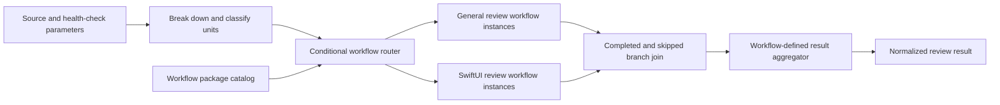
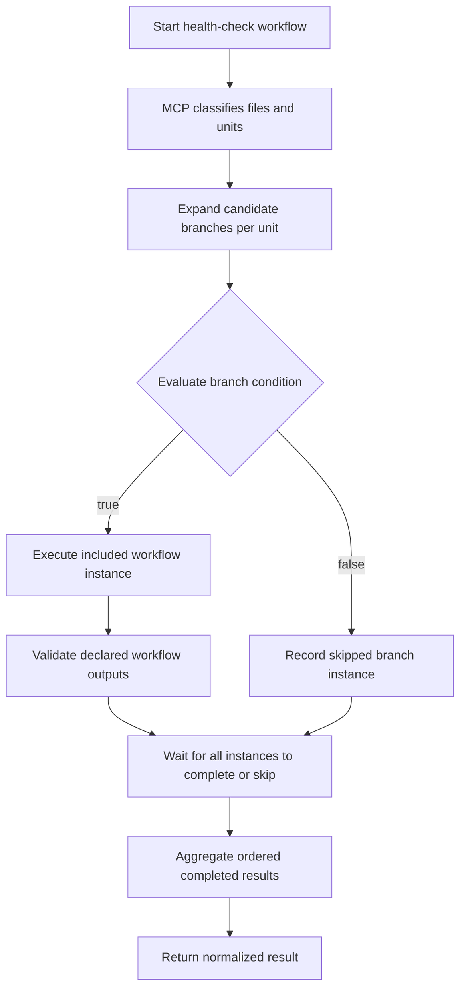
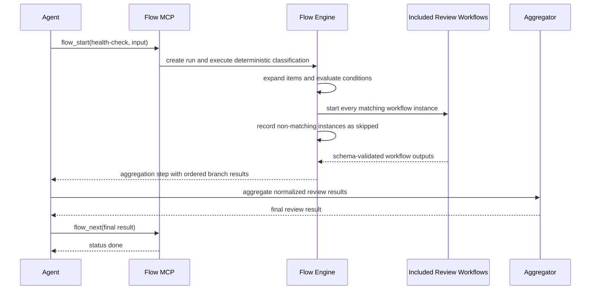

# Conditional Workflow Routing and Result Aggregation

## Description

Extend the flow engine so a workflow can classify its input, conditionally execute matching steps or included workflow packages, and converge their declared outputs into a final aggregation step. This enables flows such as health-check to break source into units, run the general reviews plus specialized reviews such as SwiftUI only for matching units, and return one normalized review result without generating a different workflow file for every run. Conditional routing builds on SPEC-030's completed `for_each` lifecycle; it must not introduce a second expansion, retry, replay, or fan-in mechanism.

## Input / Output

| | Detail |
|---|---|
| Input | A validated workflow definition containing ordinary steps and included workflow packages with optional `depends_on`, `for_each`, declarative `when` rules, and explicit input mappings; top-level `flow_start` parameters, current items, and upstream step outputs provide values. |
| Output | Durable completed or skipped branch events with typed condition evidence, validated workflow-level output envelopes for every executed branch instance, and deterministic branch-result collections available to downstream aggregation steps. |
| Consumer | `flow_start`, `flow_next`, `flow_status`, bundled review and gate workflows from SPEC-036, and client-authored workflow packages. |

## User Stories

### US-1: Route classified units through matching review workflows and converge their results

As the flow engine, I want to route classified review units through every matching workflow branch so that one final aggregation step can consume all completed branch results.

**Acceptance Criteria:**

- A workflow definition, ordinary step, path-based include, or workflow-ID include may declare an optional `when` rule using the same grammar; omitting `when` at any scope preserves unconditional execution at that scope.
- An included workflow may declare `depends_on` and `for_each` alongside `when`, allowing the condition to be evaluated once per expanded item after its declared dependencies complete.
- A reusable workflow may declare named inputs with inline or file-backed JSON Schemas. Top-level values come from `flow_start(..., params=...)`; an include maps parent values into the child through `with`. Child steps read those mapped values through the existing `params.<name>` namespace.
- A condition may read declared flow inputs, the current `for_each` item, and outputs from declared upstream dependencies. Unknown input names, invalid item paths proven by the source array's item schema, and non-upstream step references fail workflow validation before the run starts; a missing path that cannot be proven statically fails before that branch starts an execution attempt.
- Nested item paths such as `{{item.language}}` are an explicit extension of the expression resolver. Existing `{{item}}`, `{{params.<name>}}`, and `{{steps.<id>.outputs.<name>}}` behavior remains unchanged.
- Conditions use structured `all`, `any`, and `not` composition with the leaf operators `equals`, `not_equals`, `in`, `not_in`, and `exists`; arbitrary code and host-language expression evaluation are rejected.
- Condition evaluation is deterministic engine behavior. The LLM is not asked to interpret the condition, classify the payload, choose branches, or report which branches should run.
- Authored and snapshotted condition references, include input bindings, and `for_each` references are normalized once when decoded into typed workflow models. Runtime condition evaluation and replay consume those typed values without trimming, unwrapping, or reparsing expression strings.
- Health-check file and unit classification is produced by an engine-owned script/command step or an existing deterministic MCP boundary with schema-validated outputs; the classifier is not an agent step.
- Equality and membership comparisons are type-strict: the engine does not coerce strings, numbers, booleans, arrays, objects, or null values before comparison.
- When a condition evaluates true, the step or included workflow instance follows the existing execution, retry, output-validation, and failure lifecycle.
- When a condition evaluates false, the engine records a durable skipped outcome containing the step and instance identities, evaluated condition, `for_each` item and index, nested-workflow identity when applicable, parent-completion state, and typed evaluation evidence; it starts no execution attempt and consumes neither an execution attempt nor a turn.
- Typed condition evidence preserves each evaluated comparison's normalized reference, operator, expected value, resolved actual presence and value, and match result. Composite `all`, `any`, and `not` evidence preserves the ordered children actually evaluated under short-circuit semantics and the composite result.
- A false workflow-level condition skips the complete workflow instance before any internal step becomes ready. For an included workflow, the parent alias records a skipped instance and publishes no result for it; for a top-level run, the engine records the skipped workflow outcome and completes the run without executing steps.
- A false step-level condition skips only that expanded step instance. Its internal dependents treat it as terminal for dependency resolution, while the rest of the workflow continues.
- A skipped branch is terminal for dependency resolution, so a downstream join waits until every dependency is either completed or skipped and does not deadlock on a non-matching branch.
- Conditions are not exclusive: when multiple branches match the same item, all matching branches execute; when no optional branch matches, the workflow may still proceed to its join with an empty result collection.
- A workflow package may declare named workflow outputs that select values from its completed internal steps and validate those values against inline or file-backed JSON Schemas before the included workflow instance is complete.
- Every included-workflow alias exposes an ordered `results` collection to downstream interpolation; each completed item contains its stable instance identity, source item, and already validated declared workflow outputs, while skipped items are omitted from the collection. The envelope does not create a second output-schema system.
- A non-iterated included workflow exposes the same collection shape with zero or one item, so aggregators do not need separate scalar and fan-out handling.
- The result collection order follows the source `for_each` order, independent of the order in which parallel branches finish.
- A `type: delegate`, `mode: session` step with `for_each` starts one configured-backend session per ready item through a bounded concurrent executor. This is MCP-owned session fan-out; it does not use `mode: subagent` or depend on SPEC-033.
- Before a delegated session starts, the engine adds one response-envelope JSON Schema derived from the step's declared outputs to the resolved prompt. Every declared output is required and undeclared properties are forbidden; the runner does not replace that contract with a generic output instruction.
- Each delegated session's final response must be only one JSON object matching that response-envelope schema, without Markdown fences or surrounding prose. The runner does not repair a non-conforming response, and the existing step-output validator remains authoritative before that instance is recorded as completed.
- Session delegate successes are recorded even when a sibling session fails. A failed or schema-invalid sibling consumes only its own instance attempt and retrying it never relaunches completed siblings.
- When multiple delegated sessions fail in the same concurrent batch, every failed instance's attempt is durably recorded before terminal run state is evaluated once; no sibling failure is dropped because another instance exhausts its attempts first.
- Downstream dependencies become ready only after every delegated session instance completes or exhausts its attempts. Aggregated delegate outputs retain source-item order rather than session completion order, and replay never relaunches completed instances.
- A downstream aggregation step may depend on included-workflow aliases and interpolate their `results` collections into an agent prompt, script argument, or command text; the aggregation operation itself remains workflow-defined and may call an MCP tool or use a process-backed step.
- The bundled health-check flow can break input into units, run a general review for applicable units, additionally run the SwiftUI review only when `language == "swift"` and `unit_kind == "view"`, and aggregate every emitted review result into the existing normalized review-result structure.
- If an executed branch exhausts retries, produces an invalid declared workflow output, or otherwise fails, the join does not run, a `run_failed` event is recorded, and the run reports `failed`; skipped branches are not failures.
- Event replay restores the original completed/skipped decisions, their typed condition evidence, and branch output ordering without re-evaluating conditions or re-running completed workflow instances. Events created before evidence persistence restore explicit `unavailable` evidence rather than inventing operands or silently using `None` in runtime state.
- `flow_status` distinguishes pending, running, completed, and skipped branch instances and reports the condition summary for skipped instances.
- A conditional ordinary step that is skipped has no outputs. Existing interpolation failure behavior applies if a downstream step incorrectly references those absent outputs; optional branch aggregation uses the include alias's zero-or-one `results` collection.

## Technical Requirements

### Conditional branch grammar

The condition grammar is declarative and uses the existing interpolation namespaces:

```yaml
when:
  all:
    - ref: "{{item.language}}"
      equals: swift
    - ref: "{{item.unit_kind}}"
      equals: view
```

- A leaf has exactly one `ref` and exactly one comparison operator.
- `exists` accepts a boolean and distinguishes an absent path from a present null value.
- `in` and `not_in` require a YAML array comparison value.
- `all` and `any` require a non-empty list of conditions; `not` wraps exactly one condition.
- A conditional declaration must depend on every step referenced by its condition. Transitive upstream references are valid; sibling, downstream, and cyclic references are invalid.
- `for_each` resolves before `when`, and `{{item}}` is available only for the corresponding expanded item.
- Raw expression whitespace and optional `{{...}}` wrappers are accepted only by the workflow-definition and persisted-snapshot parsers. Parsed declarations carry normalized typed references; downstream resolvers do not call `strip`, split identity strings, or depend on wrapper formatting.
- `for_each` instance identity, partial completion, empty-source completion, ordered output fan-in, replay, engine-owned process execution, and per-instance attempt budgets are inherited unchanged from SPEC-030 and its characterization tests.
- Conditions are evaluated from outermost to innermost without collapsing their namespaces: include-invocation `when`, workflow-level `when`, then each ready step's `when`. Every applicable scope must pass, and a false outer scope prevents evaluation or execution of inner scopes.

### Workflow inputs and include mappings

Reusable workflows declare the values they accept instead of reading undeclared ambient parent context:

```yaml
inputs:
  - name: review_unit
    schema_file: review-unit.schema.json
```

- Input names are unique within the workflow.
- Input schemas follow the existing output-schema grammar and package-relative resource resolution.
- At top level, `flow_start` parameters are matched to declared inputs. On an included workflow, `with` supplies an expression for each required child input.
- Missing required inputs, unknown mapped input names, and statically invalid mappings fail before a run starts. Resolved values are schema-validated before the child workflow instance starts.
- Workflows without an `inputs` declaration retain the existing unrestricted `params` behavior for backward compatibility, but they cannot use undeclared parameter names in statically validated conditions.

### Workflow-level conditions

A reusable workflow may own its intrinsic applicability rule so every caller receives the same protection without copying the condition into each include:

```yaml
id: solid-swift-ui-review
inputs:
  - name: review_unit
    schema_file: review-unit.schema.json
when:
  all:
    - ref: "{{params.review_unit.language}}"
      equals: swift
    - ref: "{{params.review_unit.unit_kind}}"
      equals: view
```

- Workflow-level `when` may reference only the workflow's declared inputs. It cannot reference a parent's steps, parent `item`, or the workflow's own steps because no internal step has executed yet.
- On `flow_start`, parameters are validated before workflow-level `when` is evaluated.
- On include execution, include-level `when` is evaluated in the parent context first; when it passes, `with` is resolved and validated, then workflow-level `when` is evaluated against the child's mapped `params` context.
- A caller may add an include-level `when` to narrow an invocation, but it cannot override a false workflow-level condition.
- The workflow-level decision is recorded once per workflow instance and restored by replay without re-evaluation.

### Conditional workflow include

Workflow includes retain SPEC-027 and SPEC-035 alias qualification and package resolution while adding runtime branch fields:

```yaml
- include: { workflow: solid-swift-ui-review }
  as: swift_ui_review
  depends_on: [break_down]
  for_each: "{{steps.break_down.outputs.units}}"
  with:
    review_unit: "{{item}}"
  when:
    all:
      - ref: "{{item.language}}"
        equals: swift
      - ref: "{{item.unit_kind}}"
        equals: view
```

- The include alias remains the opaque dependency name used by downstream steps.
- Each expanded include instance has a stable identity derived from the alias and source-item index.
- Runtime fields belong to the alias group as a whole. They are not copied onto every inlined child step; one matching group instance executes one complete child DAG with instance-scoped internal step identities.
- Each transition resolves one executable workflow snapshot containing both the materialized child-step definitions and the ready instances derived from them. Readiness, handler selection, output validation, failure attribution, retry accounting, dependency release, and completion all consume that same runtime definition set.
- Runtime child-step identities remain stable across `flow_next`, `flow_status`, and event replay. Reconstructing a run from the persisted workflow, parameters, and events produces the same instance-scoped child DAG without persisting generated steps back into the workflow source.
- A runtime child-step identity must resolve to exactly one materialized definition. An unknown or ambiguous runtime identity produces a controlled flow error rather than an internal lookup failure or fallback to an unrelated template.
- Dynamic include templates describe the child DAG but are not themselves outstanding executable steps. Run completion waits for every materialized child instance and never waits for an unmaterialized template identity.
- Completing one internal step releases dependents only within the same included-workflow instance; sibling item instances retain independent readiness, outputs, attempts, and completion state.
- A false condition skips the complete included workflow instance rather than evaluating each internal step independently.
- A true condition resolves and validates `with`, then executes the included workflow using only its mapped inputs plus its own internal step outputs.

### Step-level conditions

Steps inside either a top-level or included workflow use the same grammar:

```yaml
- id: inspect_accessibility
  depends_on: [classify]
  when:
    ref: "{{steps.classify.outputs.requires_accessibility_review}}"
    equals: true
  prompt: Review accessibility behavior.
```

- A step-level condition is evaluated only after its declared dependencies complete and after its own `for_each` expansion, when present.
- Each expanded instance receives an independent condition decision using its own `item` binding.
- A skipped step instance starts no agent, process, or delegate execution and consumes no turn or attempt.
- Internal dependents wait until every relevant dependency instance is completed or skipped.

### Session delegate fan-out

Session-backed delegates reuse the existing `for_each` instance lifecycle while MCP owns their execution:

```yaml
- id: review_units
  type: delegate
  mode: session
  depends_on: [prepare_units]
  for_each: "{{steps.prepare_units.outputs.units}}"
  prompt: Review {{item.path}} and return its findings.
  outputs:
    - name: findings
      type: data
      schema_file: findings.schema.json
```

- The engine submits every currently ready instance of one session-delegate step to a bounded executor and correlates each outcome by stable `instance_id`; completion order cannot change result ordering.
- Worker threads execute configured sessions and return typed outcomes only. They do not append flow events or mutate run state; after the bounded executor joins, the orchestrator records valid outputs and failed attempts serially in source order, then evaluates terminal state once. The flow event log therefore requires no worker-thread lock.
- The configured Claude, Codex, or local runner remains selected through the existing backend profile. Fan-out does not introduce another backend-selection path.
- A successful raw session response is parsed only at the LLM boundary as a JSON object, then validated through the same declared-output contract used for agent submissions.
- The schema-derived response instruction is part of the persisted resolved prompt, so replay and every configured backend receive the same output contract. A later session hook may reject a non-conforming final response before session termination, but it does not replace engine validation.
- Missing, malformed, or schema-invalid session output is an instance-scoped failed attempt. Valid sibling results from the same batch are durably recorded before retry readiness is computed.
- Empty `for_each` input retains the existing automatic empty completion behavior and starts no session.
- The executor's concurrency bound is loaded from `[flow_engine].max_parallel_sessions`, validated as an integer of at least `1`, and defaults to `4` when omitted. The production composition root passes that value to the bounded executor; workflow authors do not create or coordinate threads and no unbounded worker count is derived from input size.
- The project-level `active-sessions.json` hook registry is not a concurrency primitive for delegate fan-out and is not used to coordinate flow instances. A future per-session response hook that stores delegate contracts there must add an inter-process transactional lock and correlate each registered session with its own response schema; the current type-and-timestamp entries are insufficient.

### Workflow output contract

Reusable review workflows publish their result without exposing their terminal internal step to the parent:

```yaml
outputs:
  - name: review_results
    type: data
    value: "{{steps.publish_review.outputs.review_results}}"
    schema_file: review-results.schema.json
```

- Workflow outputs are resolved only after every internal terminal dependency required by the output expression completes.
- Output names are unique within the workflow and output expressions may reference only internal steps.
- Output schemas follow the existing step-output schema rules and resolve relative to the declaring workflow package.
- A missing output reference or schema mismatch fails that workflow instance before its result is published.
- The parent accesses results through `{{workflows.<alias>.results}}`; an alias with no matching instances resolves to `[]`.

### Join and aggregation contract

```yaml
- id: aggregate_reviews
  depends_on: [general_review, swift_ui_review]
  prompt: |
    Call the review-result aggregation tool with these branch results:
    general: {{workflows.general_review.results}}
    swift_ui: {{workflows.swift_ui_review.results}}
  outputs:
    - name: review_result
      type: data
      schema_file: review-result.schema.json
```

- Alias dependencies are satisfied only when all expanded instances under that alias are completed or skipped.
- Result interpolation produces canonical JSON arrays rather than presentation-formatted text and uses the existing template renderer for prompts plus newly supported rendering of script arguments and command text.
- The flow engine gathers and orders branch outputs but does not define review-domain merge policy; the declared aggregation step owns deduplication, severity merging, and the final result schema.
- Existing workflows without conditions or workflow-level outputs retain their current parsed definitions, snapshots, events, and execution behavior.
- The shared live flow-engine E2E contract uses a fixed workflow definition whose classification step loads a package-relative `prompt_file`. Test setup may replace only that prompt file in a temporary workflow package so the same workflow can be exercised with different classification text without placing the text or expected category in the spawned model's launch prompt.

## Connects To

| Direction | Target | Relationship |
|---|---|---|
| Upstream | SPEC-030 Core Flow Engine | Extends step readiness, expansion, event replay, interpolation, validation, and status projection. |
| Upstream | SPEC-035 Workflow Packages, Discovery, and Composition | Uses stable workflow IDs, aliased includes, package resources, and opaque include-group dependencies. |
| Downstream | SPEC-036 Bundled SOLID Workflows and Gate-on-Write Migration | Enables one static health/review workflow to route units through general and specialized review packages before aggregation. |
| Downstream | SPEC-033 Subagent Flow Stop Hook | Deferred follow-up resumes only after the main conditional and included-workflow lifecycle is stable. |
| Downstream | Flow MCP tools | Returns conditional readiness and completed/skipped state through the existing start, next, and status boundaries. |

## Diagrams

### Connections



### Flow



### Sequence



## Test Plan

### Unit Tests — Condition validation and evaluation

- When a condition uses each supported leaf and composition operator, validation accepts it and evaluation returns the type-strict result.
- When a condition contains an unknown, sibling, downstream, or cyclic output reference, workflow loading fails with the condition location and invalid reference.
- When an `in` comparison does not provide an array or a composition node is empty, workflow loading fails before a run is created.
- When a referenced value is absent versus present with null, `exists` distinguishes the two states.
- When a `for_each` item is available, the condition evaluates separately for each item without leaking another item's context.
- When a workflow-level condition references parent state or an internal step, workflow loading rejects the invalid namespace.
- When a step-level condition references a valid transitive dependency, it is accepted and evaluated only after that dependency completes.

### Characterization Tests — Existing `for_each` lifecycle

These tests are written and passing before conditional execution code is changed:

- Partial submissions return only unfinished instances and do not unlock downstream dependencies.
- Out-of-order completions aggregate outputs in source-item order.
- Empty source arrays complete inside MCP with empty outputs and no agent turn.
- Replay restores completed instances without repeating them.
- Invalid instances retain independent attempt budgets and do not reopen completed siblings.
- Script and command fan-out executes inside MCP and returns only downstream agent-owned work.

### Unit Tests — Conditional readiness and replay

- When a top-level workflow condition is false, no internal step executes and the run records a skipped workflow outcome before completing.
- When an included workflow condition is false, the whole workflow instance is skipped and its parent alias publishes no result for that instance.
- When a step-level condition is false, only that step instance is skipped and its dependents may proceed once their remaining dependencies are terminal.
- When include-level and workflow-level conditions are both present, the include condition evaluates in parent context before input mapping and the workflow condition evaluates afterward in child context; both must pass.
- When a condition is true, the branch becomes ready and follows the existing attempt lifecycle.
- When a condition is false, one durable skipped outcome is recorded and no attempt or turn is consumed.
- When a downstream step depends on completed and skipped branches, it becomes ready only after every branch reaches either terminal state.
- When a run is replayed, recorded branch decisions and ordered outputs are restored without condition re-evaluation.
- When status is requested, skipped instances and their condition summaries are distinct from failed and pending instances.

### Unit Tests — Workflow outputs and aggregation

- When an included workflow completes with a valid declared output, its parent alias publishes one result envelope.
- When an included workflow output is missing or violates its schema, the alias does not publish the result and the join remains blocked by the failed branch.
- When parallel branch instances finish out of order, alias results remain ordered by source item and declaration order.
- When every instance of an optional alias is skipped, its result interpolation is an empty array.
- When a join interpolates multiple alias result collections, the downstream aggregation step receives JSON-compatible values conforming to the shared review-result schema.

### Unit Tests — Workflow inputs and dynamic include groups

- Top-level parameters and include `with` mappings validate against the same declared workflow input schemas.
- Missing, unknown, or schema-invalid mapped inputs fail before the child workflow instance starts.
- One iterated include creates one complete instance-scoped child DAG per matching source item rather than applying iteration independently to every child step.
- A child workflow cannot read undeclared parent parameters, parent step outputs, or another child instance's context.
- When an upstream step emits two source items, the next transition exposes two materialized child roots whose identities and rendered inputs correspond to their source indexes.
- When one materialized child root submits valid output, validation uses that child step's declared schema and only its same-instance dependent becomes ready while the sibling root remains ready.
- When a materialized process or session-delegate step becomes ready, execution selects the handler from its runtime definition and attributes any failed attempt to that exact child instance.
- When every materialized child step completes, run completion succeeds without treating the child templates as pending work.
- When the run is reloaded after partial child completion, replay recreates the same runtime identities and returns only unfinished child instances.
- When a submitted runtime identity is unknown or cannot resolve uniquely, the flow returns a controlled error and records no output or attempt against another step.
- Authored `steps.<local-id>.outputs.<name>` references are decoded into typed local references when the workflow is loaded. Materialization and execution do not parse, split, regex-match, or derive scope from runtime execution IDs.
- Materializing a child DAG leaves its authored prompts unchanged. Prompt expressions resolve exactly once when that child instance becomes ready, against its mapped inputs and same-instance completed steps.
- Completed and skipped child events persist `workflow_instance_id` and `local_step_id` separately from the opaque execution `step_id`; replay restores those fields without decoding the execution ID.

### Integration Tests — Health-check routing

- When health-check starts, MCP classifies files and units before returning agent-owned review work; no agent response supplies routing tags or branch decisions.
- When breakdown returns a Swift view and a non-view Swift unit, the general review runs for applicable units and the SwiftUI review runs only for the view.
- When breakdown returns no Swift views, the SwiftUI branch records skipped instances and the final aggregation still completes.
- When two specialized branch conditions match one unit, both workflows execute and both results reach the final aggregation step.
- When one selected review workflow exhausts retries, the final aggregation does not execute and the run reports the existing failure outcome.
- When a conditional health-check run is interrupted and resumed, completed reviews are not repeated and skipped branches remain skipped.

### Integration Tests — Session delegate fan-out

- When a session delegate expands over three items, three configured-backend runner calls overlap within the executor bound and each receives the prompt rendered for its own item.
- When sessions finish out of order, their validated outputs aggregate in source-item order and release the downstream dependency only after all instances are terminal.
- When one session returns malformed or schema-invalid output, valid siblings are recorded, only the failed instance is returned for retry, and completed sessions are not relaunched.
- When a partially completed session-delegate fan-out is reconstructed from events, only incomplete instances run and the final fan-in contains each source item exactly once.
- When the source collection is empty, no session runner is called and the downstream dependency receives the existing empty aggregate.

### Live Model E2E — Swappable classification prompt and conditional routing

- The test copies the fixed E2E workflow package to a temporary directory and writes `prompts/classify.md` before launching the model session; the workflow YAML and branch definitions remain identical between cases.
- The spawned Codex or Claude session receives only the temporary workflow path and instructions to drive the flow to a terminal state. Its launch prompt does not contain the injected classification text, expected category, or expected branch.
- With an unambiguous question injected into `classify.md`, the classification step emits `category: question`, the question branch emits its exact required sentence, the statement branch records one durable skipped outcome, and the run completes without retries or failures.
- With an unambiguous statement injected into `classify.md`, the classification step emits `category: statement`, the statement branch emits its exact required sentence, the question branch records one durable skipped outcome, and the run completes without retries or failures.
- A fan-out case uses an engine-owned preparation step to emit multiple already categorized source units, then expands per-item conditional steps over those units with `for_each`. For mixed question and statement units, each conditional step completes only its matching instance, skips its non-matching instance, preserves source order, consumes no attempt or turn for skips, and reaches `run_completed`.

### Live Model E2E — Dynamic included workflow fan-out

- A fixed parent workflow uses an engine-owned command to emit two source units, then invokes one reusable child workflow with include-level `depends_on`, `for_each`, and `with` mappings.
- The shared Codex and Claude contract receives only the parent workflow path and instructions to drive the flow to terminal state; expected child outputs remain inside the workflow package rather than the launch prompt.
- The event log records `review-1.inspect`, `review-2.inspect`, `review-1.report`, and `review-2.report` in dependency order, with each child event carrying its source item, `workflow_source_index`, `workflow_instance_id`, and `local_step_id` while retaining scalar step outputs.
- Internal child expressions such as `{{steps.inspect.outputs.finding}}` resolve against the same runtime workflow instance, never a sibling instance, and a downstream step depending on the opaque include alias becomes ready only after every materialized child DAG completes.
- Both configured live backends reach `run_completed` without retries or failures for this isolated dynamic-include contract.
- Before temporary inputs or isolated runtimes are removed, every live run preserves the effective workflow package, exact flow event log, final output, and backend-native execution logs under `.solid-coder/.artifacts/test/<backend>/e2e/live-session/<run-id>/`; Codex runs additionally retain rollout transcripts and state databases. Assertion failures and backend failures identify this directory for later inspection.

## Definition of Done

- [ ] Flow definitions accept and validate the same declarative `when` grammar at workflow, include-invocation, and step scopes.
- [ ] Workflow-level conditions evaluate against validated declared inputs and can skip a complete top-level or included workflow instance.
- [ ] Step-level conditions evaluate after dependencies and per-instance `for_each` expansion, skipping only the addressed step instance.
- [ ] Conditional workflow includes support dependency waiting and per-item fan-out without executing false branches.
- [ ] Each transition uses one executable runtime snapshot for dynamic readiness, execution, validation, retries, dependency release, replay, and completion.
- [ ] Workflow inputs and include `with` mappings provide explicit, schema-validated child values without ambient parent-context access.
- [ ] Skipped outcomes are durable, replayable, terminal for dependency joins, and visible through flow status.
- [ ] Workflow packages can declare schema-validated outputs exposed through stable alias result collections.
- [ ] Downstream aggregation steps receive deterministic results from every completed matching branch and no results from skipped branches.
- [ ] Existing unconditional workflows remain backward compatible.
- [ ] The health-check integration proves SwiftUI routing by language and unit kind followed by normalized result aggregation.
- [ ] Shared Codex and Claude live E2E tests prove that prompt-file content can be swapped without changing workflow YAML or exposing test expectations in the launch prompt, and that model-produced categories deterministically select the matching conditional branch.
- [ ] A live E2E fan-out case proves per-item `for_each` condition evaluation with mixed categories, completed matching instances, and durable non-matching skips.
- [ ] Deterministic integration tests prove bounded concurrent `mode: session` delegate fan-out, typed result validation, instance-scoped retry, ordered fan-in, empty input, and replay without relaunch.
- [ ] Shared Codex and Claude live E2E tests prove multiple session delegates complete and feed one downstream join without using subagents.
- [x] Shared Codex and Claude live E2E tests prove engine-owned source preparation materializes one complete included child DAG per item, preserves source association, resolves internal child outputs, and releases the downstream alias join.
- [x] Live Codex and Claude flow-engine runs preserve the effective workflow, flow events, final response, and backend-native evidence before cleanup and report the artifact directory.
- [x] Typed local output references, readiness-time child prompt rendering, explicit child event identities, and replay restoration avoid runtime execution-ID parsing.
- [ ] Unit and integration tests cover validation, execution, failure, ordering, status, and resume behavior.
- [ ] Existing `for_each` characterization tests pass unchanged before and after conditional routing is added.
