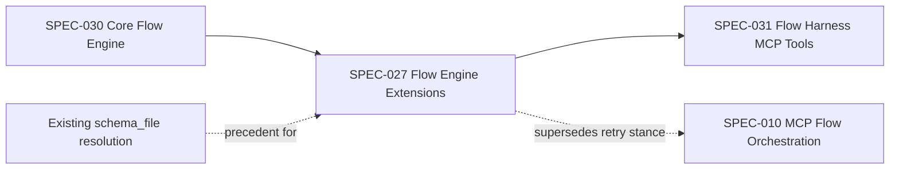
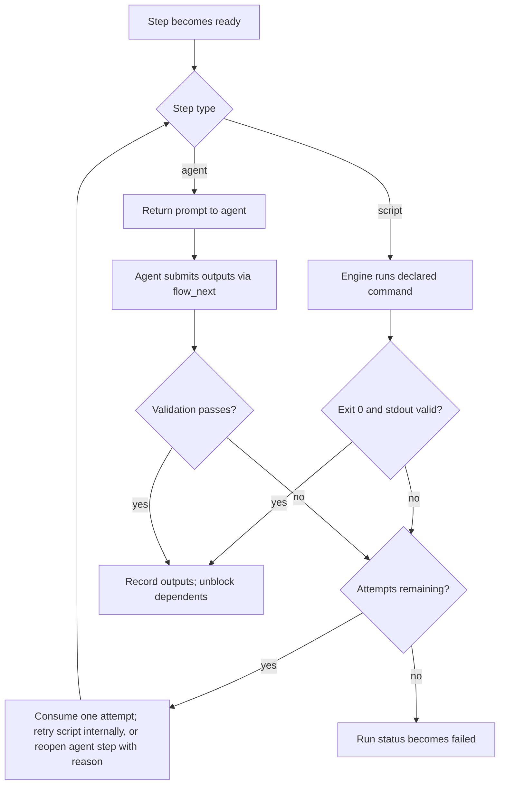
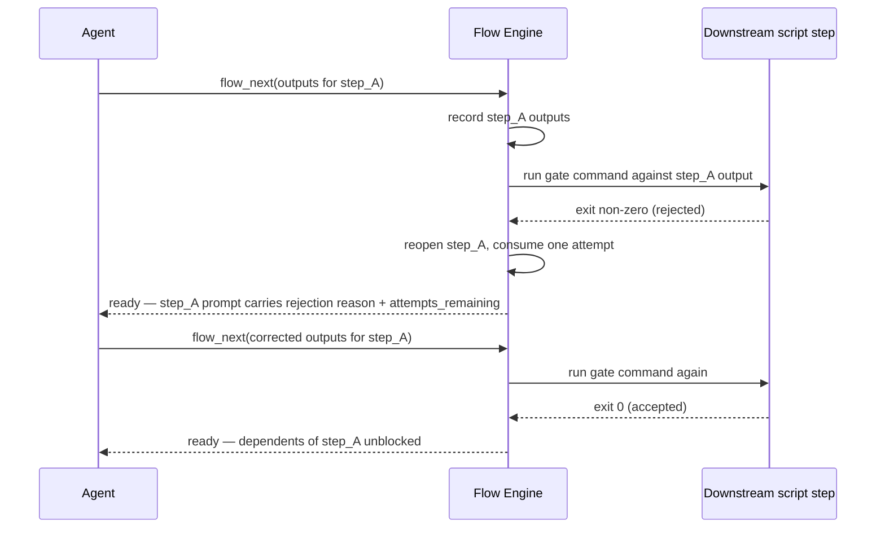

# Flow Engine Extensions: Prompt Files, Script Steps, and Nested Sub-Flows

## Description

Extends the core flow engine (SPEC-030) with three additive capabilities: steps can source their instruction text from an external file instead of only inline text; a new step type executes a declared command directly rather than waiting on an agent turn, feeding its result into the same output/dependency wiring agent steps use; and a flow can include another flow's steps under a named, aliased group, so the group is inlined at load time and exposed to the rest of the DAG as a single opaque dependency unit. A shared attempts counter bounds every kind of step failure — schema-shape, semantic rejection, or script execution — so a persistent bug short-circuits a run instead of looping indefinitely.

## Input / Output

|   | Detail |
|---|--------|
| Input | Flow YAML definitions carrying the new step fields (`prompt_file`; `type: script` with `command`, `timeout_seconds`, `max_attempts`; `include` with `as`), loaded from user or plugin harness folders by the existing flow loader. |
| Output | A resolved `FlowDef` consumed by the dag runner and stepper; per-step outputs (agent- or script-produced) recorded into the run's event log; a `failed` terminal run status, and `attempts_remaining` / rejection-reason data, surfaced to the calling agent via the existing `flow_next` / `flow_status` contract. |

## User Stories

### US-1: Prompt sourced from an external file

As the system, when a step's content source is a file reference, I want to load the prompt text from that file at load time, so authors can reference reusable prompt documents instead of duplicating inline text.

**Acceptance Criteria:**
- A step whose type is agent declares exactly one of `prompt` or `prompt_file`; declaring both, or declaring neither, raises a validation error at load time, before any run starts.
- When `prompt_file` is set, its value is a path resolved relative to the step file's own location — the same relative-path convention the engine already uses for schema files — and the resolved text becomes that step's prompt content.
- When `prompt_file` points to a path that does not resolve, load raises a validation error naming the step's ID and the missing path.
- Expression interpolation (`{{steps.<id>.outputs.<name>}}` and other supported expressions) applies identically to file-sourced and inline prompt text — the source of the text does not change when interpolation happens.

### US-2: Script-executed steps with a shared attempts cap

As the system, when a step's type is script, I want to run its declared command myself and feed the result into the same output and dependency wiring agent steps use, and I want every step's validation failures — schema-shape, semantic rejection, or script execution failure — bounded by one shared attempts counter, so a persistent bug short-circuits a run instead of retrying forever.

**Acceptance Criteria:**
- A step whose type is script declares `command` (a list of argument strings) and must not declare `prompt` or `prompt_file`; a step whose type is agent declares exactly one of `prompt`/`prompt_file` and must not declare `command`. A mismatch between a step's declared type and the fields it carries raises a validation error at load time.
- Each `command` is checked against a permitted-executable allowlist at load time; a command naming a non-permitted executable raises a validation error before any run starts — never at execution time.
- Readiness computation (`depends_on`, `for_each` expansion) treats script and agent steps identically. The step's type only determines which handler runs and validates it; the readiness computation itself performs no type-specific branching.
- A script step's process runs under an explicit `timeout_seconds`; exceeding it terminates the process and counts as one failed attempt.
- A script step that exits with code 0 and produces stdout that parses and validates against its declared output schema records those outputs and unblocks its dependents, identically to an agent step's declared outputs.
- A script step that exits with a non-zero code, or exits 0 with stdout that fails to parse or fails schema validation, counts as one failed attempt; the process's stderr (or the parse/validation error) becomes the recorded rejection reason for that attempt.
- Every step declares `max_attempts` (defaulting to 3 when unset). This cap applies uniformly across schema-shape validation failures, semantic/script rejections, and script execution failures — replacing today's unlimited-retry behavior on schema-shape failures.
- While attempts remain, a script step's failure is retried by the engine itself, without being surfaced to the calling agent as an error or a required response.
- While attempts remain, an agent step whose already-recorded output is rejected by a downstream step is reopened: it is removed from the completed set, its prompt is re-rendered with the rejection reason interpolated in, and the response to the agent reports how many attempts remain for that step.
- When a step's attempts are exhausted, the run's status becomes `failed` — distinct from `done` and `timed_out`. Both `flow_next` and `flow_status` report `failed`, and the run's active pointer is cleared the same way it already is for `done`/`timed_out`.

### US-3: Nested sub-flows via aliased includes

As the system, when a flow includes another flow's steps under a named group, I want to inline that group's steps into the parent's flat step list at load time, expose the group as a single dependency unit to the rest of the flow, and detect malformed or circular includes before any run starts.

**Acceptance Criteria:**
- A flow can include another flow file under an `as` alias; every step ID from the included flow is qualified in the loaded flow definition as `<alias>.<original_id>`.
- The same sub-flow file can be included more than once within the same parent flow, under distinct aliases, without an ID collision.
- An alias that collides with an existing top-level step ID, or with another group's alias, raises a validation error at load time.
- A circular include chain — a flow including, directly or transitively, itself — raises a validation error at load time, detected by a dedicated include-validation check invoked from the engine's existing dependency-cycle validator.
- A step outside a group may declare a dependency on the group's alias, and that dependency is satisfied only once every step within that group has completed; it may not declare a dependency on a qualified `<alias>.<step_id>` from outside the group — that raises a validation error, keeping the group opaque from the outside.
- A step inside a group declares dependencies on its sibling steps using their original, unqualified IDs; those references resolve against the group's own local step list, before qualification is applied to the outside world.

## Connects To

| Direction | Spec / Component | Relationship |
|---|---|---|
| Upstream | SPEC-030 Core Flow Engine (`models.py`, `dag_runner.py`, `flow_loader.py`, `interpolator.py`, `schema_validator.py`) | This spec extends the engine's step model, load-time validation, and readiness computation. |
| Upstream | Existing `schema_file` resolution pattern | `prompt_file` resolution mirrors this precedent for file-backed step content. |
| Downstream | SPEC-031 Flow Harness MCP Tools | `flow_next` / `flow_status` response contract gains a `failed` run status and per-step `attempts_remaining` / rejection-reason data. |
| Downstream | SPEC-010 MCP-Driven Flow Orchestration | Its stop-hook handler must treat `failed` the same as `done`/`timed_out` (allow exit, clear the active run pointer, do not re-inject a prompt). Its "no per-step retry config" design stance is intentionally superseded for the uniform attempts cap introduced here. |

## Diagrams

### Connection

### Flow — step readiness through attempts / retry

### Sequence — agent step rejected by a downstream gate

## Technical Requirements

- **Step content-source fields**: `prompt` (inline text, existing), `prompt_file` (new, path resolved relative to the step file), `command` (new, list of argument strings, script steps only), `timeout_seconds` (new, script steps only), `max_attempts` (new, all steps, default 3). Exactly one content-source field is valid per step type, checked at load time.
- **Allowlist**: permitted executables are declared as engine-level configuration (the same configuration surface that already resolves user vs. plugin search paths). A `command` whose first argument is not on the allowlist fails load-time validation.
- **Type-dispatched handler**: the orchestration layer resolves a per-step handler by the step's declared type before invoking `run` and `validate` on it. The DAG readiness computation (`depends_on` resolution, `for_each` expansion) does not itself inspect step type — new step types must not require changes to that computation.
- **Uniform attempts bookkeeping**: attempts consumed are tracked per step ID and persist across the same mechanism that already persists completed-step outputs (the append-only event log), so a resumed run reconstructs the correct remaining-attempts count.
- **Run status**: `failed` is added as a terminal run status alongside `done` and `timed_out`. Anything currently treating `done`/`timed_out` as "stop re-injecting, clear active run" must also treat `failed` that way.
- **Include qualification**: `include`/`as` extends the engine's existing single-step fragment reference (`uses:`) to a multi-step, aliased group reference. ID qualification, alias-collision detection, and circular-include detection are implemented as an extension of the existing dependency-cycle / duplicate-ID validation, not as a separate, unrelated check.

## Test Plan

### Unit Tests — prompt_file resolution
- When a step declares only `prompt_file`, load resolves the file's text as that step's prompt.
- When a step declares only `prompt`, load keeps the inline text as that step's prompt.
- When a step declares both `prompt` and `prompt_file`, load raises a validation error.
- When an agent-type step declares neither `prompt` nor `prompt_file`, load raises a validation error.
- When `prompt_file` points to a path that does not resolve, load raises a validation error.

### Unit Tests — script step handler
- When a script step's command names a non-allowlisted executable, load raises a validation error.
- When a script step exits 0 with stdout that validates against its declared output schema, the step's outputs are recorded and its dependents unblock.
- When a script step exits 0 with stdout that fails to parse as declared, the attempt is counted as failed.
- When a script step exits with a non-zero code, the attempt is counted as failed and stderr becomes the rejection reason.
- When a script step's process exceeds `timeout_seconds`, the attempt is counted as failed and the process is terminated.
- When a script step fails and attempts remain, the engine retries the command internally without surfacing an error to the agent.
- When a script step exhausts `max_attempts`, the run's status becomes `failed`.

### Unit Tests — uniform attempts / reject-retry gate
- When a downstream step rejects a prior agent step's recorded output, the prior step is removed from the completed set and reopened.
- When a reopened step's prompt is re-rendered, it carries the rejection reason and the count of attempts remaining.
- When any step — agent or script — fails validation and attempts remain, the response reports attempts remaining and does not advance run state.
- When any step exhausts `max_attempts`, the response reports `failed` and the active run pointer is cleared, matching `done`/`timed_out` behavior.
- When a step declares no `max_attempts`, the default cap of 3 applies.

### Unit Tests — aliased includes
- When a flow includes a sub-flow under an alias, each of the sub-flow's step IDs is qualified as `<alias>.<original_id>` in the loaded flow definition.
- When the same sub-flow is included twice under distinct aliases, both inclusions load without an ID collision.
- When an alias collides with an existing step ID or another group's alias, load raises a validation error.
- When an included sub-flow includes itself, directly or transitively, load raises a validation error.
- When a step outside a group depends on the group's alias, it unblocks only once every step inside that group has completed.
- When a step outside a group depends on a qualified `<alias>.<step_id>`, load raises a validation error.
- When a step inside a group depends on a sibling using its unqualified original ID, the dependency resolves correctly within the group's local context.

### Integration Tests
- When a flow combining a `prompt_file` step, a script step, and an aliased include runs end-to-end through the existing start/next tool loop, it reaches `done`.
- When a script step in a running flow exhausts all its attempts, the run's status is `failed` and no further steps are returned as ready.

## Definition of Done

- [x] `prompt_file` resolves at load time with one-of validation against `prompt` for agent-type steps
- [x] `type: script` steps declare `command`/`timeout_seconds`, validated against an executable allowlist at load time
- [x] A type-dispatched step handler runs/validates each step; DAG readiness computation contains no step-type branching
- [x] `max_attempts` (default 3) uniformly gates schema-shape failures, semantic rejections, and script execution failures across all step types
- [x] Script step failures retry internally up to `max_attempts` without surfacing to the agent; rejected agent steps reopen and report attempts remaining
- [x] Attempts-exhausted transitions run status to `failed`, distinct from `done`/`timed_out`, and clears the active run pointer
- [x] Aliased includes qualify step IDs as `<alias>.<step_id>`, support repeat inclusion under distinct aliases, and detect alias collisions and circular includes at load time
- [x] `depends_on` may target a group alias (waits for the full group) or an unqualified step ID; a qualified cross-group reference from outside a group is rejected at load time
- [x] All test plan cases pass
