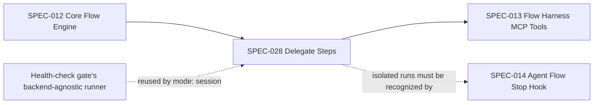
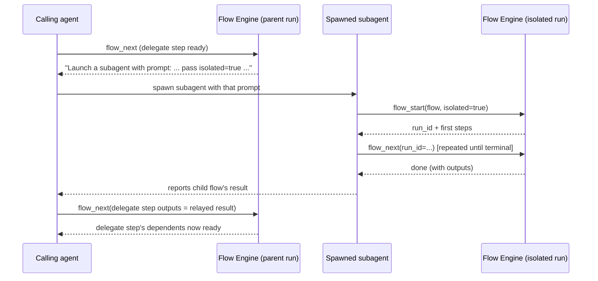

# Delegate Steps and Isolated Runs

## Description

Extends the flow engine (SPEC-012) with a `delegate` step type that hands a unit of work to a separate agent context — either a spawned subagent or a synchronously-run nested session — instead of the calling agent doing it inline. Delegated work runs its own child flow in a self-contained isolated run box, distinct from the single main-run slot, so it never collides with the parent's own active-run lock. This replaced an earlier environment-variable-detection design (`CLAUDE_AGENT_TYPE`) that never worked in practice, because no such variable exists — isolation mode is instead declared explicitly by the flow author at authoring time.

## Input / Output

|   | Detail |
|---|--------|
| Input | A step in a flow YAML declaring `type: delegate` and `mode: subagent` or `mode: session`, with `prompt`, `outputs`, and `depends_on` like any other step. |
| Output | For `mode: subagent`: a rendered instruction telling the calling agent to launch a subagent, which starts and drives its own isolated child flow via `flow_start(isolated=true)`/`flow_next(run_id=...)`, then relays its outputs back through the normal step-output contract. For `mode: session`: the delegate step runs to completion synchronously within the same process, with no separate outputs — the same mechanism a script step's success/failure and dependent-unblocking uses. |

## User Stories

### US-1: Declaring a delegate step

As the system, when a flow author declares a step with `type: delegate`, I want the step's shape validated at load time exactly like every other step type, so a malformed delegate step is caught before any run starts, not mid-execution.

**Acceptance Criteria:**
- A `type: delegate` step must declare a non-empty `prompt`; omitting it raises a validation error naming the step's ID, at load time.
- A `type: delegate` step must not declare `command`; declaring it raises a validation error naming the step's ID, at load time.
- A `type: delegate` step must declare `mode` as exactly `subagent` or `session`; omitting `mode` or declaring any other value raises a validation error naming the step's ID and the two valid values, at load time.
- Readiness computation (`depends_on`, `for_each` expansion) treats delegate steps identically to every other step type — the step's declared type only determines which handler and validator run against it.

### US-2: `mode: subagent` — spawning a separate agent context

As the system, when a delegate step's mode is `subagent`, I want the calling agent's rendered instruction to explicitly say to launch a subagent, carrying the step's own prompt plus the isolation instructions the subagent needs, so the calling agent never runs the delegated work itself and the subagent knows how to start and drive its own isolated run.

**Acceptance Criteria:**
- A ready `mode: subagent` delegate step's rendered text begins with an explicit instruction to launch a subagent, followed by the step's declared prompt.
- The instruction handed to the subagent additionally tells it: to pass `isolated=true` when it starts its own flow, and to keep advancing that flow until it reports done, failed, or timed out.
- The delegate step itself is not auto-run and does not block the calling agent from being offered other ready steps at the same time — it becomes ready under the same `depends_on` rules as any other step, and stays pending (awaiting the calling agent's action) until its declared outputs are submitted like a normal agent step.
- Once the calling agent submits this step's declared outputs (produced by relaying whatever the subagent reported), the step completes and unblocks its own dependents exactly as any other agent step would.

### US-3: `mode: session` — synchronous nested execution

As the system, when a delegate step's mode is `session`, I want the delegated work to run to completion synchronously within the current process, using the same backend selection (Claude, Codex, or local) the rest of the system already uses, so switching backends requires no separate delegate-specific implementation.

**Acceptance Criteria:**
- A ready `mode: session` delegate step runs automatically, without being offered to the calling agent as a pending step — it behaves like a script step from the calling agent's perspective: either it succeeds and its dependents unblock, or it fails and consumes one of the step's attempts.
- The delegated session receives the step's own prompt plus the same isolation instructions described in US-2 (pass `isolated=true`, keep advancing until terminal).
- The delegated session's backend (which LLM/CLI actually executes it) is selected via the same configuration surface that already selects the backend for the pre-write health-check gate — no separate delegate-specific backend selection exists.
- A `mode: session` delegate step that produces no usable result is treated as a failed attempt, consuming one of the step's `max_attempts` like any other step failure.

### US-4: Isolated run storage keeps delegated flows out of the main lock

As the system, when a delegated flow starts with isolation requested, I want it to persist its own run state in a location entirely separate from the single main-run slot, so a delegated child flow can never collide with — or be mistaken for — the parent's own active run.

**Acceptance Criteria:**
- Starting a flow with isolation requested creates a self-contained run location distinct from the shared main-run slot; that location holds its own run-active marker, its own event log, and its own resolved flow snapshot — the same three artifacts a main run has, but never sharing the main run's file.
- Advancing or reading an isolated run's state requires naming its exact run identifier on every call; omitting it resolves the main run instead, never an isolated one.
- Naming a run identifier that has no corresponding isolated run raises a clear error distinguishing "not found" from "no run active."
- Starting an isolated run never fails with "another run is already active" because of a main run already in progress, and starting or advancing the main run is never blocked by an isolated run in progress.
- When a flow is started with isolation requested, the response discloses that run's identifier and states that the identifier must be passed on every subsequent call for that run. When isolation is not requested, no internal identifier is disclosed, matching today's existing main-run behavior exactly.

## Technical Requirements

- **Step model**: delegate is a step `type` alongside `agent` and `script`; it adds a `mode` field (`subagent` | `session`) with no default — declaring `type: delegate` without `mode` is a load-time error.
- **No environment-based mode detection.** A prior design attempted to infer "am I in a subagent" from an environment variable; confirmed empirically that Claude Code never sets any such variable, and there is no MCP-protocol-level signal distinguishing a main-session tool call from a subagent's. Mode is therefore always an explicit, authored flow property, never inferred at runtime.
- **`mode: subagent` rendering**: delegation is a rendering-time concern, not a handler-time one — the step executes through the same path as a normal agent step; only the rendered instruction text differs (prefixed with an explicit "launch a subagent" directive plus the isolation instructions).
- **`mode: session` execution**: reuses the existing backend-agnostic LLM runner factory already used by the pre-write health-check gate (supports Claude, Codex, and local backends via existing `[llm].backend` configuration) — deliberately not a new, delegate-specific runner, so adding a backend anywhere else in the system automatically covers delegate sessions too. Runs with a fixed, generous timeout suited to a full nested flow (minutes, not seconds).
- **Isolated run storage**: a dedicated subdirectory under the runs root, keyed by run identifier, holding the same three artifacts (run-active marker, event log, resolved flow snapshot) a main run has. Main-run lookups (no run identifier given) and isolated-run lookups (run identifier given) are two distinct, non-overlapping resolution paths sharing the same return shape.
- **Tool surface**: the flow-start tool gains an isolation-request flag (default off, preserving today's main-run behavior exactly when omitted); the flow-advance and flow-read tools gain an optional run-identifier parameter that, when given, targets the isolated run instead of the main one.
- **`--bare`/scripted-CLI constraint**: a `Task`/subagent-spawning tool is not available in `--bare`-style invocations regardless of tool allowlisting — `mode: subagent` cannot be exercised in that context; only `mode: session` can. Flow authors who need delegate behavior that also has to work under `--bare` should use `mode: session`.

## Connects To

| Direction | Spec / Component | Relationship |
|---|---|---|
| Upstream | SPEC-012 Core Flow Engine (`models.py`, `dag_runner.py`, step handler/validator dispatch) | Extends the step type model and load-time validation, following the same type-dispatched-handler pattern SPEC-027 established for script steps. |
| Upstream | Pre-write health-check gate's backend-agnostic LLM runner factory | `mode: session` reuses this factory rather than introducing a parallel, delegate-specific backend selection mechanism. |
| Downstream | SPEC-013 Flow Harness MCP Tools | `flow_start` gains an isolation-request parameter; `flow_next`/`flow_status` gain an optional run-identifier parameter to target an isolated run. |
| Downstream | SPEC-014 Agent Flow Stop Hook | Must recognize that an isolated run's own stop/turn-ending behavior is independent of the main run's — a pending isolated run does not, by itself, imply the main run is also pending. |

## Diagrams

### Connection



### Flow — delegate step dispatch by mode

```mermaid
flowchart TD
  A[Delegate step becomes ready] --> B{mode}
  B -- subagent --> C[Render: "Launch a subagent" + prompt + isolation instructions]
  C --> D[Calling agent spawns subagent]
  D --> E[Subagent starts isolated child flow, drives it to a terminal state]
  E --> F[Calling agent submits delegate step's outputs, relaying the subagent's result]
  F --> G[Delegate step completes; dependents unblock]
  B -- session --> H[Engine runs backend-agnostic session synchronously with prompt + isolation instructions]
  H --> I{Produced a usable result?}
  I -- yes --> G
  I -- no --> J[Attempt consumed; retry if attempts remain, else run fails]
```

### Sequence — `mode: subagent` end to end



## Test Plan

### Unit Tests — delegate step validation
- When a `type: delegate` step declares no `prompt`, load raises a validation error naming the step.
- When a `type: delegate` step declares `command`, load raises a validation error naming the step.
- When a `type: delegate` step declares no `mode`, load raises a validation error naming the step and the valid mode values.
- When a `type: delegate` step declares a `mode` value outside `subagent`/`session`, load raises a validation error.

### Unit Tests — `mode: subagent` rendering
- When a ready step's mode is `subagent`, its rendered text begins with an explicit subagent-launch instruction.
- When a ready step's mode is `subagent`, the rendered instruction includes the isolation directive (pass `isolated=true`, keep advancing until terminal).
- When a step's mode is not `subagent` (or the step is not type `delegate`), rendering is unaffected — no subagent-launch prefix appears.
- When a `mode: subagent` step's outputs are submitted via the normal step-output path, it completes and unblocks dependents identically to a plain agent step.

### Unit Tests — `mode: session` execution
- When a `mode: session` step runs and produces a usable result, its dependents unblock without the calling agent ever seeing that step as pending.
- When a `mode: session` step produces no usable result, the attempt is counted as failed against the step's `max_attempts`.
- When a `mode: session` step is invoked, the prompt handed to the underlying runner includes the same isolation directive as the subagent path.

### Unit Tests — isolated run storage
- When a flow is started with isolation requested, its run-active marker, event log, and flow snapshot are created under the isolated-run location, not the main run's.
- When `flow_next`/`flow_status` are called with a run identifier, they read and advance that isolated run, not the main run.
- When `flow_next`/`flow_status` are called with no run identifier, they read and advance the main run, unaffected by any isolated run in progress.
- When a run identifier naming a nonexistent isolated run is given, a "not found" error is raised, distinguishable from "no run active."
- When an isolated run is started while the main run is already active (or vice versa), neither blocks the other.
- When a flow is started with isolation requested, the response discloses that run's identifier; when isolation is not requested, no internal identifier is disclosed.

### Integration Tests
- When a flow with a `mode: session` delegate step runs end-to-end, the delegate step's own nested flow reaches a terminal state and the parent step's dependents unblock, all within one top-level session.
- When a flow with a `mode: subagent` delegate step runs against a real spawned subagent, the subagent starts and drives its own isolated child flow to completion, and the value it produces is correctly relayed back into the parent step's own declared output.

## Definition of Done

- [x] `type: delegate` steps are validated at load time: `prompt` required, `command` forbidden, `mode` required and restricted to `subagent`/`session`
- [x] Readiness computation treats delegate steps identically to other step types — no type-specific branching in the DAG readiness path
- [x] `mode: subagent` steps render an explicit subagent-launch instruction carrying the step's prompt plus isolation directives, without being auto-run
- [x] `mode: session` steps run synchronously via the existing backend-agnostic runner factory, behaving like a script step from the calling agent's perspective
- [x] Isolated runs persist their own run-active marker, event log, and flow snapshot under a dedicated location, fully independent of the main run's lock
- [x] `flow_start` supports an isolation-request flag; `flow_next`/`flow_status` support an optional run-identifier targeting an isolated run
- [x] An isolated run and the main run never block each other's start/advance
- [x] Live-verified end to end for both modes: `mode: session` (nested session drives a 2-step child flow to completion while the parent continues) and `mode: subagent` (real subagent spawn, child flow driven to completion, output value correctly relayed to the parent step)
- [x] All test plan cases pass
