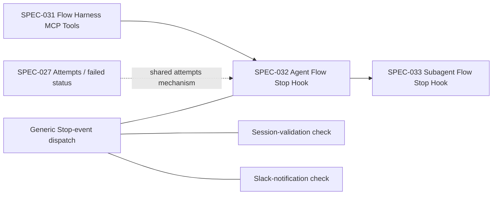
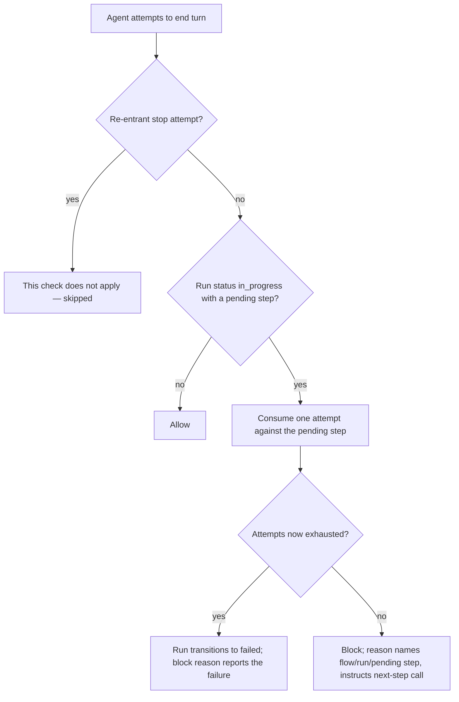
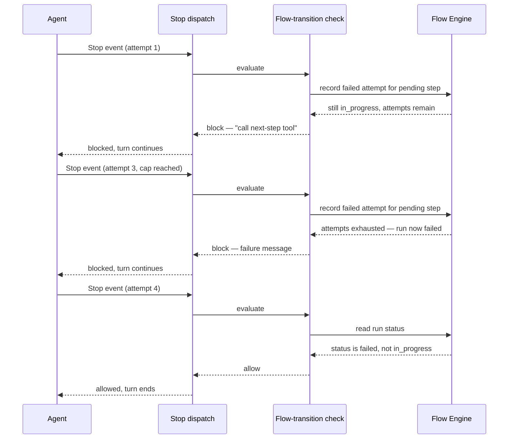

# Agent Flow Stop Hook

## Description

Prevents the main agent from ending its turn while a flow run it started is left `in_progress` with a step still pending — the concrete fix for agents that call `flow_start`, receive the first step, and stop without ever calling `flow_next`. Implemented as one handler among several evaluated concurrently for every `Stop` event through a shared, generic dispatch mechanism (also used by session validation and Slack notification) rather than as its own standalone script — the design originally proposed here (a separate `on_flow_stop.py` using raw stderr and an exit-code-2 block) was superseded before being built.

## Input / Output

|   | Detail |
|---|--------|
| Input | A Claude Code `Stop` event (JSON on stdin), carrying at minimum `stop_hook_active` and `session_id`. |
| Output | A structured allow/block decision communicated back through the hook response protocol's decision/reason fields — never a raw exit code or stderr text. When blocking, the reason names the flow, run, and pending step(s), or — once the pending step's attempts are exhausted — the run's own failure message. |

## User Stories

### US-1: Block ending a turn while a flow is left pending

As the system, when the main agent tries to end its turn while a flow run it started is `in_progress` with a step still pending, I want the turn-ending to be blocked with an instruction to call the flow's next-step tool, so the agent doesn't silently abandon a flow it never finished.

**Acceptance Criteria:**
- When the current run's status is `in_progress` and it has at least one pending step, ending the turn is blocked; the block reason names the flow, the run, and the pending step(s), and instructs the agent to advance the run before stopping.
- When the current run's status is not `in_progress` (e.g. no run has ever started, or the run already reached a terminal state), ending the turn is allowed, unaffected by this check.
- When the current run's status is `in_progress` but it has no pending steps, ending the turn is allowed.
- This check never runs on a re-entrant stop attempt (one already triggered by a prior block on the same turn) — it only evaluates on a fresh stop attempt, preventing the check from re-blocking its own re-entry indefinitely.

### US-2: A stuck agent cannot be blocked forever

As the system, when the same pending step keeps blocking the agent's turn-ending across repeated attempts, I want each block to count as one failed attempt against that step, so that once its attempts are exhausted the run fails cleanly and stops re-blocking — the same attempts bookkeeping every other kind of step failure already uses, not a separate counter.

**Acceptance Criteria:**
- Each time ending the turn is blocked for a given pending step, that block counts as one consumed attempt against that step, using the same per-step attempts cap (and default value) every other step failure mode already shares.
- Once a pending step's attempts are exhausted by repeated blocks, the run's status transitions to its terminal failed state — distinct from simply being `in_progress` — and the block reason on that exhausting attempt reports the failure explicitly (naming the step and its exhausted attempt count), not the generic "call the next-step tool" message.
- Once the run has transitioned to its terminal failed state, the very next turn-ending attempt is allowed — the failed run no longer reads as `in_progress`, so US-1's condition no longer applies.
- Ending the turn while a *different* run's steps are pending is entirely unaffected by one run's attempts being exhausted — attempts are tracked per step, within one run, not globally.

### US-3: Coexists with other independent Stop-time checks

As the system, when multiple independent Stop-time checks (this one, session validation, and a notification side effect) all apply to the same Stop event, I want them evaluated together and combined into one decision, so that any one of them blocking is enough to block the turn, and an unrelated check's internal error never itself blocks a turn it has nothing to do with.

**Acceptance Criteria:**
- When this check and at least one other Stop-time check both apply to the same event and either denies, the turn-ending is blocked; when all that apply allow it, the turn-ending is allowed.
- When more than one applicable check denies, the block reason communicates every denying check's reason, not just one of them.
- An unrelated Stop-time check's internal error never itself causes a turn-ending to be blocked — an error in one check is treated as that check allowing, not denying.
- A Stop-time check whose own applicability condition isn't met for a given event (e.g. it only applies to sessions carrying a particular identifier) is skipped entirely for that event — it neither allows nor denies, and does not affect the combined decision.

## Technical Requirements

- **Dispatch model**: Stop events are handled by a single registered entry point that fans out to every applicable check concurrently (one thread per applicable check), then combines their individual allow/deny decisions into one: any denial wins, every denying reason is preserved (not just the first), and every check's supplementary context is merged regardless of allow/deny. A check that raises is treated as an allow, not a denial or a crash of the whole dispatch.
- **Response protocol**: decisions are communicated via the Stop-hook response protocol's structured decision/reason fields, not raw stderr text or a non-zero exit code — a deliberate correction from this spec's original design, made when a design flaw (two methods for one concept) was found and fixed platform-wide across every hook response path, not just this one.
- **Attempts bookkeeping reuse**: a blocked stop consumes a step attempt through the exact same mechanism a rejected agent-step submission or a failed script step already uses — no separate, Stop-hook-specific attempts counter exists. The default attempts cap (3) is the same default every step type shares unless a flow author overrides it.
- **Applicability, not a fixed handler list**: whether this check (or any other Stop-time check) applies to a given event is itself an inspectable, independently-testable condition — separate from what the check does once it applies — so a new Stop-time concern can be added without changing how existing ones are evaluated or combined.

## Connects To

| Direction | Spec / Component | Relationship |
|---|---|---|
| Upstream | SPEC-031 Flow Harness MCP Tools | Reads the same run-status/pending-step state `flow_status` exposes; reuses the same active-run resolution `flow_next`/`flow_status` use (including session-scoping). |
| Upstream | SPEC-027 Flow Engine Extensions (attempts / `failed` status) | This check's attempt-exhaustion behavior (US-2) is the same uniform attempts mechanism SPEC-027 introduced for script and agent step failures — not a separate implementation. |
| Sibling | Session-validation and Slack-notification Stop-time checks | Independent concerns evaluated through the same dispatch mechanism described in Technical Requirements; this spec does not own or describe their behavior, only that it coexists with them per US-3. |
| Downstream | SPEC-033 Subagent Flow Stop Hook | The equivalent check for a subagent's own turn-ending, guarding a delegated/isolated run instead of the main run. |

## Diagrams

### Connection

### Flow — turn-ending evaluation for one pending step

### Sequence — repeated blocks to exhaustion

## Test Plan

- Unit: when no run has ever started, ending the turn is allowed.
- Unit: when the run is `in_progress` with a pending step, ending the turn is blocked with a reason naming the flow, run, and pending step.
- Unit: when the run is `in_progress` with nothing pending, ending the turn is allowed.
- Unit: when the run's status is not `in_progress` (done, failed, timed out), ending the turn is allowed.
- Unit: a re-entrant stop attempt (already triggered by a prior block) is skipped by this check entirely.
- Unit: this check's own internal error is treated as an allow, never a block, when combined with other checks.
- Integration: three consecutive blocked stop attempts against the same pending step consume its default 3 attempts; the third attempt's block reason reports the exhaustion/failure message naming the step; a fourth attempt is allowed because the run's status is no longer `in_progress`.
- Integration: blocking one run's pending step has no effect on ending the turn while a different, unrelated run's steps are pending.
- Integration: when this check and another applicable Stop-time check both deny the same event, the combined block reason includes both denying reasons.

## Definition of Done

- [x] Ending the turn is blocked while the current run is `in_progress` with a pending step, with a reason naming the flow/run/pending step
- [x] A re-entrant stop attempt is never re-evaluated by this check
- [x] Each block consumes one attempt against the pending step via the same shared attempts mechanism every step failure mode uses
- [x] Exhausting a pending step's attempts transitions the run to its terminal failed state and the exhausting block's reason reports that failure explicitly
- [x] Once the run is no longer `in_progress`, ending the turn is allowed unconditionally
- [x] Coexists correctly with other independent Stop-time checks: any denial wins, every denying reason is preserved, an unrelated check's internal error never blocks
- [x] Live-verified via real on-disk flow runs (real run state, no stubs), including the full three-attempts-then-exhaustion-then-allow sequence
- [x] All test plan cases pass
