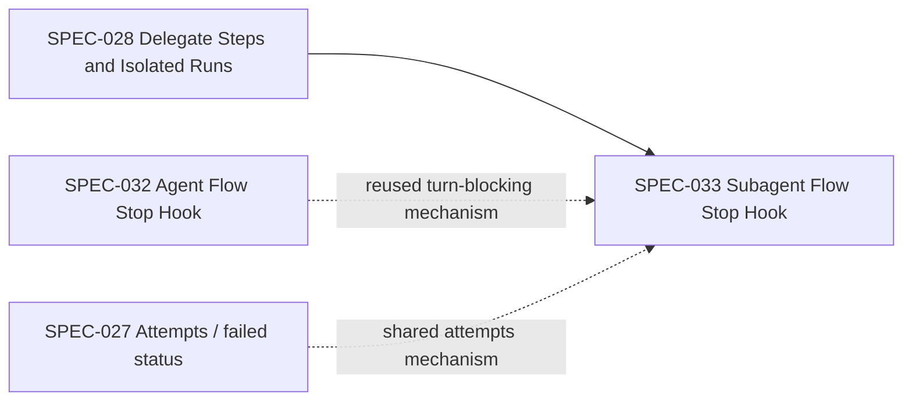
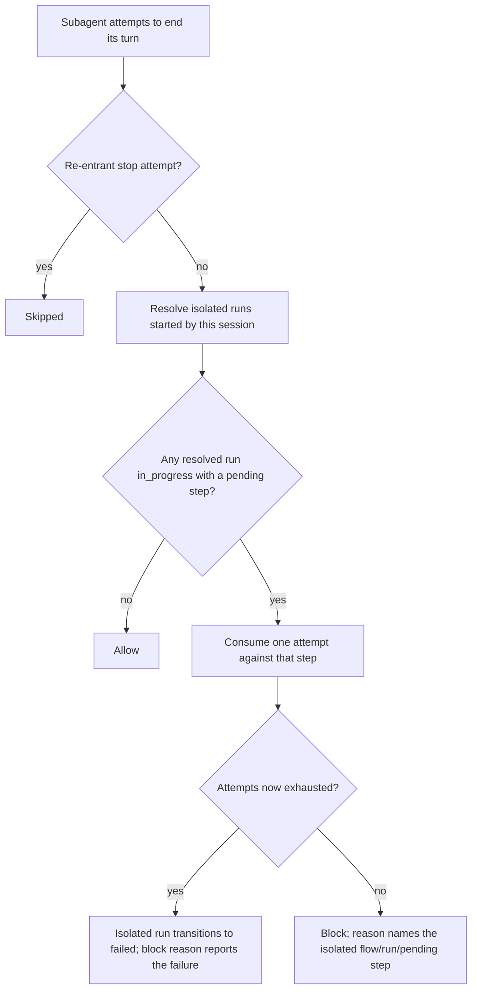

# Subagent Flow Stop Hook

## Description

Prevents a subagent spawned to drive a delegated, isolated child flow (SPEC-028's `mode: subagent` delegate step) from ending its own turn while that isolated run is left `in_progress` with a step still pending — the `SubagentStop` counterpart to SPEC-032's main-agent `Stop` check, reusing the same turn-blocking and attempt-exhaustion mechanism, pointed at the subagent's own isolated run instead of the main run.

**Redesigned from the original draft.** The original design assumed a subagent submits its output directly into the *parent's* run by calling the parent's own `flow_next`, and could be checked via a `session_id → instance_id` mapping recorded in the parent's event log. That model predates SPEC-028: a `mode: subagent` delegate step's subagent starts and drives its own **isolated** child flow (its own run directory, its own event log) via `flow_start(isolated=true)`/`flow_next(run_id=...)` — it never calls the parent's `flow_next` at all, so the parent's event log never contains any record of the subagent's session. The original mechanism cannot see the isolated run and would silently no-op for every real `mode: subagent` case. This redesign checks the *isolated* run's own state instead.

**Why this still matters despite SPEC-032 already covering the parent.** The parent's own turn-ending is already blocked correctly by SPEC-032 while the delegate step (from the parent's perspective, an ordinary pending step) remains unsubmitted — a parent can't silently walk away from a delegate step it never got a result for. What SPEC-032 does *not* catch: the subagent itself abandoning its isolated child flow mid-way and reporting back to the parent anyway (a plausible-looking but incomplete result), or simply leaving an orphaned isolated run directory behind. This spec closes that narrower gap; it is a safety net for the subagent's own diligence, not the safety-critical parent-side guarantee (which is already secure).

## Input / Output

|   | Detail |
|---|--------|
| Input | A `SubagentStop` event (JSON on stdin), carrying `session_id`. |
| Output | An allow/block decision through the same hook response protocol SPEC-032 uses. When blocking, the reason names the isolated flow, run, and pending step(s), matching SPEC-032's message shape for the main run. |

## User Stories

### US-1: Recording which session owns an isolated run

As the system, when a flow is started with isolation requested, I want the starting session's identifier recorded against that isolated run, so a later `SubagentStop` event can find which isolated run (if any) that session was driving.

**Acceptance Criteria:**
- Starting an isolated run records the starting session's identifier as part of that run's own persisted state, alongside its existing run-active marker, event log, and flow snapshot.
- When no session identifier is available at start time (e.g. a `--bare`-style context), the isolated run is created exactly as it is today, without a session identifier recorded — this check will simply never find it later, matching today's behavior of no check applying.
- This recording adds no new failure mode to starting an isolated run — a run starts successfully whether or not a session identifier happens to be available.

### US-2: Block subagent stop while its isolated run is left pending

As the system, when a subagent's own turn-ending attempt occurs while an isolated run it started is `in_progress` with a step still pending, I want the turn-ending blocked with an instruction to keep advancing that run, so the subagent doesn't abandon a delegated flow it was specifically spawned to drive.

**Acceptance Criteria:**
- When the `SubagentStop` event's session identifier matches the starting session of an isolated run that is `in_progress` with a pending step, ending the turn is blocked; the reason names the isolated flow, its run identifier, and the pending step(s), and instructs calling the next-step tool with that run identifier.
- When the session identifier matches no isolated run's starting session, or matches one that is not `in_progress`, or has no pending steps, ending the turn is allowed — this check is a no-op for ordinary subagents (per-step workers, non-flow work) exactly as it is for a session that never started an isolated run at all.
- When a session identifier started more than one isolated run (sequential delegate steps in the same subagent turn, for example), each is checked; ending the turn is blocked if any of them is `in_progress` with a pending step.
- This check never runs on a re-entrant stop attempt, matching SPEC-032's US-1 re-entrancy rule.

### US-3: Same attempt-exhaustion safety valve as the main run

As the system, when the same isolated-run pending step keeps blocking a subagent's turn-ending across repeated attempts, I want each block to count as one failed attempt against that step using the exact same mechanism SPEC-032 uses for the main run, so a stuck subagent isn't blocked forever either.

**Acceptance Criteria:**
- Each blocked subagent stop attempt consumes one attempt against the isolated run's pending step, through the identical shared attempts mechanism SPEC-032 and SPEC-027 already use — not a separate, isolated-run-specific counter.
- Once that step's attempts are exhausted, the isolated run transitions to its terminal failed state, the exhausting attempt's block reason reports the failure explicitly, and the very next subagent stop attempt is allowed.
- Exhausting an isolated run's attempts has no effect on the main run, or on any other isolated run — attempts are tracked per step, within one run, exactly as today.

## Technical Requirements

- **Reuses the existing turn-blocking mechanism, not a parallel implementation.** The same status-check-then-record-attempt logic SPEC-032 already implements for the main run applies unchanged to an isolated run — the only new input is which run identifier to evaluate against, resolved via the session→isolated-run lookup from US-1, instead of always the main run.
- **Session→isolated-run lookup**: given a session identifier, resolve zero or more isolated run identifiers that session started, by reading the recorded starting-session identifier persisted per isolated run (US-1). A session identifier that started no isolated run resolves to none, and this check applies to nothing for that event.
- **Dispatch integration**: registers as one more independently-applicable check within the same generic Stop/SubagentStop dispatch mechanism SPEC-032 describes (concurrent evaluation, deny-wins aggregation, fail-open on internal error) — not a standalone script with its own response protocol.
- **Distinguishing a flow-driving subagent from an unrelated one**: applicability is entirely determined by whether the session identifier resolves to at least one isolated run via US-1's lookup — a subagent doing unrelated work, or a per-step worker subagent from an older/different mechanism, resolves to none and this check is a no-op for it. No transcript scanning or tool-call inspection is needed to make this distinction.

## Connects To

| Direction | Spec / Component | Relationship |
|---|---|---|
| Upstream | SPEC-028 Delegate Steps and Isolated Runs | This spec exists specifically to guard the isolated runs SPEC-028 introduces; the session→isolated-run recording in US-1 is an addition to SPEC-028's isolated-run-start behavior. |
| Upstream | SPEC-032 Agent Flow Stop Hook | Reuses SPEC-032's turn-blocking, attempt-exhaustion, and dispatch-integration mechanisms unchanged, applied to an isolated run instead of the main run. |
| Sibling | SPEC-027 Flow Engine Extensions (attempts / `failed` status) | Same uniform attempts mechanism, same terminal `failed` status semantics. |

## Diagrams

### Connection

### Flow — SubagentStop evaluation

## Test Plan

- Unit: starting an isolated run with a session identifier available records that identifier against the run.
- Unit: starting an isolated run with no session identifier available succeeds exactly as today, with nothing recorded.
- Unit: a `SubagentStop` event whose session identifier resolves to no isolated run is allowed (no-op).
- Unit: a `SubagentStop` event whose session identifier resolves to an isolated run that is `in_progress` with a pending step is blocked, naming that run's flow/run identifier/pending step.
- Unit: a `SubagentStop` event whose session identifier resolves to an isolated run that has reached a terminal state is allowed.
- Unit: a re-entrant `SubagentStop` attempt is skipped.
- Integration: a session that started two isolated runs sequentially is blocked if either is left `in_progress` with a pending step.
- Integration: three consecutive blocked `SubagentStop` attempts against the same isolated pending step exhaust its attempts, transition that isolated run to failed, and a fourth attempt is allowed.
- Integration: exhausting one isolated run's attempts has no effect on the main run or on a different isolated run.

## Definition of Done

- [ ] Starting an isolated run records the starting session's identifier as part of that run's persisted state
- [ ] `SubagentStop` resolves the event's session identifier to zero or more isolated runs it started
- [ ] Ending a subagent's turn is blocked while any resolved isolated run is `in_progress` with a pending step, with a reason naming the flow/run/pending step
- [ ] Each block consumes one attempt against the isolated run's pending step via the same shared mechanism SPEC-032 uses
- [ ] Exhausting an isolated run's pending-step attempts transitions it to failed and the next stop attempt is allowed
- [ ] A session that started no isolated run is entirely unaffected by this check
- [ ] Registers as one more check in the existing generic Stop/SubagentStop dispatch mechanism, not a standalone script
- [ ] All test plan cases pass

**Not yet implemented** — this is a redesigned plan, not a built feature. Nothing under `## Definition of Done` is checked. See `handover-session-scoped-run-lock.md`'s "Next session" list for follow-up.
