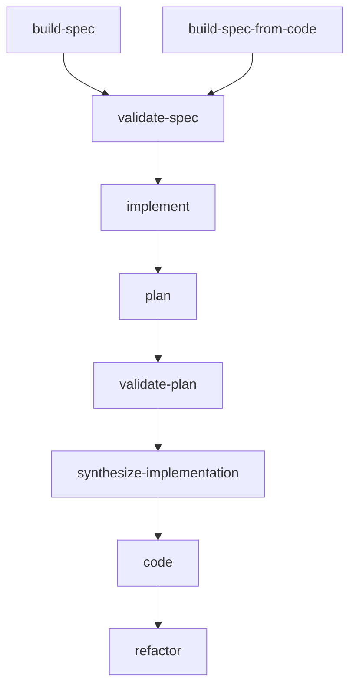
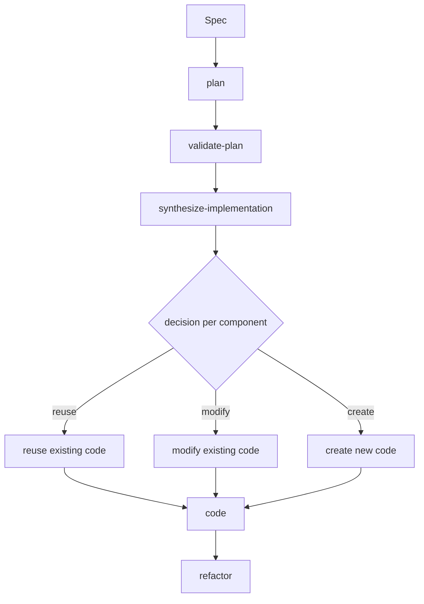
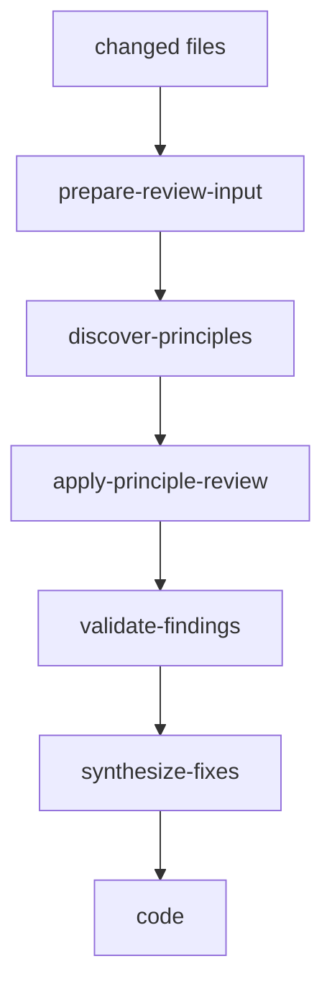

# solid-coder

A Claude Code plugin for **spec-driven implementation**, **principle-based review**, and **structured self-correction**.

`solid-coder` helps turn a spec into code through a staged workflow:

- build or refine specs
- derive an implementation plan
- validate that plan against the existing codebase
- decide what should be reused, modified, or created
- write code with active coding rules already loaded
- review and refactor the result using reusable principles such as DRY and SOLID

It is designed for **bounded, fresh-context implementation work**, not vague one-shot code generation.

---

## Core ideas

`solid-coder` is built around a few principles:

- **Specs drive implementation**  
  Work starts from structured specs, not ad hoc prompts.

- **Planning comes before coding**  
  Implementation is split into planning, validation, synthesis, coding, and refactor phases.

- **Rules are applied proactively**  
  Coding rules are discovered and loaded before code is written, then checked again during self-correction.

- **Front matter builds semantic memory**  
  Generated code is annotated with `solid-*` metadata so later workflows can discover and reuse it more reliably.

- **Refactor is a safety net**  
  Principle-based review and fix synthesis run after implementation to catch misses, drift, or architectural issues.

---

## Main workflows

### 1. `build-spec`

Interactive spec authoring for new or existing work.

Use it to:
- create a new spec from a prompt
- resume a draft spec
- extend an existing spec
- break a larger spec into smaller subtasks

What it does:
1. finds or creates the target spec context
2. interviews for stories, inputs/outputs, edge cases, integrations, technical requirements, and UI
3. generates diagrams
4. produces a draft spec
5. runs `validate-spec` before writing

---

### 2. `build-spec-from-code`

Creates a rewrite-oriented spec from existing code.

Use it when:
- you want to redesign or replace an existing module
- you need to preserve behavior while rewriting internals
- you want rebuild / bridge / migrate specs from current implementation

What it does:
1. reads code and extracts behaviors as stories
2. maps consumers, dependencies, and boundary points
3. generates current-state and target-state diagrams
4. interviews for what should stay vs change
5. scaffolds rewrite specs
6. runs `validate-spec` before writing

---

### 3. `implement`

Runs the staged spec-to-code pipeline.

What it does:
1. **plan** — derive the ideal architecture from the spec
2. **validate-plan** — search the codebase for existing code that may satisfy the plan
3. **synthesize-implementation** — decide what should be reused, modified, or created
4. **code** — write code with active rules already loaded
5. **refactor** — review the result against principles and apply safe corrections

This is the main workflow for turning a validated spec into code.

---

### 4. `refactor`

Runs principle-based review and structured correction for changed code.

What it does:
1. prepares normalized review input
2. discovers which principles are relevant
3. runs review per principle
4. validates findings
5. synthesizes fixes
6. routes fixes back through `code`

`refactor` is not a generic cleanup pass. It is a structured correction workflow.

---

## Workflow overview



---

## Implement flow



The key point: `implement` is not a single “write code” step. It explicitly branches into **reuse**, **modify**, and **create** decisions before coding.

---

## Refactor flow



The key point: `refactor` is a principle-driven review and correction pipeline, not a loose review prompt.

---

## How coding rules are discovered and applied

Rules are not only used after code is written.

During `code`:

1. active principles are discovered
2. each principle's `rule.md` is loaded
3. referenced examples are loaded
4. each principle's `fix/instructions.md` is loaded
5. these become active constraints while writing code
6. the result is self-checked against rules and acceptance criteria

After implementation, `refactor` can run a second safety pass using the same principle ecosystem.

In practice this means rules are used in two places:

- **proactively during coding**
- **reactively during refactor**

This is one of the main differences between `solid-coder` and a simple prompt loop.

---

## Front matter in code

When new top-level types are created, `solid-coder` adds semantic front matter as doc comments such as:

- `solid-name`
- `solid-category`
- `solid-stack`
- `solid-description`

Example:

```swift
/**
 solid-name: DSTheme
 solid-category: service
 solid-stack: [swiftui, foundation, tca] 
 solid-description: resolves design tokens for color, spacing, typography, elevation, and motion.
 */
public struct DSTheme {
    // ...
}
```

This metadata is used to:
- document what a type is for
- make later codebase searches more precise
- improve reuse and modification decisions in `validate-plan`

Front matter is a **discovery aid**, not a replacement for reading the code.

If front matter is missing, `validate-plan` falls back to name/content search across the codebase.

---

## Expected spec format

Specs are markdown files with YAML front matter.

Typical front matter includes:

- `number`
- `feature`
- `type`
- `status`
- `blocked-by`
- `blocking`
- `parent`

Example:

```md
---
number: SPEC-012
feature: inspector-panel
type: feature
status: ready
blocked-by: []
blocking: []
parent: SPEC-010
---
```

### Common sections

All specs should include:
- Description
- Diagrams
- Definition of Done

Feature / subtask specs usually include:
- Input / Output
- User Stories
- Connects To
- Technical Requirements
- UI / Mockup

Epic specs usually include:
- User Stories
- Features list / subtask breakdown

Bug specs usually include:
- Steps to Reproduce
- Expected vs Actual
- Affected Component

---

## User story style

User-facing stories:

- `As a [user], I want [goal] so that [reason]`

System-facing stories:

- `As the system, when [trigger], [outcome]`

Acceptance criteria should be:
- concrete
- independently verifiable
- behavioral rather than implementation-specific

---

## Spec validation

`validate-spec` checks whether a spec is concrete enough to implement without guessing.

It looks for issues such as:
- missing required sections
- vague language
- undefined types or contracts
- implicit consumer assumptions
- unverified external APIs
- implementation leaking into behavioral requirements
- acceptance-criteria-to-architecture disconnects

It also benefits from softer signals such as:
- likely ambiguity
- combined concerns
- likely broad scope
- likely poor session fit

These softer signals should be treated as **risk predictions**, not truth claims.

The validator is read-only: it reports gaps, risks, and decomposition pressure instead of rewriting the spec itself.

---

## Validation philosophy

`solid-coder` treats validation in two layers:

- **hard checks** for structure and buildability
- **soft risk signals** for ambiguity, broadness, and decomposition pressure

Soft signals should map to workflow consequences such as:
- split before implementation
- generate assumptions artifact
- require child specs
- request manual review

The goal is not to prove a spec is perfect. The goal is to prevent unsafe guessing and improve bounded execution.

---

## Recommended execution model

`solid-coder` works best with **fresh bounded execution**.

A strong operating model is:

- one spec or subspec
- one fresh Claude Code session
- one staged implementation run
- one verification pass
- optional bounded self-correction
- close the session

If a spec cannot fit inside one bounded session, it is usually a sign that the spec should be split.

---

## Documentation

- [Architecture overview](docs/architecture-overview.md)
- [Spec format](docs/spec-format.md)
- [Build spec](docs/build-spec.md)
- [Build spec from code](docs/build-spec-from-code.md)
- [Implement flow](docs/implement-flow.md)
- [Refactor flow](docs/refactor-flow.md)
- [Rules and principles](docs/rules-and-principles.md)
- [Front matter](docs/front-matter.md)
- [Validate spec](docs/validate-spec.md)
- [Orchestrator ideas](docs/orchestrator-ideas.md)

---

## What this repo is not

`solid-coder` is not trying to be:
- a single giant autonomous coding loop
- a prompt-only rules pack
- a replacement for code review or architecture thinking

It is a **structured implementation and correction system** designed to make spec-driven coding more consistent, reusable, and auditable.
