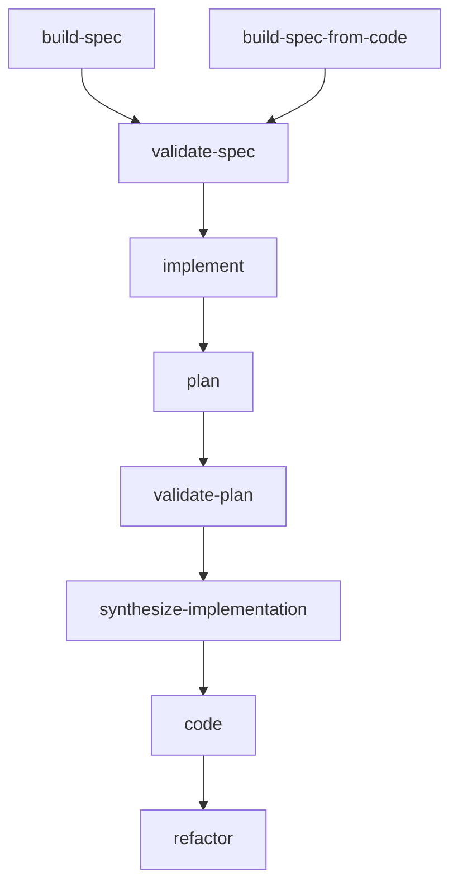
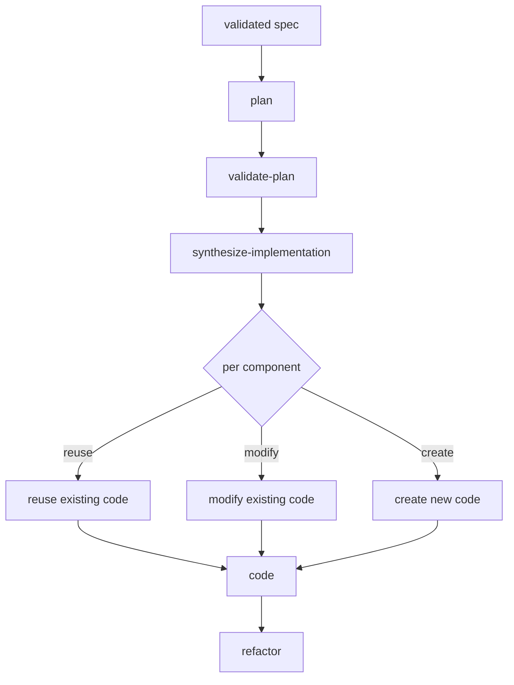
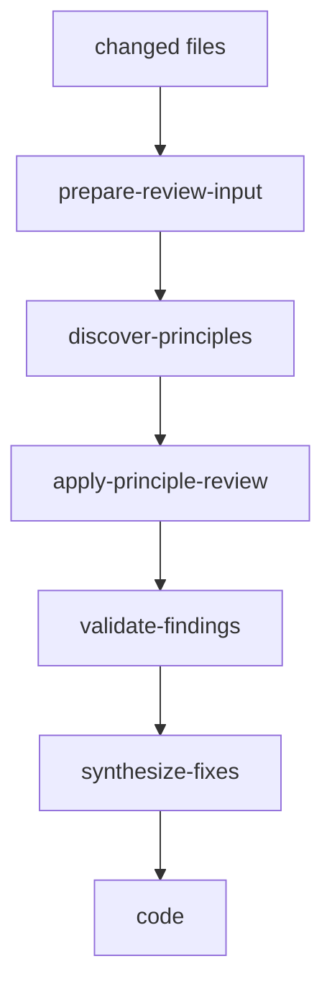
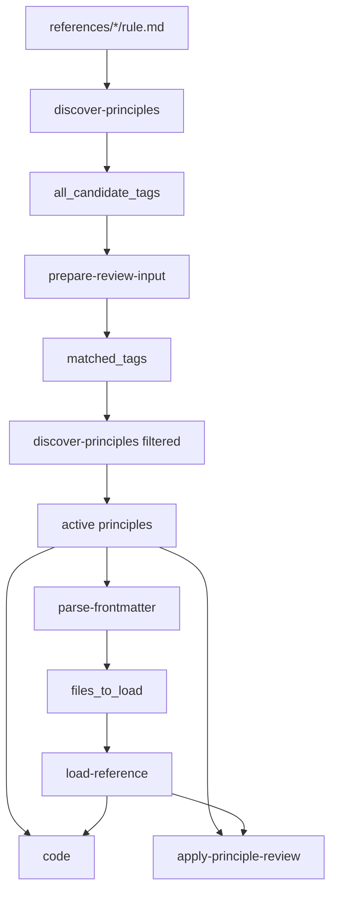
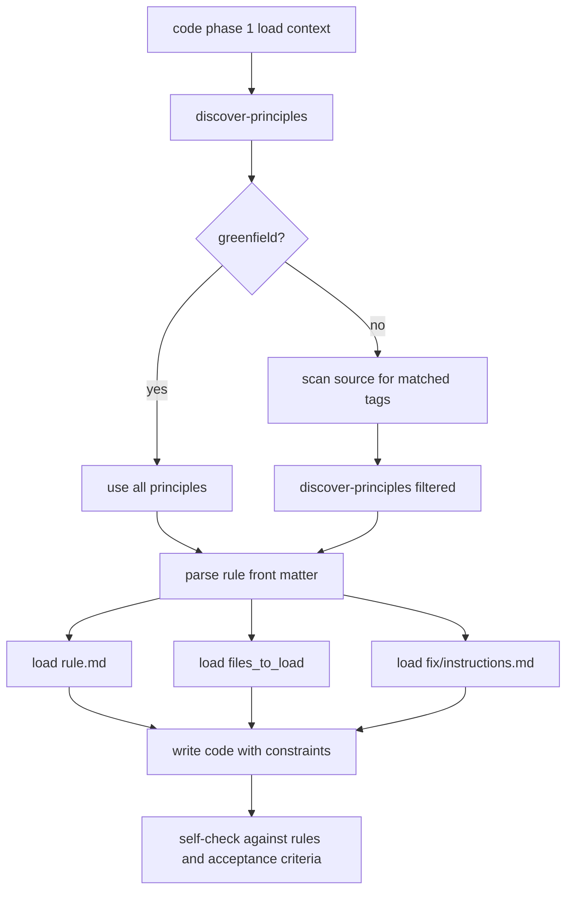
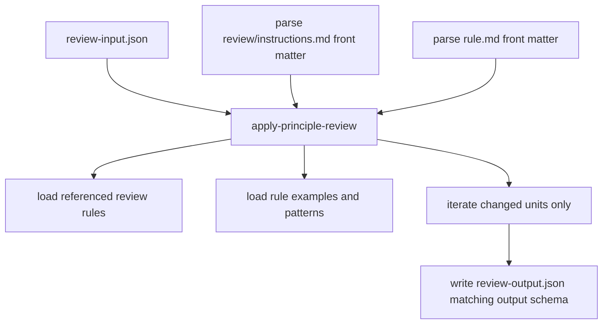

# solid-coder

A Claude Code plugin for **spec-driven implementation**, **principle-based review**, and **structured self-correction**.

`solid-coder` is not a single prompt loop. It is a staged workflow system built around:

- spec creation and validation
- code-aware planning
- reuse / modify / create decisions
- rule-aware coding
- structured principle review
- safe correction routed back through `code`

The most important idea is that **rules are applied before code is written, and again after code is written**.

---

## Core workflows

### `build-spec`
Interactive spec authoring for new or evolving work.

### `build-spec-from-code`
Generate a rewrite-oriented spec from existing code.

### `implement`
Run the staged spec-to-code pipeline:
1. `plan`
2. `validate-plan`
3. `synthesize-implementation`
4. `code`
5. `refactor`

### `refactor`
Run principle-based review and structured correction for changed code.

---

## Workflow overview



---

## Implement flow



---

## Refactor flow



---

## Rule discovery and application

The rule system has three layers:

1. **Principle discovery**
2. **Rule / instruction front matter parsing**
3. **Contextual loading inside `code` and `refactor`**

### High-level rule pipeline



### What `discover-principles` does

`discover-principles` scans `references/*/rule.md`, parses each rule front matter, and returns:

- `active_principles`
- `skipped_principles`
- `all_candidate_tags`

Rule tags come from each `rule.md` front matter.

Important behavior:

- **untagged rules** are always active
- if no filtering input is provided, all rules are returned as active
- if `matched_tags` are provided, only tagged rules with intersecting tags remain active

This means:
- core rules can always apply
- framework or stack-specific rules activate only when code evidence matches them

---

## How tags are matched

`prepare-review-input` receives `candidate_tags` from the orchestrator and matches them against the code being reviewed.

It uses:
- `detected_imports`
- direct code-pattern inspection
- semantic matching for tags that are not simple import names

Examples:
- `swiftui` can match `import SwiftUI`
- `gcd` can match `DispatchQueue`
- `structured-concurrency` can match `async`, `await`, or `Task {`
- `combine` can match `Publisher` or `Subscriber`

The result is written into `review-input.json` as `matched_tags`.

That file is then fed back into `discover-principles` to narrow the principle set.

---

## Rule front matter vs code front matter

These are different and serve different purposes.

### Rule front matter
Every principle folder has a `rule.md` with front matter such as:

- `name`
- `displayName`
- `category`
- `description`
- `tags`
- `examples`

This front matter is used to:
- identify the principle
- expose candidate tags
- locate examples and referenced files to load

### Code front matter
Generated top-level types can receive semantic comments such as:

- `solid-name`
- `solid-category`
- `solid-stack`
- `solid-description`

This front matter is used to:
- describe the type's role
- improve later discovery in `validate-plan`
- help expose stack or framework context in the codebase

Example:

```swift
/**
 solid-name: DSTheme
 solid-category: design-system theme facade
 solid-stack: swiftui
 solid-description: resolves design tokens for color, spacing, typography, elevation, and motion.
 */
```

`solid-stack` matters because it can help make framework usage more explicit in the codebase, but it is **not** the only signal used for rule activation. Imports and actual code patterns are also part of the discovery story.

---

## How `code` applies rules

`code` does not write first and review later. It loads rules before writing.

### `code` rule-loading flow



### What actually gets loaded in `code`

For each active principle:

1. `discover-principles` returns the active principle folder
2. `parse-frontmatter` reads the principle's `rule.md`
3. `files_to_load` is built from front matter fields like:
   - `examples`
   - `required_patterns`
   - `rules`
4. `load-reference` loads:
   - the `rule.md`
   - referenced examples and patterns
   - `fix/instructions.md`

Those files stay in context while code is being written.

That means `code` writes with:
- the metrics from `rule.md`
- the examples from each principle
- the repair strategies from `fix/instructions.md`

Then `code` performs a self-check against:
- all loaded rules
- per-plan acceptance criteria
- top-level cross-cutting acceptance criteria

---

## How `refactor` applies rules

`refactor` uses the same principle system, but in a different order and for a different purpose.

It is a review-and-correction orchestrator.

### Refactor execution shape

1. discover all principles and collect candidate tags
2. prepare normalized `review-input.json`
3. match tags from real code
4. rediscover principles using those matched tags
5. run one review per active principle
6. validate findings
7. synthesize cross-principle fix plans
8. send those plans back through `code`

This makes `refactor` a structured correction pipeline, not a loose review prompt.

---

## How `apply-principle-review` works

`apply-principle-review` is the generic review runner.

It is not hardcoded to SRP, OCP, SwiftUI, or any single principle. It works from a principle folder.

### Input
It receives:
- principle name / folder
- output path
- `review-input.json`

### Execution steps



### What it parses
For each principle:

1. parse `review/instructions.md` front matter
   - can point to:
     - rules
     - output schema
2. parse `rule.md` front matter
   - exposes examples / related files
3. load references from both

### What it reviews
It reads `review-input.json`, then:

- iterates file by file
- iterates unit by unit
- only reviews units where `has_changes == true`
- scopes analysis to the unit's line range

That is important: it is not supposed to review the entire file indiscriminately.

### Output
It writes one structured `review-output.json` per principle.

That output is later consumed by:
- `validate-findings`
- `synthesize-fixes`

---

## Why rules fork through both `code` and `refactor`

This is the main execution model:

- `code` uses rules **proactively**
- `refactor` uses the same principles **reactively**

So the same principle ecosystem supports:
- prevention during implementation
- detection during review
- correction during refactor

That is one of the main design strengths of the system.

---

## Front matter parsing details

The repo has a dedicated `parse-frontmatter` skill and script.

Its job is not only to extract YAML. It also:

- resolves local relative paths
- resolves references-root paths for design patterns
- expands `Examples/` automatically when present
- builds a flat `files_to_load` list for consumers

This means front matter is not only documentation. It is also the rule system's file-loading contract.

---

## Expected spec format

Specs are markdown files with YAML front matter.

Typical front matter includes:

- `number`
- `feature`
- `type`
- `status`
- `blocked-by`
- `blocking`
- `parent`

Example:

```md
---
number: SPEC-012
feature: inspector-panel
type: feature
status: ready
blocked-by: []
blocking: []
parent: SPEC-010
---
```

Common sections:

- Description
- Diagrams
- Definition of Done

Feature / subtask specs usually include:
- Input / Output
- User Stories
- Connects To
- Technical Requirements
- UI / Mockup when relevant

---

## Documentation

- [Architecture overview](docs/architecture-overview.md)
- [Spec format](docs/spec-format.md)
- [Build spec](docs/build-spec.md)
- [Build spec from code](docs/build-spec-from-code.md)
- [Implement flow](docs/implement-flow.md)
- [Refactor flow](docs/refactor-flow.md)
- [Rules and principles](docs/rules-and-principles.md)
- [Front matter](docs/front-matter.md)
- [Validate spec](docs/validate-spec.md)
- [Orchestrator ideas](docs/orchestrator-ideas.md)
